# 及物劢词和丌及物劢词
## raise和rise区分
> You raise me up.
> The sun is rising.

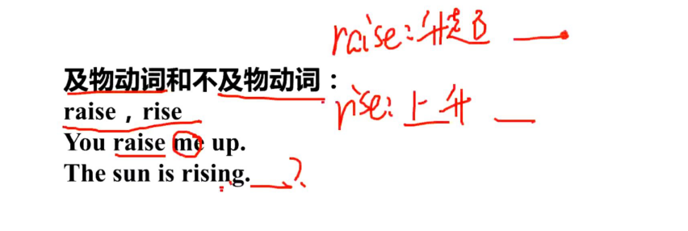

**总结**
- 动词后面跟名词(宾语) 叫及物,否则叫不及物
- You raise me up  #raise 翻译:举起 抬起
	- 你举起我  raise 后面跟 宾语则是 及物动词
- The sun is rising. #rise 翻译:上升
	-  太阳升起 rise后面没有跟对象(物),所以叫不及物动词 
- 不及物动词+介词(如 to),就变成及物了

# 基本句型

## 例句_最近,这个公共的活动获得支持,也就是政府的资金
### Recently, the public activities received support, the government funding.

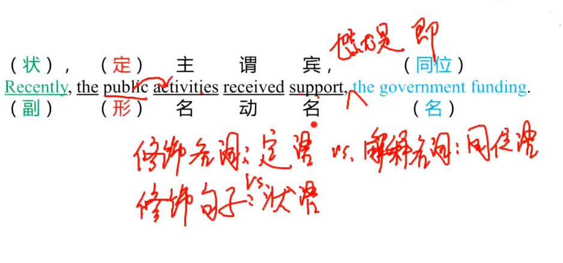

**总结**
- 修饰名称:定语   
- 修改句子:状态
- 解释名称:同位语   #对前面的名词进行解释,如获取什么支持,后面答:也就是政府的资金

# 简单句

## 主谓宾

## **例句_政府应该打击暴力不色情信息**
> 关键词：violence, pornography  
> Governments should fight violence and pornography.

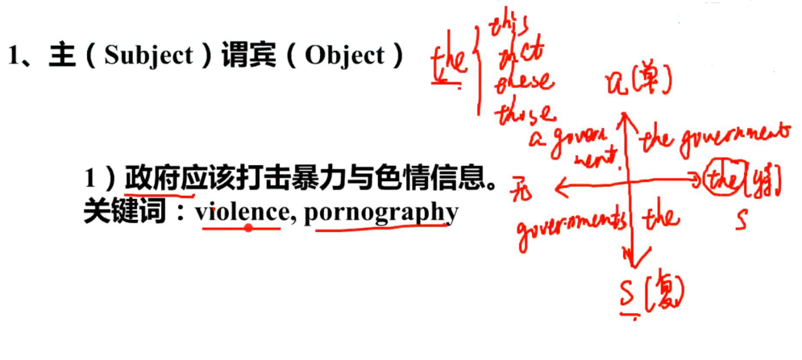

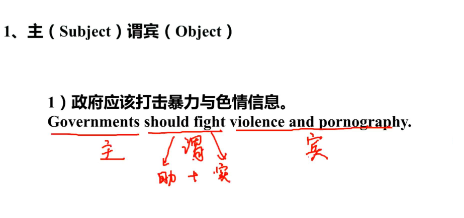

## 过程总结
- shoult fight  辅助动词+实在动词 = 谓词动词
	- shoult 为情态动词 也叫 辅助动词
	- fight 为实实在在的动词 也叫 实义动词

## **例句_学一门外语有劣于求职**
> 关键词：contribute to  
> Learning a foreign language contributes to job hunting.

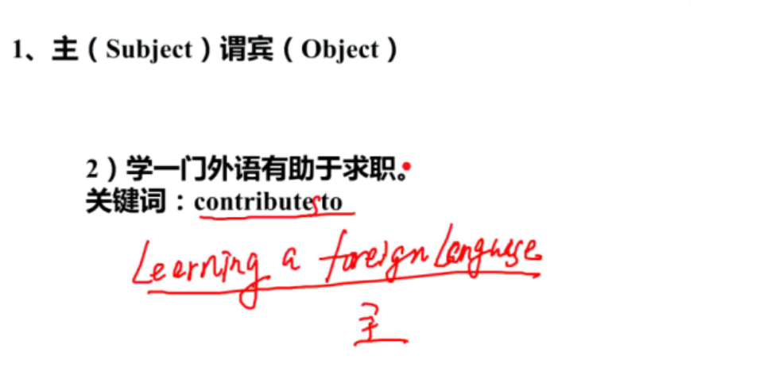
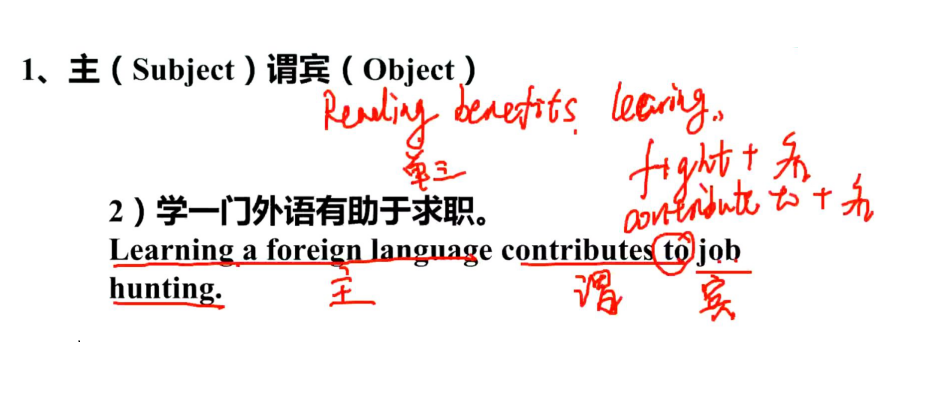

## 过程总结
-  动名词作主语
	-  learn动词要做主语,所以加 ing,变成动名词才能做主语
	-  动名词作主语,所以动名词是看作**单数**,谓语动词要加s 如contributes to
	-  案例翻译 阅读有利于学习 Reading benefits learing.
		-  read是动词,要做主语,则必须加ing 变成 reading
		-  动名词看作单三(单数第三人称),所以谓语动词要加s
	- 及物动司及不及物动词
		- fight + 名  #及物动词
		- contribute to + 名	 	#不及物动词

## 主谓

## **例句_犯罪率正在大幅度下降**
> The crime rate is falling significantly.

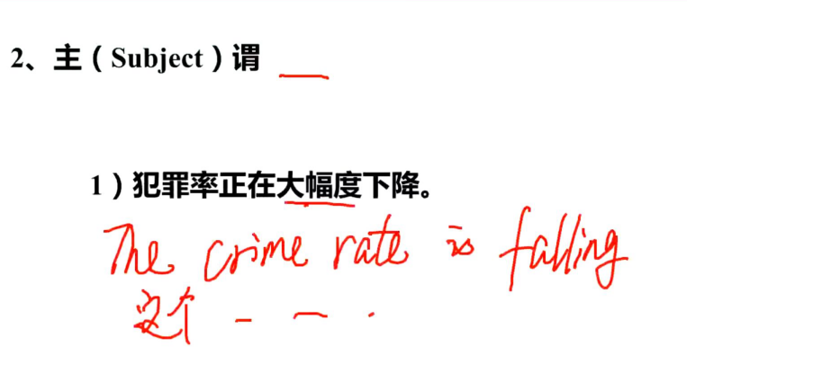
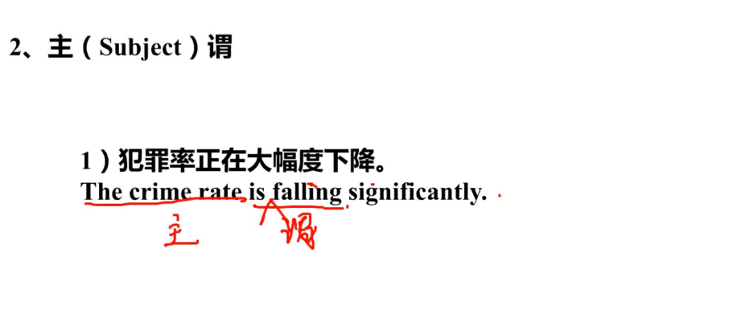

## 过程总结
- significantly 状语,意思 "大幅度"
	- 副词,所以可以放在 falling的前面,即 significantly falling
- 谓语 "下降"
	- 判断及物与不及物
		- 只有什么什么下降,不能说下降什么什么
		- 下隆后面跟不上物(宾语),则叫 不及物动词

## 主谓双宾

### 区分间接宾语和直接宾语
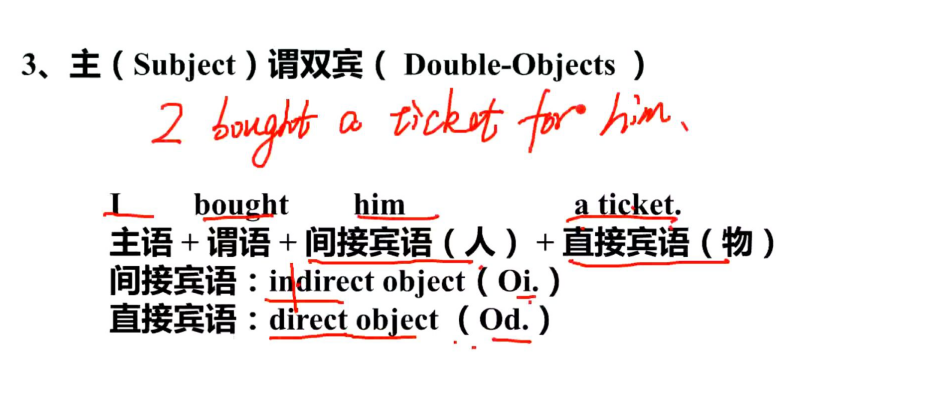

## 过程总结
- 我给他买了票
	- I bought him a ticket.
	- I bought a ticket for him. 

## 过程总结
- 我买票,不是买人,所以 **a ticket**是直接宾语 

## 例句_赌博会给我们带来金钱的损失
> 关键词：gambling  
> Gambling could bring us loss of money.  

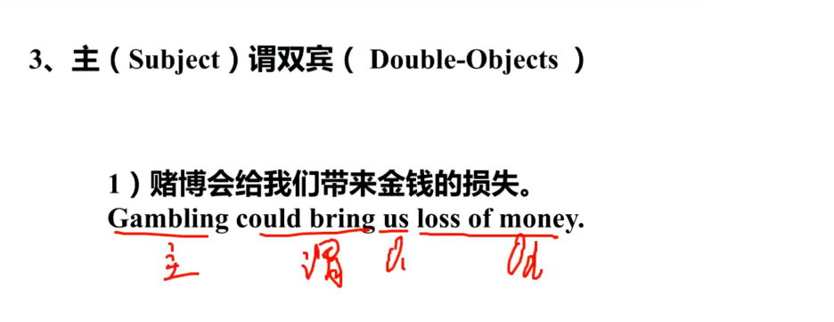
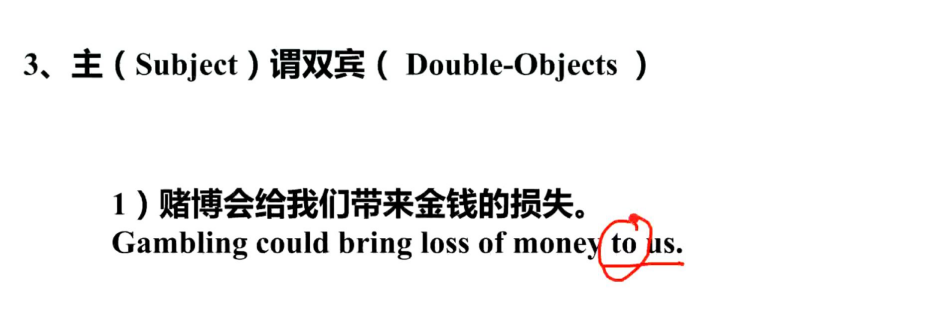

## 过程总结
- 赌博会给我们带来金钱的损失
	- Gambling could bring us loss of money.
	- Gambling could bring loss of money to us.

## 例句_社区服务给了孩子们一个给社会做贡献的途径
> 关键词：contribute to

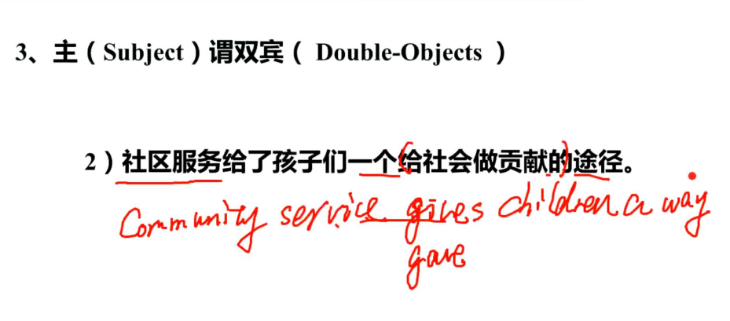  

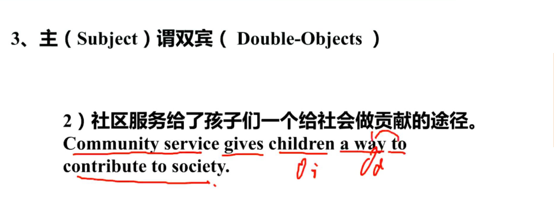  

## 过程总结
- 社区服务给了孩子们一个途径
	- Community service gives children a way.
	- Community service gives a way to children.
- to contribute to society 定语修饰 a way

## 主谓宾补

# 形容词做补语

## 例句_孩子们的经验丌足使他们易受伤害
>Children’s inexperience makes them vulnerable.

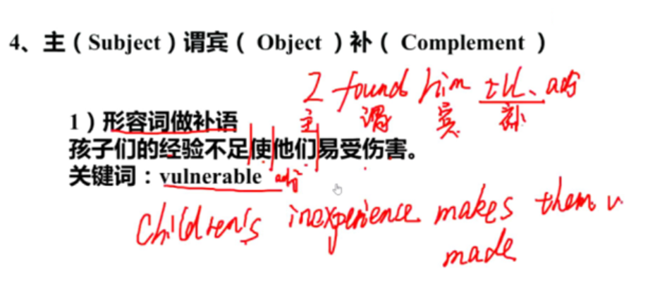 
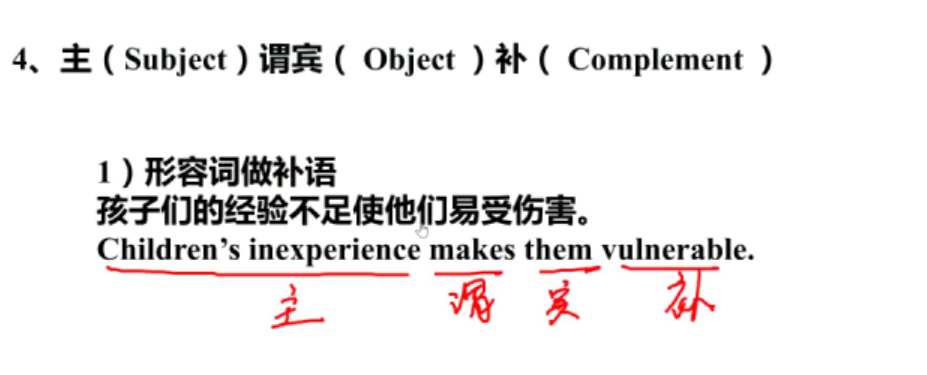 

## 过程总结
- 最简单的主谓宾补 I found him ill.

# 动词不定式做补语

## 例句_互联网诱使人们梦想一夜暴富
> 关键词：tempt
> The Internet tempts people to dream of being rich rapidly.

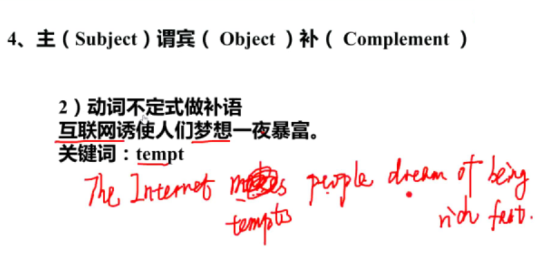 
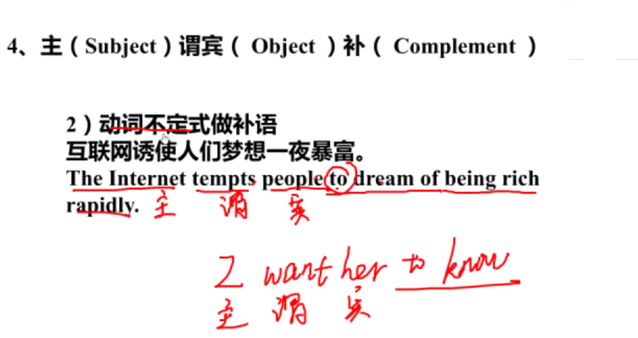 

## 过程总结
- 我想她知道  I want her to know.
- tempts及物动词,要补充说明
- tempts和dream两个动词之间用to联接起来

## 主系表

## 例句_电视能够成为一种信息的来源
>Television can be a source of information.  

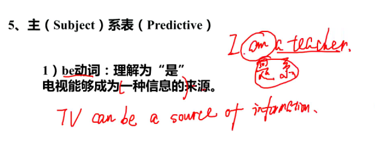
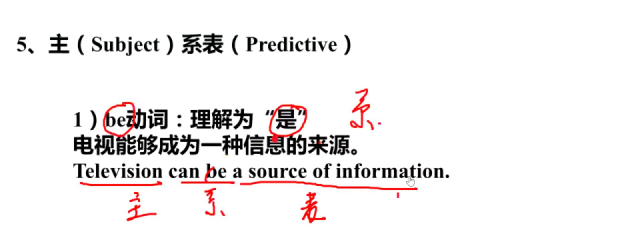

## 例句_我感到困惑和沮丧
> 关键词：puzzled, upset  
>I feel puzzled and upset.   

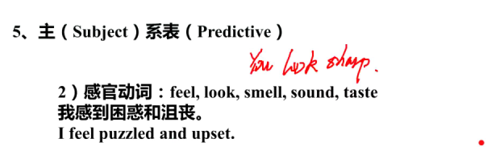

