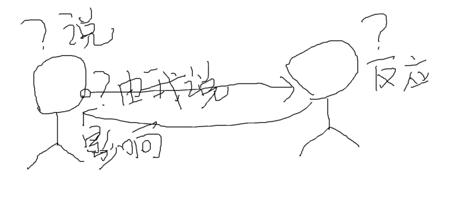

# 沟通

- 10堂课教你成为沟通达人 @自己总结
    - 开口之前,想一想

    

        - 我为什么要说这些?
        - 这些话为什么是我来说?
        - 希望对方有什么反应?
        - 希望我的现状具体发生什么变化?
    - 扩大内存 提大自己的阅读范围
    - 关键词拆分
    - 不理别人使用 "啊" "哦"  "嗯" 
    - 第一印象
        - 微笑,肌肉颤抖1秒钟
        - 眼神,如看别人的眼角或旁边
    - 搭配小物体,创造机会
- 10堂课教你成为沟通达人 @王奕霖
    - [全通沟通图谱_核心模型_3个环节_4步破解](wyl/README.md#全通沟通图谱_核心模型_3个环节_4步破解)
    - 自检:你有哪些你不知道的沟通坏习惯
        - 学习沟通的目的 
            - 自我顺畅
            - 和他人交流顺畅
            - 与环境和谐
        - "自己"的问题
            - 想到什么就说什么,没明确沟通"目的"
            - 不会应付,不知道说什么
            - 不敢表达自己的想法
            - 说的话别人不明白,表达不精准
            - 废话太多,太细碎,没重点
            - 情绪化,爱吐槽抱怨
        - 学习重点和提供关键点
            - 痛点不同,学习重点就不同,训练方法也不同
            - "懒得动脑"型  [不动脑子,思维力差]
                - 症状
                    - 想到什么就说什么,没明确沟通"目的"
                    - 说的话别人不明白,表达不精准
                    - 废话太多,太细碎,没重点
                - 药方
                    - "目的"为先 + 学习分析方法+逻辑思维+语言表达
            - "不知道说什么"型 [缺沟通方法和技巧,缺素材]
                - 症状 
                    - 不知道如何回应
                    - 不知道聊什么
                - 药方
                    - 沟通过程三环节+刻意训练+扩大"内存"
            - "不自信"型 [自我价值低,不自信]
                - 症状
                    - 不敢表达自己
                    - 不敢拒绝
                - 药方
                    - 沟通表达+重建自信+心理辅导
            - "阴晴不定"型 [积压情绪过重,无法理性思考]
                - 症状
                    - 情绪化,脾气大
                    - 爱吐槽抱怨
                    - 动不动就爱生气
                    - 觉得都是别人的错
                - 药方
                    - 语言沟通训练+情绪处理方法+心理辅导
    - 忽略"他人"而产生的问题
        - 忽略他人的存在
            - 症状
                - 听不到别人说的话
                - 不走心,以为听到其实没听
                - 太急于表达自己
            - 药方
                - 倾听 + 沟爱开启+规范表达
        - 忽略他人的身份与自己的关系 [考虑不足,思维力不足]
            - 症状
                - 说超越身份层级的话
                - 不考虑关系远近
            - 药方
                - 沟通开启
                - 分析方法
                - 刻意训练
        - 不会处理冲突
            - 症状
                - 回避不同意见
                - 直接冲突 
            - 药方
                - 精准表达+情绪处理+心理辅导
    - 忽略"情境"因素产生的问题
        - 不分场合  聚会,年会/午餐,宴会/偶遇 
            - 职场有职场的规矩,情场有情场的"套路"
            - 什么样的情境说什么样的话
            - 症状
                - 情境禁忌
            - 药方
                - 学会分析
        - 不会利用情境
            - 话题开启
            - 话题继续
            - 注意观察
        - 课后作业
            - 总结回顾第一章的内容,写下你在沟通中出现的问题
            - 制定学习计划,标出你要学习的重点章节
    - 第一印象(对话的开启)  @ 4
        - 你是主动发起进攻的捕食者,还是静候猎物上门的狩猎者
        - 总有人另避奚径
            - 一定要你主动说第一句话吗?
            - 如何能让对方先主动来和我讲话
        - 如何做到未开口就吸引到对方
            - 颜值不够 态度来凑 [好的外在精神面貌,是人际交往的通行证]
                - 衣着干净整洁,头发柔顺无异味
                - 优雅的衣着,拉高颜值
                - 身姿挺拔不猥琐 
            - 发出你的邀约信号
                - [5秒绽放勾人的微笑](wyl/README.md#5秒绽放勾人的微笑) [皮笑肉不笑没有吸引力]
                    - 嘴色要翘起
                    - 牵动眼色和脸颊的肌肉
                    - 当对方目光移过来的时候,停顿1秒钟,缓慢绽放的微笑
                - [蜜糖的目光](wyl/README.md#蜜糖的目光) [深深地吸引对方]
                    - 不要死眼着对方的眼睛看
                    - 请看着对方的眉心,也可以移动目光在对方的眼角眉梢,始终不离开这个区域
        - 课后任业
            - 照镜子,练习微笑.请同事或是朋友帮你拍下正脸的微笑照片,方便调整
            - 不自信的同学,每天照镜子看着自己,叫自己的名字,然后说"我支持你".
    - 轻松破冰(对话的开启) @5
        - 两大常见的问题
            - 不知道说什么,显得木纳或是不自然
            - 用力过猛吓到对方
        - 破冰的目的 
            - 降低心理防御
            - 产生亲和感
            - 产生吸引力
        - 说出第一句话的时机
            - 对方的暗示 [对你微笑,点头,朝你的方向张望 ]
            - 就现场的事件开始对话
            - 利用环境开始交谈 [图书馆,聚会餐桌前,书架前,水吧台]
        - 开户第一句话的正确姿势 
            - 中间人
                - 共同认识的人引荐
                - 找主办方的现场负责人引荐
            - 小物件 [安全岛]
                - 可拿出来点赞的配饰
                - 请你自己也要注意使用配饰,给别人搭讪你的机会
            - 共同话题
                - 我们吃什么
                - 共同注意的事件
                - 两性话题  
        - 破冰环节的关键点
            - 观察力
            - 好奇心
            - 勇敢尝试
        - 开启对话环节的注意事项
            - 切忌连续发问
            - 切忌交线言深,探究隐私
            - 来日方长,见好就收
        - 课后作业
            - 请在一周内挑选一名陌生人,用课上教的方法去开启一次对话 
    - 关键词法(对话的继续) @6
        - 聊不下去的对话方式
            - 就事论事儿,不给对方接话的空间
            - 总结陈词,概括评价
        - [关键词拆分法_举例](wyl/README.md#关键词拆分法_举例)
            - 拆出关键词,引导话题走向
            - 以关键词为核心,提问或是回应
            - 表达感受或非看法, 除非对方明确问你怎么办? **即陈述句说,陈述句答,不要表现自己的看法**
        - 沟通时的接话原则
            - 不明确对方真实的表达意图之前,尽量不要给建议或是下论断
            - 分不清对方是吐槽，柔情还是救助，就尽量挑关注"人"的关键词去往下接话
            - 没有明显沟通目的的对话,以拉近关系为第一目标 
        - 关键词接接活的开放式问句回应 [开放式问句可以让对方聊更多的细节,细节本身就是延继对话的不二法宝]
            - 能具体说说吗? (细节的展开)
            - 这个问题你是怎样看的? (了解想法,放松关系)
            - 有什么办法,解决了没有?(聊细节,承接对话)
        - 总结
            - 从对方的话里拆出关键词来做为回应的核心
            - 用开放式的问句展开细节来延继对话
        - 课后作业
            - 和朋友或是同事闲聊沟通的时候,用关键词拆分法来展开对话,看看最长可以聊多久 
    - 结束的技巧(对话的结束) @7
        - 优雅的结束对话
            - 优雅地结束对话的方法
                - [总结概括式的语句,是结束话题的好工具](wyl/README.md#总结概括式的语句,是结束话题的好工具)
            - 怎么应对没完没了的说不停的人
                - 你渴不,要不要喝点水 (打岔)
                - 使用 "嗯","啊","哦"地回应
                - 行为暗示
                    - 看表
                    - 是不时看别处
                    - 身体姿态
            - 注意事项
                - 每次结束其实都**是下一次沟通的预热**.结束得好不好,关系到下次沟通
                - 对双方已达成共识的内容做总结,**营造愉快的ending,升华关系**
                - 如有未完成的对话,记得**对下次的约谈做出约定**
                - **不要展开细节**,避免没完没了
        - 课后作业
            - 对开启对话到结束对话,完整地进行一次沟通,记录下来感受或是不足,方便 下次再做调整
    - 告别语无伦次 @8
        - 如何明确你的沟通目的
        - 不同内容的不同表达方式
        - 为什么会语无伦次
            - 目的不明确
            - 逻辑混乱
            - 核心语定义不清
        - 梳理沟通目的list [想要吐槽,抒发情绪?还是为自己争取利益,还是要告某人的黑状,还是显示自己很厉害]
            - 我为什么要说这些?
            - 这些话为什么是我来说?
            - 希望对方有什么反应?
            - 希望我的现状具体发生什么变化?
        - 不同内容不同表达方式
            - 讲述事件
                - 1.人物间的关系(我和上司之间)
                - 2.人物重要程度(不好好工作,会被领导炒鱿鱼)
                - 3.时间先后顺序(先找到领导,后找到另外一个部门的同事)
                - 4.具体情节(领导让我展开一项工作,但没给权限,我调动不了资源)
            - 表达情感 [用事实去证明情感]
                - [x] 老板你好厉害(没有传递情感)
                - [√] 老板,看您这样处理XXX事,让我学会了XX(用真实事件证明,他是如何影响到你的)
            - [讲道理\讨论](wyl/README.md#讲道理\讨论) [核心词的定义一定要统一]
                - 阐述观点
                - 元素:论点-论据(具体的事例来支持论点)
                - 表达的结构:总-分-总
            - 课后作业
                - 1.每天读一段名著中场景化的描写(海明威\毛姆\村上春树等)
                - 2.练习给别人去讲你看天台的人和事
    - 想要说服别人 你要这样表达 @9
        - 关于影响和说明的误区
            - 控制别人,就是影响力
            - 影响和说服的本领是天生的
            - 说的好听,有亲和力就有影响力
        - 说服力三个组成要素
            - 个人特质 能力 诚信 专业度
            - 情绪感染力
            - 逻辑
        - 如何让你的话有分量 [成为牛副的人,并且让牛逼的人夸你牛逼]
            - 能力:呈现完成任务的能力,用可见成果来说话
            - 诚信:平台,证书,对方信任的人的推荐
            - 重复上述的两步骤
        - 案例 
            - [经典的广告套路_美宝莲](wyl/README.md#经典的广告套路_美宝莲)
            - [职场](wyl/README.md#职场)
        - 说有影响力&说服力的话你需要
            - 1.学习和锻炼思维力
                - 了解人性,了解沟通对象,加强逻辑思维力
            - 2.练习语言
                - 日常沟通中的刻意练习 
            - 3.持续的学习
                - 复杂人际关系&职场关系影响的语言 
        - 课后作业
            - 想想有没有最近想说服别人的事情,然后试着用课上教的说明的表达顺序来组织你的语言,试试看效果如何
    - 何提出你的小建议不招人烦 @10
        - 关于提建议的唯一原则
            - 不要随便给别人提建议
        - 不得不提建议,区分对待
            - 区分身份和关系,选择恰当的方式
                - 朋友还是同事
                - 上司还是平级关系
        - 平级建议的三个要点 [提建议不是目的，目的是怎幺说句话让对方产生你想要的行为 改变]
            - 私下解决，递小纸条不被其他人知道，别伤人家面子
            - 陈述你的感受而不是指导别人的行为；
            - 请别人照顾你的感受，需要示弱的方式，而不是命令。
        - 语言的作用有限
            - 不是提建议能解决的事情，就不要浪费唇舌
            - 想让别人改变，方法有很多种，比如采取行动。
        - 提建议不影响关系的前提
            - 1.对方强烈要求 --他人意愿
            - 2.你确实有好的建议 -- 你自己的意愿
            - 3.不显得你低端  -- 要说别人想不到的
            - 4.不显得对方傻  -- 不要踩对方
        - 职场中被上司要求提建议
            - 1表达你的真实感受 --不是评价
            - 2.了解对方这么做的原因
            - 3.只提一条建议，避免连珠炮
            - 4.表达要留有余地
        - 总结
            - 一个原则:不要随便提建议
            - 两个区分:区分身份关系,区分事情
            - 三个步骤:谈感受 - 问思路 - 只提一条
        - 沟通力的提升
            - 1.养成具体的问题具休分析的习惯
            - 2.持续的训练
            - 3.持续的学习+好的教练指导