# 10堂课教你成为沟通达人

## 全通沟通图谱_核心模型_3个环节_4步破解

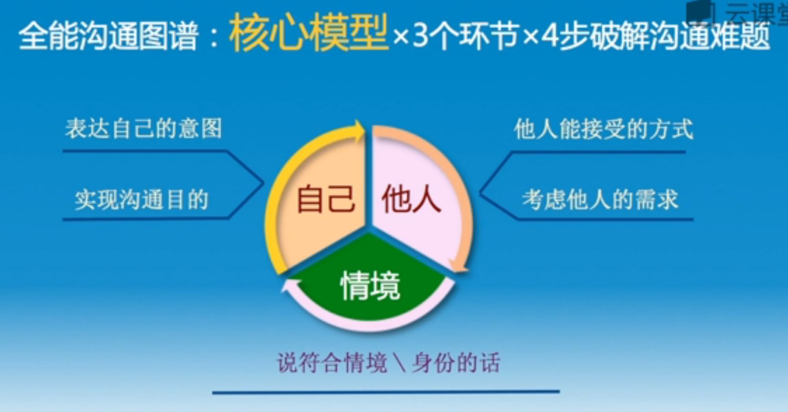

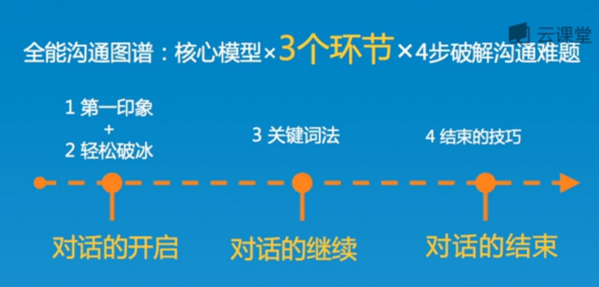

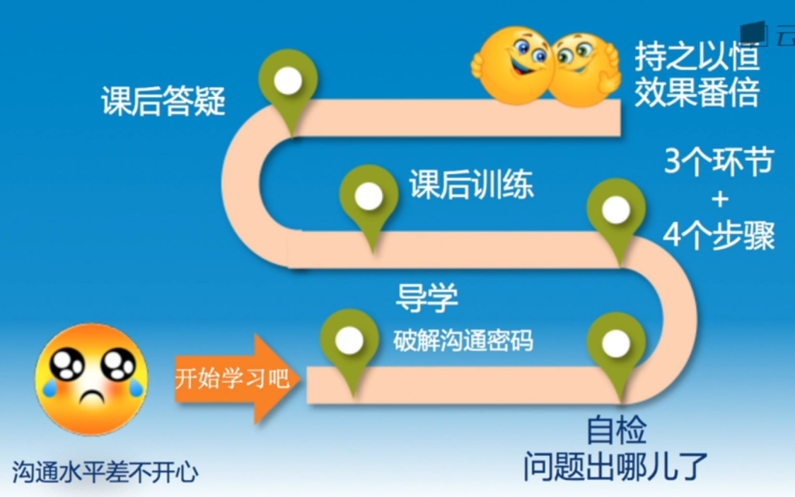

## 5秒绽放勾人的微笑
- 嘴色要翘起
- 牵动眼色和脸颊的肌肉
- 当对方目光移过来的时候,停顿1秒钟,缓慢绽放的微笑

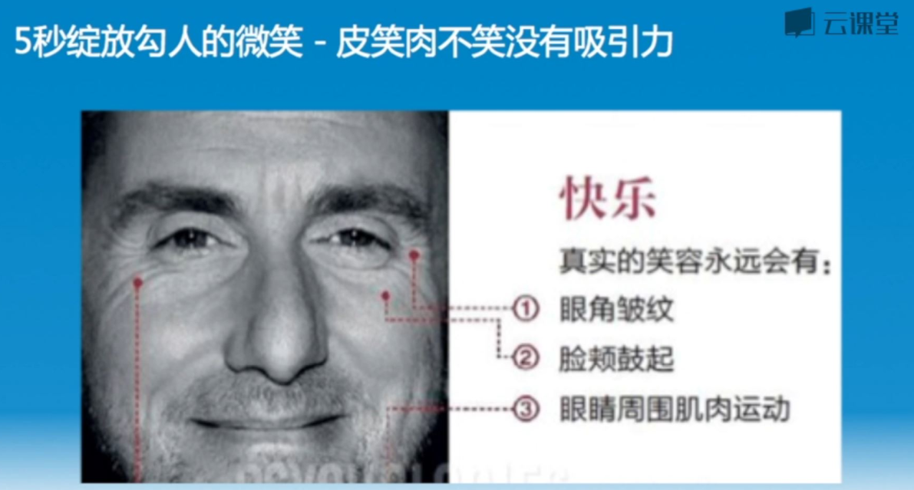

## 蜜糖的目光
- 不要死眼着对方的眼睛看
- 请看着对方的眉心,也可以移动目光在对方的眼角眉梢,始终不离开这个区域

## 关键词拆分法_举例
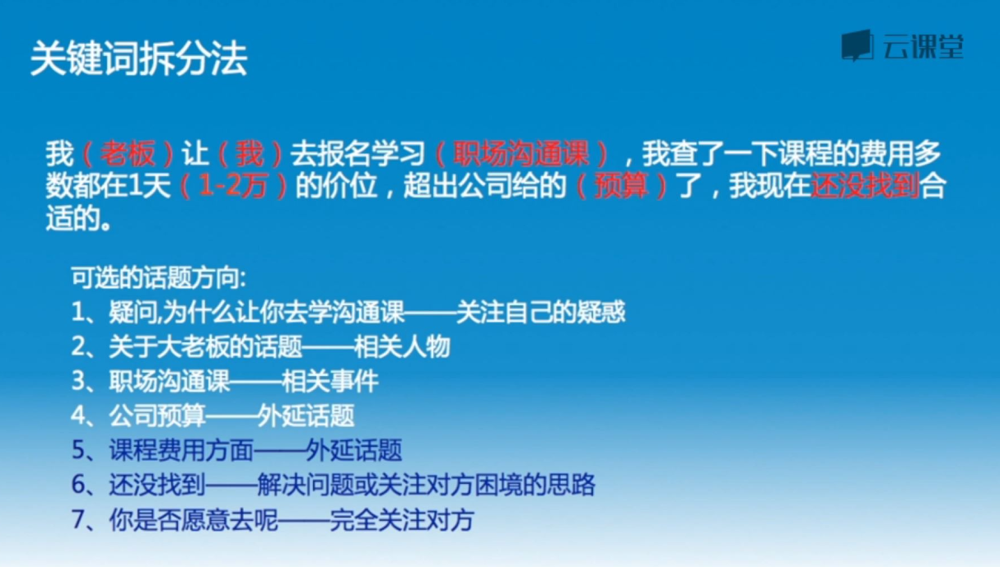

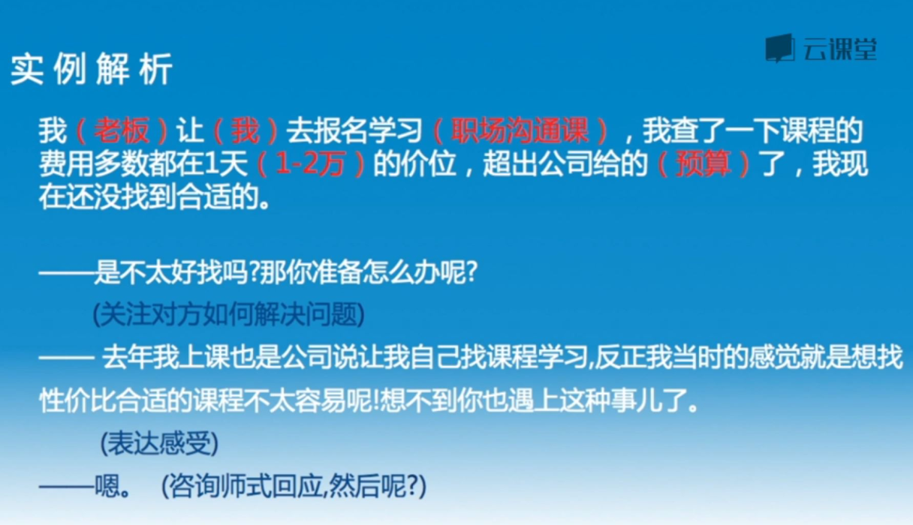

## 总结概括式的语句,是结束话题的好工具
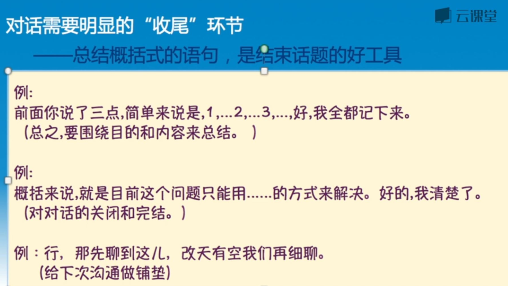

## 讲道理\讨论
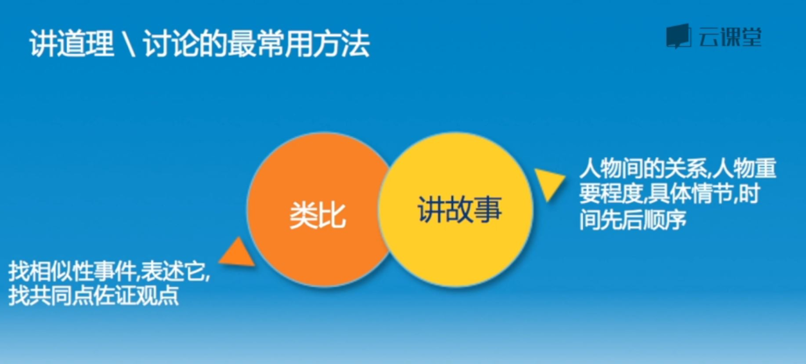

## 经典的广告套路_美宝莲

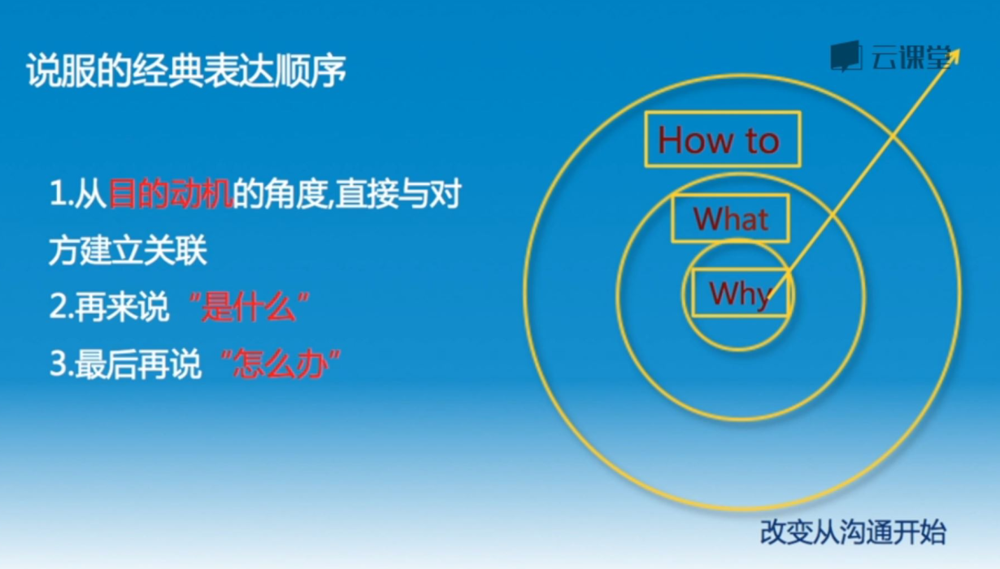

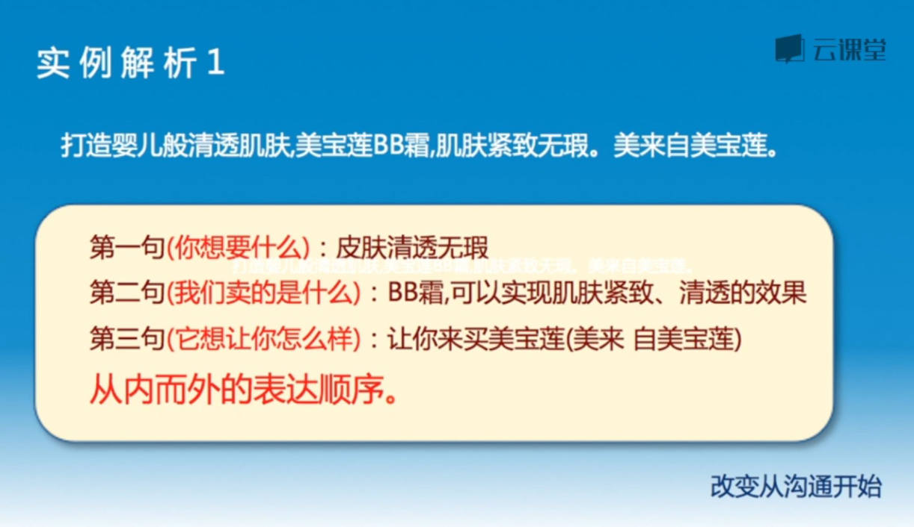

## 职场
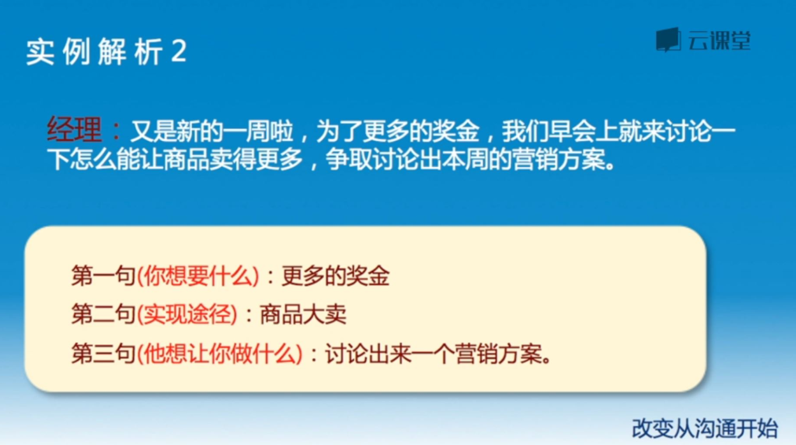