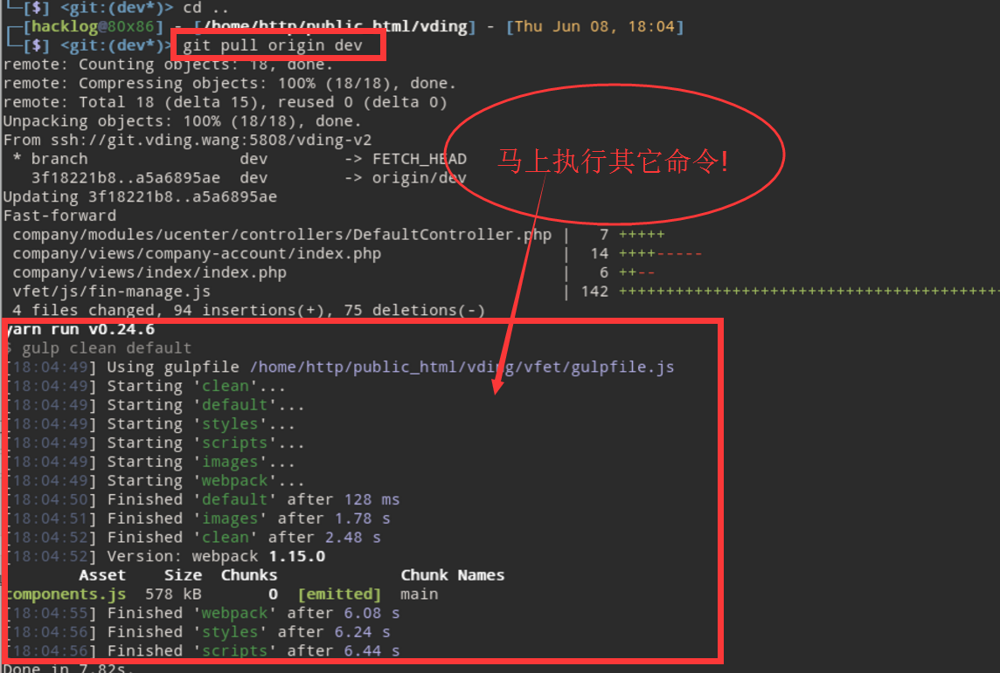

# shell

## 让你的git pull之后自动 运行 yarn run build

### 调用函数代码



> - 进入 .git/hooks 目录，  
> - 创建名为 post-merge 的文件，没有后缀  
> 内容如下：  
 
```shell
#! /bin/bash
#
# post-checkout hook that checks for changes to composer.lock, and fires a composer install if required.
# Copyright (C) 2017 HuangYeWuDeng <hacklog@80x86>
#
# Distributed under terms of the MIT license.
#
# git hook to run a command after `git pull` if a specified file was changed
# Run `chmod +x post-merge` to make it executable then put it into `.git/hooks/`.

changed_files="$(git diff-tree -r --name-only --no-commit-id ORIG_HEAD HEAD)"

check_run() {
	echo "$changed_files" | grep --quiet "$1" && eval "$2"
}

# you can change composer path and parameters as you need.
check_run vfet "cd vfet && yarn run build"

```

## 改造cp命令_文件不存在则创建_并且过滤文件名

```shell
#!/bin/bash

# 运行的例子
# 1 ../ccp.sh 'E:\cmk\qian100\web\vding\vding_dev\rest\versions\v1\controllers\UserController.php' rest/versions/v1/controllers/aaa.php
# 2 ./ccp.sh 'E:\cmk\qian100\web\vding\vding_dev\rest\versions\v1\controllers\UserController.php' rest/versions/v1/controllers/
# 3  ccp.sh /e/cmk/qian100/web/vding/vding_dev/common/models/User.php common/models/User.php

if [ ! -n "$1" ]; then
  echo "请输入参数1:源文件路径,如 ccp.sh 'c:\test\1.txt' /test/b/"
  exit
fi


if [ ! -n "$2" ]; then
  echo "请输入参数2:目的文件路径,如 ccp.sh 'c:\test\1.txt' /test/b/"
  exit
fi


isFile=`expr index $2 "."` 

if  [[ $isFile -gt 0 ]]; then   # 查找字符串里包括点(".") 有表示包括文件,则将文件包括点也去掉 
	
	#获取末尾'/'的位置
	strToCheck=$2
	charToSearch='/'
	let pos=`echo "$strToCheck" | awk -F ''$charToSearch'' '{printf "%d", length($0)-length($NF)}'`
    
     #截取开始到末尾出现的/的位置	
     filterResult=`expr substr "$2" 1  $pos` 
else
     filterResult=$2
fi

#echo $filterResult
if [ ! -d "$2" ]; then
  mkdir -p "$filterResult"
fi
cp -R "$1" "$filterResult"

```

## 加入日志模块_锁模块_注释参考_模板shell

```shell
#!/bin/bash
#######################################################
# $Name:         shell_template.sh
# $Version:      v1.0
# $Function:     Backup MySQL Databases Template Script
# $Author:       Jason Zhao
# $organization: https://www.unixhot.com/
# $Create Date:  2016-08-27
# $Description:  You know what i mean,hehe
#######################################################

# Shell Env
SHELL_NAME="shell_template.sh"
SHELL_DIR="c:/opt/shell"
SHELL_LOG="${SHELL_DIR}/${SHELL_NAME}.log"
LOCK_FILE="c:/tmp/${SHELL_NAME}.lock"

#Write Log 
shell_log(){
    LOG_INFO=$1
    echo "$(date "+%Y-%m-%d") $(date "+%H-%M-%S") : ${SHELL_NAME} : ${LOG_INFO}" >> ${SHELL_LOG}
}

# Shell Usage
shell_usage(){
    echo $"Usage: $0 {backup}"
}

shell_lock(){
    touch ${LOCK_FILE}
}

shell_unlock(){
    rm -f ${LOCK_FILE}
}

# Backup MySQL All Database with mysqldump or innobackupex
mysql_backup(){
    if [ -f "$LOCK_FILE" ];then
        shell_log "${SHELL_NAME} is running"
        echo "${SHELL_NAME}" is running && exit
    fi
    shell_log "mysql backup start"
    shell_lock
    sleep 10
    shell_log "mysql backup stop"
    shell_unlock
}

# Main Function
main(){
    case $1 in
        backup)
            mysql_backup
            ;;
        *)
            shell_usage;
    esac
}

#Exec
main $1
```

## 自动化部署脚本

```shell
#!/bin/bash

#Date/Time
CTIME=$(date "+%Y-%m-%d-%H-%M")

#Shell
CODE_DIR="/deploy/code/deploy"
CONFIG_DIR="/deploy/config"
TMP_DIR="/deploy/tmp"
TAR_DIR="/deploy/tar"


usage(){
	echo $"Usage: $0 [ deploy | rollback-list | rollback-pro ver]"
}

git_pro(){
  echo "begin git pull"
  cd "$CODE_DIR" && git pull
  API_VERL=$(git show | grep commit | cut -d ' ' -f2)
  API_VER=$(echo ${API_VERL:0:6})
  cp -r "$CODE_DIR" "$TMP_DIR"
}

config_pro(){
  echo "copy pro config to dir"
  /bin/cp "$CONFIG_DIR"/* $TMP_DIR/deploy/
  TAR_VER="$API_VER"-"$CTIME"
  cd $TMP_DIR && mv deploy pro_deploy_"$TAR_VER"
}

tar_pro(){
  echo "begin tar"
  cd $TMP_DIR && tar czf pro_deploy_"$TAR_VER".tar.gz pro_deploy_"$TAR_VER"
  echo "tar end pro_deploy_"$TAR_VER".tar.gz"
}

scp_pro(){
  echo "begin scp"
  /bin/cp $TMP_DIR/pro_deploy_"$TAR_VER".tar.gz /opt
  #scp $TMP_DIR/pro_deploy_"$TAR_VER".tar.gz 192.168.1.2:/opt
  #scp $TMP_DIR/pro_deploy_"$TAR_VER".tar.gz 192.168.1.3:/opt
  #scp $TMP_DIR/pro_deploy_"$TAR_VER".tar.gz 192.168.1.4:/opt
}
#执行部署操作
deploy_pro(){
  #socat haproxy unix nginx 
  echo "begin deploy"
  cd /opt && tar zxf pro_deploy_"$TAR_VER".tar.gz
  rm -f /var/www/html && ln -s /opt/pro_deploy_"$TAR_VER" /var/www/html
}
#测试部署
test_pro(){
  echo "begin test"
  #curl --head http://192.168.56.31/index.php | grep xxxx
  echo "add cluster" # socat haproxy-nginx+php
}
#回滚列表
rollback_list(){
  ls -l /opt/*.tar.gz
}
#制定版本回滚
rollback_pro(){
  #ssh 192.168.56.31 
  rm -f /var/www/html && ln -s /opt/$1 /var/www/html
}
#主函数，对之前编写的进行组合
main(){
  case $1 in
	deploy)
		git_pro;
		config_pro;
		tar_pro;
		scp_pro;
		deploy_pro;
		test_pro;
		;;
	rollback-list)
		rollback_list;
		;;
	rollback-pro)
		rollback_pro $2;
		;;
	*)
		usage;
  esac
}
main $1 $2
```