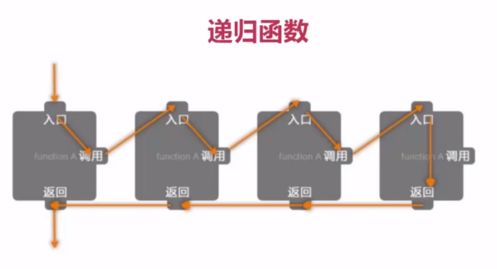

# 递归
## 简单的递归例子



```php
//n! = n*(n-1)*(n-1-1)...*1(n>0)
//3! = 3*2*2

function recursive($i)
{
    $sum =1;
    echo "recursive()当前参数\$i值为{$i}<br />";
    if(1==$i){
        echo "\$i={$i};\$sum={$sum}<br />";
        return 1;
    }else{
        $sum=$i*recursive($i-1);
    }
    echo "\$i={$i};\$sum={$sum}<br />";
    return $sum;
}

echo recursive(3);

//输出
recursive()当前参数$i值为3
recursive()当前参数$i值为2
recursive()当前参数$i值为1
$i=1;$sum=1
$i=2;$sum=2
$i=3;$sum=6
6
```