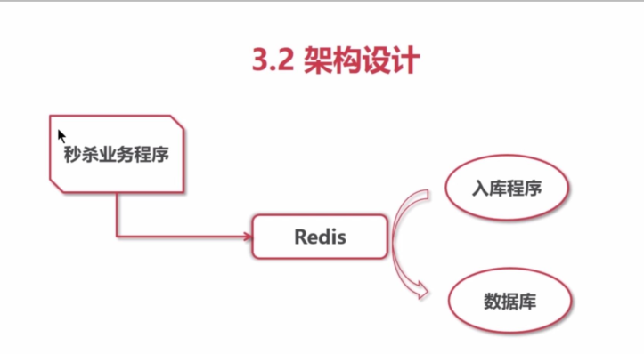

# redis的List类型实现秒杀_例子



## 流程
-  秒杀程序把请求写入Redis。(Uid , time_stamp)
-  检查Redis已存放数据的长度，超出上限直接丟弃。
-  死循环处理存入Redis的数据并入库

## 表
```
 CREATE TABLE `redis_queue` (
  `id` int(10) unsigned NOT NULL AUTO_INCREMENT,
  `uid` int(11) NOT NULL DEFAULT '0',
  `time_stamp` varchar(24) NOT NULL,
  PRIMARY KEY (`id`)
) ENGINE=InnoDB AUTO_INCREMENT=88 DEFAULT CHARSET=utf8;

```

## 秒杀入库redis操作
```php
//首先呢，我要加载一下redis组件，
$redis = new Redis();
$redis->connect('127.0.0.1', 6379);
$redis->name = "miaosha";

//模拟100个抢
for ($i = 0; $i < 100; $i++) {
    $uid = rand(100000, 999999);
//接受用户的id,
//$uid = $_GET[，uid.]:
//获取一下reis里面己有的数量，
    $num = 10;
//如果当天人数少于十的时候，则加入这个队列，
    if ($redis->lLen($redis_name) < 10) {
        $redis->rPush($redis_name, $uid . '%' . microtime());
        echo $uid . "秒杀成功";
    } else {
//如果当天人数己经达到了十个人，则返回秒杀己完成，
        echo "秒杀己结束";
    }
}
$redis->close();

```

## 业务系统操作及入mysql

```php
<?php
require "DB";
//首先呢，我要加载一下redis组件，
$redis = new Redis();
$redis->connect('127.0.0.1', 6379);
$redis_name = "miaosha";
$db = DB::getIntance();

while (1) {
// 从队刿最左侧取出一个值来，
    $user = $redis > lPop($redis_name);
// 然后判断这个值是否存在，
    if (!$user || $user == 'nil') {
        sleep(2);
        continue;
    }
// 切割出时间 ，uid
    $user_arr = explode('%', $user);
    $insert_data = [
        'uid' => $user_arr[0],
        'time_stamp' => $user_arr[1],
    ];
// 保存到数据库中，
    $res = $db->insert('redis_queue', $insert_data);
// 数据库插入的失败的时候的回滚机制，
if (!$res) {
    $redis->rPush($redis_name, $user);
}
    sleep(2);
}
// 释放一下 redis
$redis->close();

```