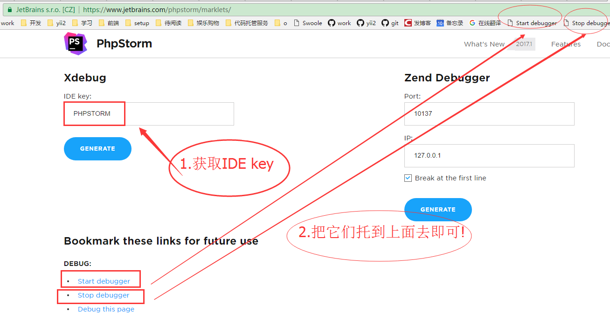
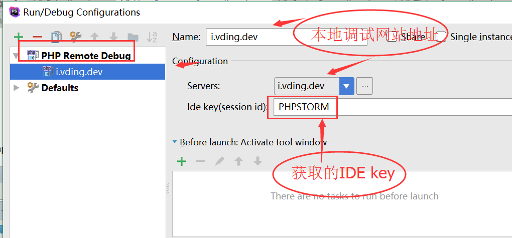
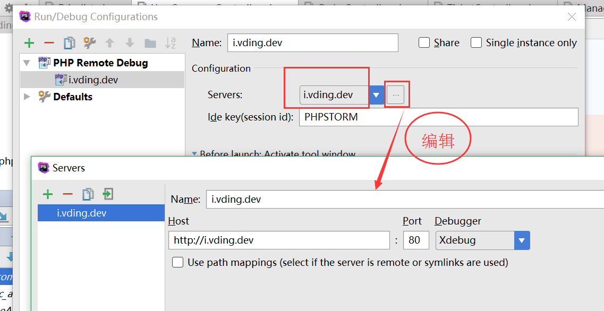
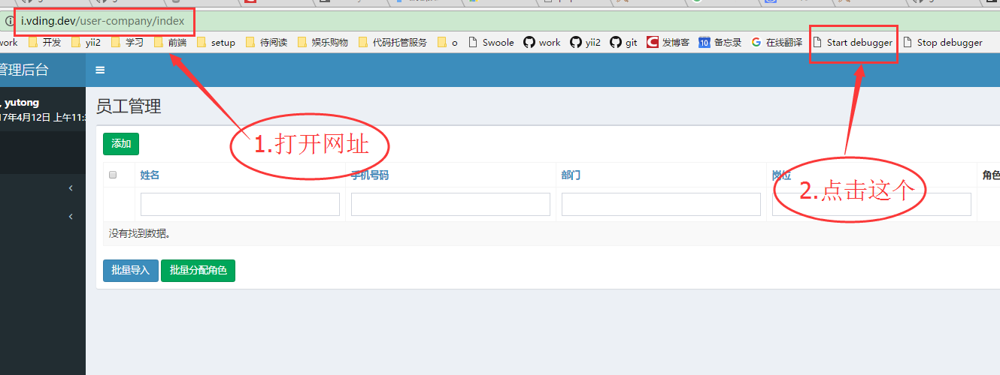
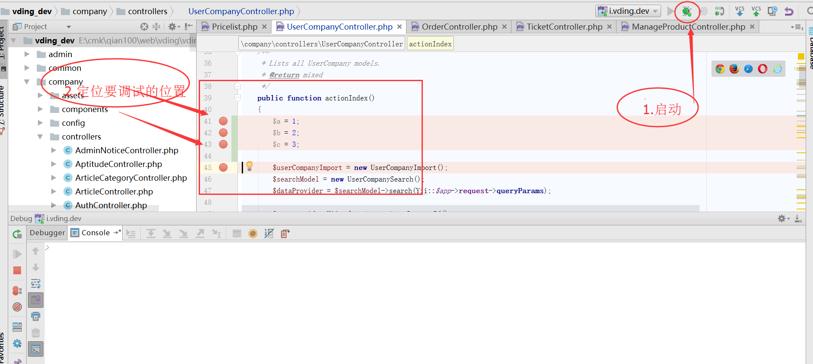
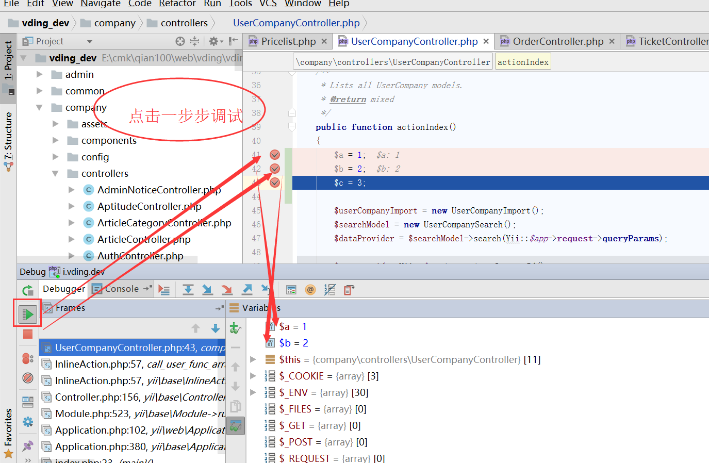

# xdebug

# 配合phpStorm调试

## 笔记本的PHP版本是
```
php 7.0.13
TS,VC14
```

## 获取xDebug的启动与关闭地址 和  IDE key

```
https://www.jetbrains.com/phpstorm/marklets/
```



### IDE key
```
PHPSTORM
```

### "Start debugger"按纽与地址
```
javascript:(/** @version 0.5.2 */function() {document.cookie='XDEBUG_SESSION='+'PHPSTORM'+';path=/;';})()
```

### "Stop debugger"按纽与地址
```
javascript:(/** @version 0.5.2 */function() {document.cookie='XDEBUG_SESSION='+''+';expires=Mon, 05 Jul 2000 00:00:00 GMT;path=/;';})()
```

## 安装谷歌插件
jetbrains ide support

## phpStorm 激活码 http://idea.imsxm.com

## xdebug下载地址 
https://xdebug.org/download.php


## php.ini配置
```
[xdebug]
zend_extension="D:\lamp20161203\php-7.0.13\ext\php_xdebug-2.5.0-7.0-vc14-x86_64.dll"
xdebug.remote_enable = On
xdebug.remote_handler = dbgp   
xdebug.remote_host= localhost
xdebug.remote_port = 9000
xdebug.idekey = PHPSTORM
```
## phpStorm配置
### 打开Run/Debug Configuration添加与配置



```
添加要调试的网站
```



## 实际演示操作

### 测试的地址
http://i.vding.dev/user-company/index   

### 代码定位
```
浏览器打开要调试网站及点击"debug按钮"
```


```
代码里定位要调试的位置及打开调试开关
```



```
刷新一个浏览器,进入phpStorm,按F5一步步来调试
```



