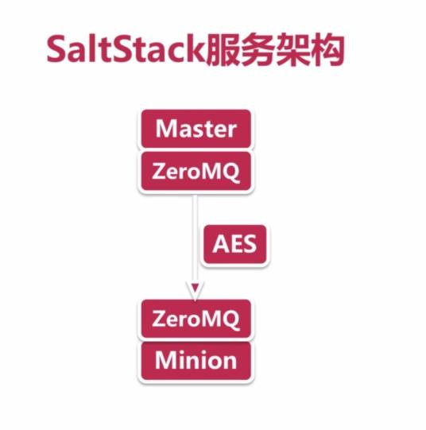
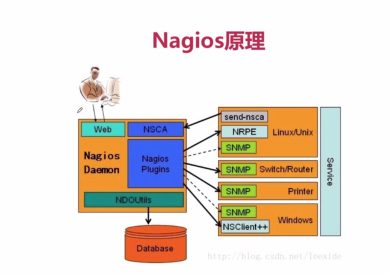
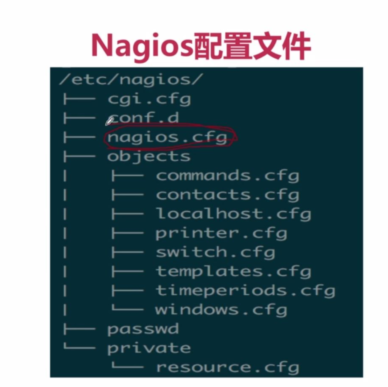

# python自动化运维篇

## ansible
- ansible介绍
    - 一个自动 化管理IT资源的工具
- ansible优点
    - 无客户端
    - 推送式
    - 丰富的module
    - 基于YAML的Playbook
    - 商业化支持
- ansible缺点
    - 效率低,易挂起
    - 并发性能差
- 比较
 
- 运行
 

## ansible安装
- 快速安装
    - 安装pip:easy_install pip
    - 安装Ansible: pip install ansible
- 源码安装
    - 获取源码 github.com/ansible/ansible
    - 解压源码
    - 进入源码目录
    - 运行source ./hacking/env-setup
- 系统源安装
    - Centos
        - yum install ansible
    - Ubuntu
        - apt-get install software-properties-common
        - apt-add-repository ppa:ansible/ansible
        - apt-get update
        - apt-get install ansible
## Ansible配置文件路径
- export ANSIBLE.CONFIG
- ./ansible.cfg
- ~/.ansible.cfg
- /etc/ansible/ansible.cfg

## Ansible配置文件获取
- /etc/ansible 目录下

## ansible新手上路
> 过程明细: 教程记录截图/慕课网/python自动化运维篇_七寸法师\第2章 ansible教程\2-4 Python自动化运维——Ansible使用教程1  

1.编辑/etc/ansible/hosts  
2.添加本机的public SSH key到目标机器的authorized_keys  
3.添加本机的私钥到Ansible  
4.运行ansible all -m ping测试是否添加成功  

# saltstack
- saltstack优点
    - 简单(相对于Puppet)
    - 并行执行
    - 基于成熟技术(ZeroMQ,AES)
    - Python API
    - 灵活,开放
- saltstack缺点
    - 需要单独安装客户端
    - 安全隐患大
- saltstack服务架构
 
    - Master - 负责管理所有节点
    - Minion - 节点服务
    - ZeroMQ - 通信服务
    - AES - 数据加密方法
## saltstack安装
**依赖**

1. python2.6〜python3.0  
2. ZeroMQ or RAET
3. mako(可选):一个可选的Salt States解析器
4.  gcc(可选）

**安装**
- 安装
    - MacOS安装方法
        1. brew install saltstack
        2. sudo port install salt
        3. sudo pip install salt
    -  Ubuntul4.04安装方法
        1. wget -O - https://repo.saltstack.com/apt/ubuntu/3A04/amd64/latest/SALTSTACK-GPG-KEY.pub |sudo apt-key add -  
        2. deb http://repo.saltstack.com/apt/ubuntu/14.04/amd64/latest trusty main  
        3. apt-get install salt-api salt-cloud salt-master salt-minion salt-ssh salt-syndic
    -  Centos6安装方法：
        1. sudo pip install salt
        2. sudo yum install salt-master salt-minion
- SaltStack启动
    - 运行Master节点
    - 修改Minion节点配置，填入Master节点信息
    - 启动Minion
    - Master节点添加Minion
- SaltStack测试
    - 运行命令：salt minion-id test.ping
    - 期望返回
```
minion-id :  
True  
```

## nagios
- 结构
    - 核心功能
    - 插件
- 特殊
    - 监控网络服务
    - 监控主机资源
    - 主动通知
    - web页面
    - 可扩展
- 优点
    - 轻量级，架构简单
    - 容易部署
    - 文档健全
    - 灵活、全面
- 缺点
    - 修改配置麻烦
    - 太灵活，学习成本高
    - 监控报警缺乏历史数据
    - 严重依赖外部插件
- 原理
   
   - Nagios执行安装在它里面的check_nrpe插件，并告诉 check_nrpe去检测哪些服务。
   - 通过SSL , check_nrpe连接远端机子上的NRPE daemon
   - NRPE运行本地的各种插件去检测本地的服努和状态 (check_disk,..etc)
   - 最后，NRPE把检测的结果传给主机端的check_nrpe , check_nrpe再把结果送到Nagios状态队列中。

## nagios安装
- centos 
    - yum install nagios-deveLx86_64
- ubuntu
    - sudo apt-get install apache2 nagios3 nagios-nrpe-plugin

## nagios配置文件
  

- cgi.cfg :控制cgi访问的配置文件
- nagios.cfg : nagios主配置文件
- resource.cfg :资源文件，在此文件中定义的变量可以在其 他配置文件中引用
- object :这个目录下有多个配置文件，用于定义nagios对象
- objects/commands.cfg :定义命令的配置文件，可以被其 他文件引用
- objects/contacts.cfg :定义联系人和联系人组
- objects/localhostsxfg 定义监本机的配置文件
- objects/printer.cfg :定义监控打印机配置文件默认不启用
- objects/switch.cfg :监控路甶器的配置文件，默认没有启 用该配置文件
- objects/templates.cfg :模板配置文件
- objects/timeperiods.cfg :定义监控时间段的配置文件
- objects/windows.cfg :监控windows主机的一个配置文 件模板，默认不启用

## Nagios主配置文件
- 对象配置文件模块
    - 定义主机、主机组、联系人、联系人组、服努、等等。
    - cfg_file指明的配置文件分开定义
    - Nagios将会读取并且处理所有这些配置文件
- 对应文件路径
    - #cfg_file=/etc/nagios/timeperiods.cfg
    - #cfg_dir=/etc/nagios/servers 
    - #cfg_dir=/etc/nagios/printers
    - #cfg_dir=/etc/nagios/switche
    - #cfg_dir=/etc/nagios/routers

## Nagios主配置文件
- 对象缓存文件
    - 这些选项将决定当Nagios启动时或重新启动时，对象定义将被 缓存在什幺地方。CGI将从这个对象文件中读取对象的定义，而不是 在之前的对象配置文件路径中去找。这样做是为了避免修改Nagios 配置文件后引起的不一致问题。  
    - object_cache_file=/var/log/nagios/objects.cache  
- 状态文件
    - status_file=/var/log/nagios/status.dat
- 运行用户和用户组
    - nagios_user=nagios
    - nagios_group=nagios
- 外部命令行
    - check_external_commands=l //这个选顷允许用户指定是否Nagios应运对外部的命令进行检查
    - command_check_interval=15s    //外部命令检测时间间隔
    - command_file=/var/log/nagios/rw/nagios.cmd    //这是 Nagios用来检i外部命令请求的文件。这个文件同样也是用户操作 提交与CGI命令写入的地方
    - external_command_buffer_slots=4096    //外部命令缓冲
- 运行文件
    - downtime_file=/var/log/nagios/downtime.dat    //这是 Nagios用来记i主机和服努故障停机时间数据的文件
    - lock_file=/var/run/nagios.pid //设定Nagios的PID文件
    - temp_file=/var/log/nagios/nagios.tmp      //设定临时文件的 路径
- 日志
    - log_file  //设定Nagios的主曰志文件路径
    - log_rotation_method   //写主日志记录时的循环记录方式
    - log_archive_path  //设定日志归档路径
    - use_syslog    //默认设定Nagio信息加入系统日志
    - log_notifications     //默认设定Nagios的通知信息是记录的
    - log_service_retries   //默认设定记录服努重启信息
    - log_host_retries      //默认设定记录主机重启信息
    - log_event_handlers    //默认启用记录事件处理程序信息
    - log_initial_states    //默认不记录初始化状态信息
    - log_external_commands //默认设定记录外部命令信息
    - log_passive_checks    //默认设定记录被动检查信息

## nagios安装使用
> 过程明细: 教程记录截图/慕课网/python自动化运维篇_七寸法师\第4章 nagios教程/"4-3 python自动化运维-nagios安装使用1" 和 "4-4 python自动化运维-nagios安装使用2"


