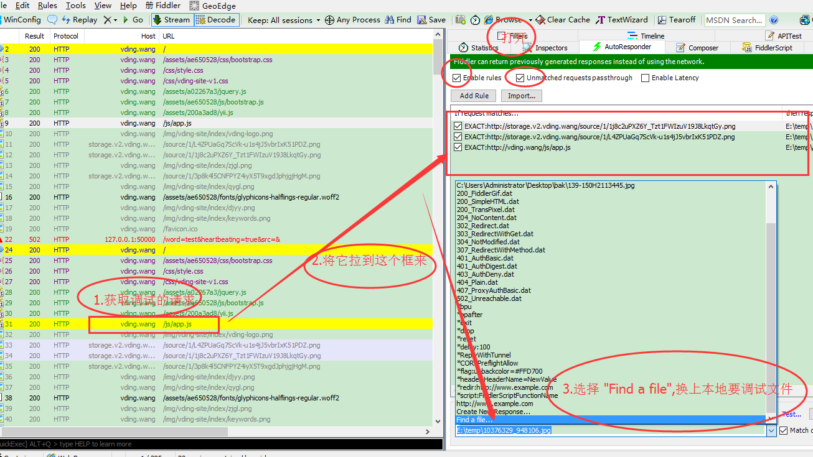
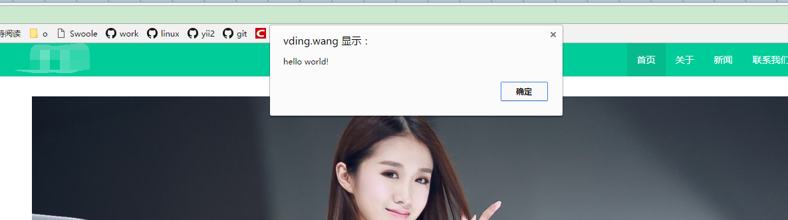
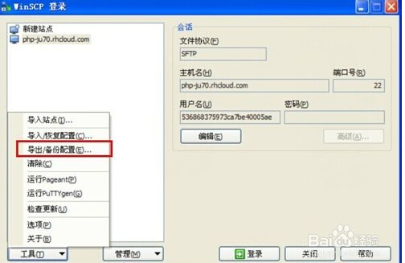
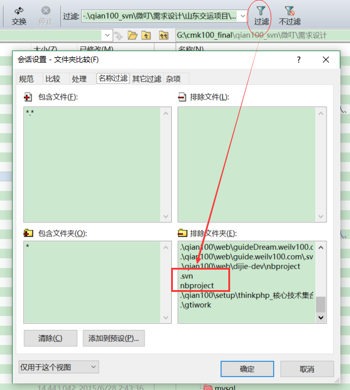
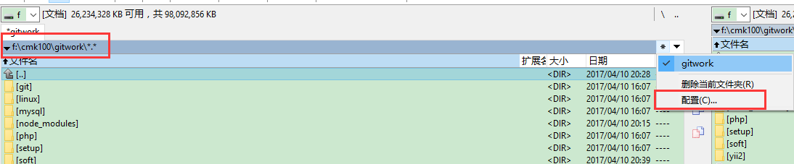
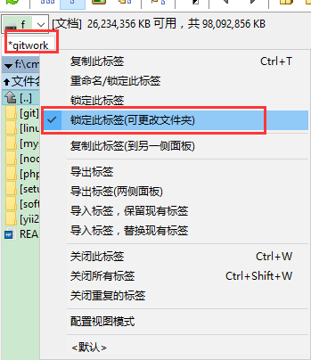

# 软件
- 下载神器
	- 流媒体
		- Chrome 配合 IDM 
			- 安装 Internet Download Manager （IDM）
				- 官网地址 https://www.internetdownloadmanager.com/
			- 启动 Chrome ，提示添加了 IDM Integration Module 扩展
		- VSO Downloader [破解版已放百度云盘]
- excel
	- 相对单元格如 A3变为 $A$3
		- 固定单元格A3与其它的单元计算 如 $A$3 * A4
- 抓包工具
	- Fiddler
		- 前端线上调试
			- js的调试
				- 1.下载要调试的JS文件至本地
				- 2.打开fiddler,获取要调试的请求地址,并换上本地文件

					
				- 3.结果显示

				
- winscp 配置导入与导出
	- 
- bitbucket
	- 验证码恢复[二次密码]
		- ssh git@bitbucket.org recovery_codes //输入密码
		- 获取一串数字,选择其中一个即可
- Beyound Compare
	- 排除 右键+输入E
	- 过滤目录[排除文件夹] 继续整理中

  

	 .svn
	 nbproject
	  
- markdown
	- [markdownw使用](markdown.md)
	- [markdownpad](markdownpad.md)
- phpStorm
	- license
		-  http://idea.imsxm.com
		-  http://idea.qinxi1992.cn
		-  http://idea.lanyus.com
		-  http://idea.qinxi1992.cn
		-  http://jetbrains.tencent.click
		-  http://idea.iteblog.com/key.php
	-  内网
		-  http://192.168.97.1:8888/
		-  http://192.168.2.1:8888/

- editplus
	- 用户名：Free User   注册码：6AC8D-784D8-DDZ95-B8W3A-45TFA 
- Total Commander常用 
	- 标签 
		- 打开 ctrl+t
		- 关闭 ctrl+w
	- 自定义目录上标签 
		- 1.打开目录 
		- 2.点击最右边"*" [星号],配置目录名及路径  
			
		- 3.右键"标签",选择   
			 
		
- Cmder-Win下必备神器(替换cmd.exe)
	- Cmder.exe /REGISTER ALL  //添加 cmder 到右键菜单
	- 配置
		- [配置目录](cmder.md#配置目录)
		- [配置默认启动目录](cmder.md#配置默认启动目录)
	- 常用快捷键
		- alt+shift+数字： 标签切换
		- Alt + enter： 切换到全屏状态；
		- Ctr+r 历史命令搜索;
		- Alt+F4：关闭所有页签
		- Ctrl+Tab：切换页签;
		- Tab：自动路径补全(爽,赞！)
		- Ctrl+T：建立新页签；
 - 路由器
	- ss上不了网的解决方案
		- 修改DNS Provider第二或第三选项 与 端口由原来的 443修改为53
	- 有时候2.4信号或5信号找不到
		- 修改无线区域 
	- 刷机
		- 工具
			- [路由器刷breed Web助手下载](http://qiannao.com/ls/huzibbs/01399c29/)
				- [官网](http://www.itkeji.top "官网")
			- [breed包下载](https://breed.hackpascal.net/)
			- [固件下载](http://p4davan.80x86.io/download/ " 固件下载")
		- [newifi_y1_R6850刷机](route/newifi_y1s_R6850/README.md)
		