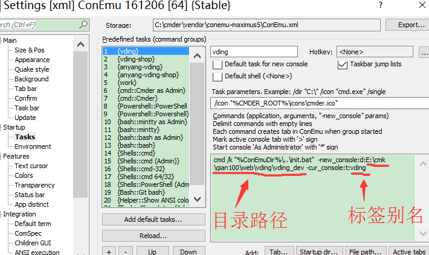
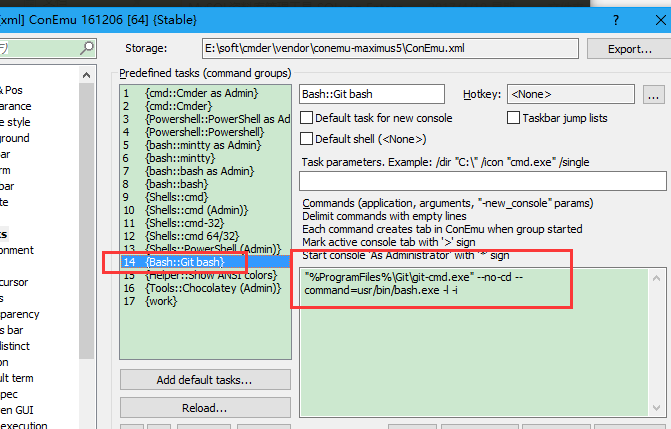
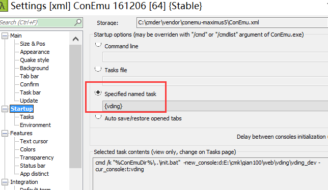
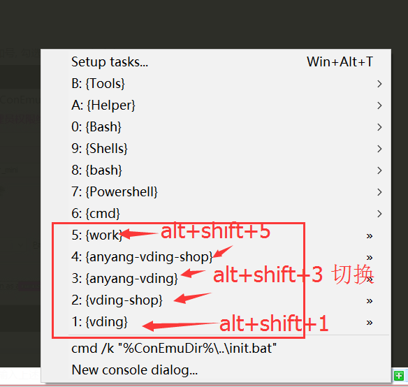

#Cmder
来源：http://blog.csdn.net/lhorse003/article/details/60959504

##配置
###配置目录


###方案1 

#### 参数1  为空  

#### 参数2

完整的例子如下

```
"%ConEmuDrive%\Program Files\Git\git-cmd.exe" --no-cd --command=usr/bin/bash.exe -l -i  -new_console:d:E:\cmk\qian100\web\vding\vding_dev -cur_console:t:vding
```
注:
```php
 //关于
"%ConEmuDrive%\Program Files\Git\git-cmd.exe" --no-cd --command=usr/bin/bash.exe -l -i


```

//来源于



###配置默认启动目录


##常用快捷键

###标签切换
