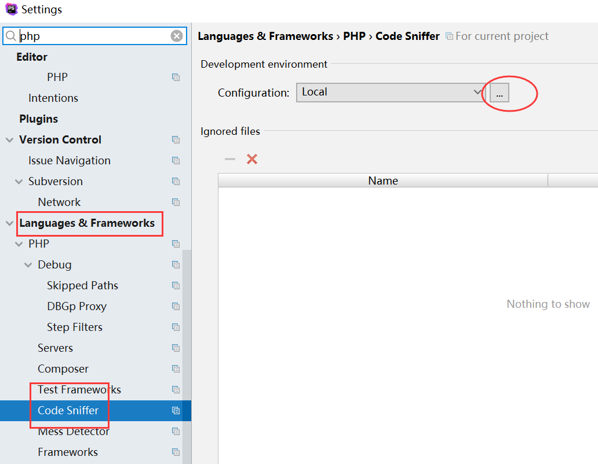
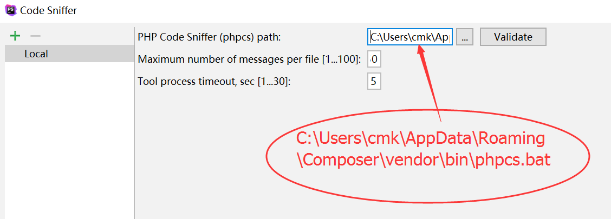
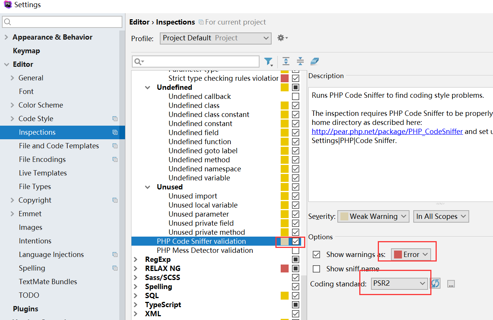
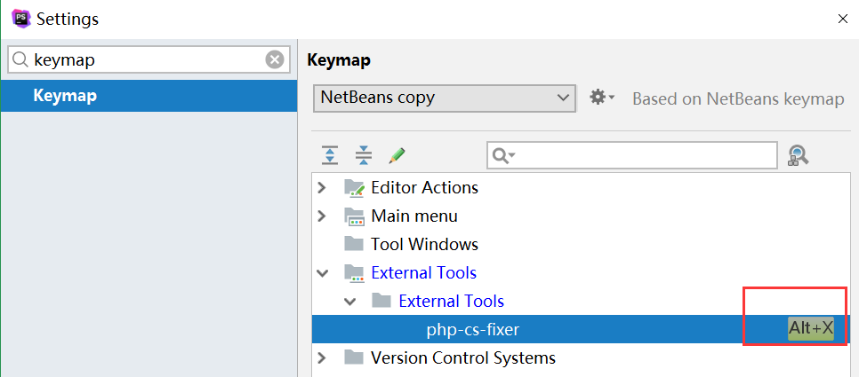

# phpStorm

## CodeSniffer
> [参考地址](https://confluence.jetbrains.com/display/PhpStorm/PHP+Code+Sniffer+in+PhpStorm)

**1.composer全局安装**
```
composer global require "squizlabs/php_codesniffer=*"


$ composer global require "squizlabs/php_codesniffer=*"                                                                
Changed current directory to C:/Users/cmk/AppData/Roaming/Composer                                                     
./composer.json has been updated                                                                                       
Loading composer repositories with package information                                                                 
Updating dependencies (including require-dev)                                                                          
Package operations: 1 install, 0 updates, 0 removals                                                                   
  - Installing squizlabs/php_codesniffer (3.0.2): Downloading (100%)                                                   
Package fabpot/php-cs-fixer is abandoned, you should avoid using it. Use friendsofphp/php-cs-fixer instead.            
Writing lock file                                                                                                      
Generating autoload files                                                                                              
``` 
上面获了以地址 
C:\Users\cmk\AppData\Roaming\Composer\vendor\bin\phpcs.bat


**2.phpStorm配置**
> [参考地址](https://blog.skyx.in/archives/207/)





## PHP-CS-Fixer

**composer安装**
```
composer global require fabpot/php-cs-fixer
```

**配置安装**
>composer global require fabpot/php-cs-fixer  


**配置快捷方式**
> File > Settings > Keymap  



