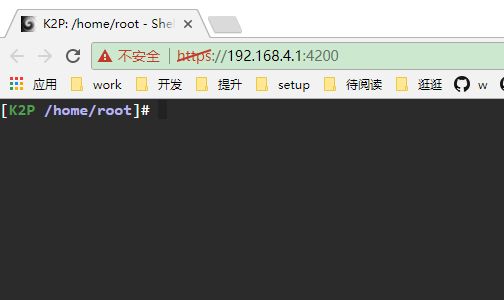

# 华硕固件配置

# SS的配置
## 添加节点的顺序
```
 s4.sxiami.com	 
 s5.sxiami.com	 	 	 	 
 s2.sxiami.com	 	 
 s9.sxiami.com	 	 
 s12.sxiami.com	 	 
 s11.sxiami.com	 	 
i6s1.sxiami.com	 
```

## 开启webshell
https://192.168.4.1:4200/




## ssh开启ss

```
nvram set google_fu_mode=0xDEADBEEF
nvram commit
```
