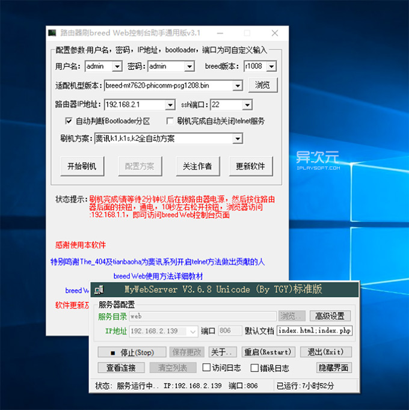

# k2_PSG1218刷机

## 使用 Breed Web 助手通用版刷机
> 工具已经在当前目录下  

 

- 将电脑通过「网线」连接到路由器的 LAN 口，WIFI 不行哦！
- 右键点击“Breed Web 助手通用版.exe”，选择「以管理员身份运行」的方式启动
- 刷机方案选择「斐讯k1,k1s,k2全自动方案」，其他地方不需改动
- 直到软件显示「刷机完成」后，等待2分钟左右拔掉路由器电源
- 在断电状态下，按住路由器后面的重置按钮不放，插上电源，持续按住10秒左右，再松开按钮，等待1分钟。
- 如果顺利，这时应该可以通过电脑浏览器访问 192.168.1.1 进入到「breed Web 控制台界面」了