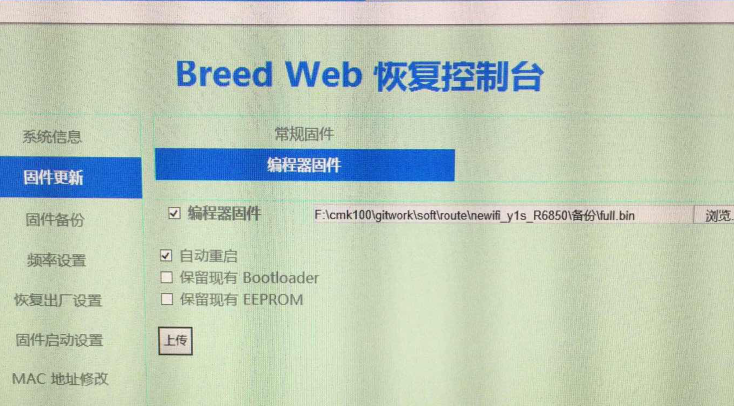

配置情况 | &nbsp;
------------ | -------------
CPU | MediaTek MT7620A ver 2, eco 6
内存  |256MB DDR2
Flash | Winbond W25Q128 @ 24MHz (16MB) 
以太网 | MediaTek MT7620A built-in 5-port 10/100M switch 
时钟频率 | CPU:  580MHz, Bus: 193MHz 
编译日期 | 2017-06-13 [git-2df7776] 
版本 | 1.1 (r1016) 

## 刷机过程 
> 参数 "Newifi-y1路由器第三方固件玩机教程.html" 和 "breed Web刷机升级详细教材修正编译器固件说明.html"
- 把路由器Y1用网线跟电脑连接，去设置本地连接的IP固定为192.168.1.2，子网255.255.255.0
- 进入"恢复模式"
	- 拔掉电源，按住复位键，再插入电源，等待6秒松开复位键。
	- 打开浏览器输入192.168.1.1,**使用IE浏览器**
	- 上传指定的breed文件,完毕之后
		- 再次拔掉电源，按住复位插入电源等待6秒松开。这时候进入breed的恢复页面了，证明breed刷入成功。
- 进入 "恢复控制台"
	- 恢复出厂设置 使用默认 点击"执行"
	- 固件备份 "**EEPROM**" 和 "**编辑器固件**" 

## 还原之前系统
- 固件更新 -> 编辑器固件 选择 "编辑器固件" 即可
 
	
