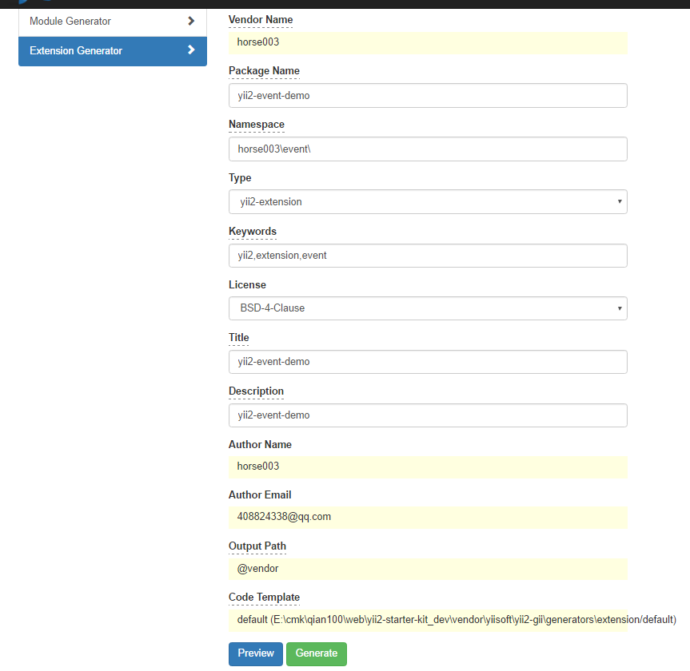
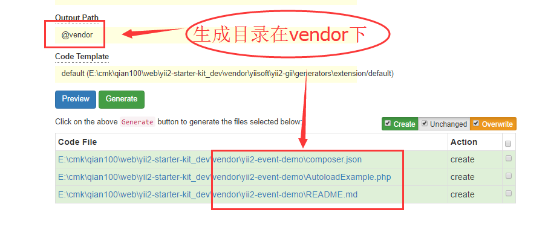
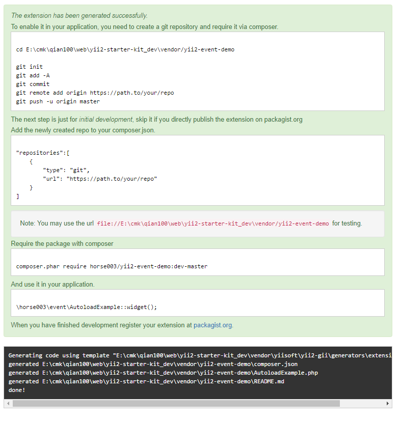

#扩展

##自定义扩展
>猫与老鼠事件

###1.实现gii生成extension

##自定义路径

##生成结果

#### 生成之后
```php
The extension has been generated successfully.
To enable it in your application, you need to create a git repository and require it via composer.

cd E:\cmk\qian100\web\yii2-starter-kit_dev\vendor/yii2-event-demo

git init
git add -A
git commit
git remote add origin https://path.to/your/repo
git push -u origin master
The next step is just for initial development, skip it if you directly publish the extension on packagist.org
Add the newly created repo to your composer.json.

"repositories":[
    {
        "type": "git",
        "url": "https://path.to/your/repo"
    }
]
Note: You may use the url file://E:\cmk\qian100\web\yii2-starter-kit_dev\vendor/yii2-event-demo for testing.
Require the package with composer

composer.phar require horse003/yii2-event-demo:dev-master
And use it in your application.

\horse003\event\AutoloadExample::widget();
When you have finished development register your extension at packagist.org.
```

##注：会向几处写入信息
- vendor\composer\autoload_psr4.php
- vendor/yiisoft/extensions.php

##访问的路径
http://ysk.dev/admin/demo-event/animal  
---

##将别人扩展放入自己的仓库_然后从自己的仓库调用

```php
//1.先定义仓库
"repositories": [
    {
      "type": "git",
      "url": "https://github.com/xxxx/yii2-aceeditor.git"
    },
    {
      "type": "git",
      "url": "https://github.com/xxxx/yii2-alipay.git"
    },
    {
      "type": "git",
      "url": "https://github.com/xxxx/yii2-rsa.git"
    },
    {
      "type": "git",
      "url": "https://github.com/xxxx/yii2-noty.git"
    },
    {
      "type": "git",
      "url": "https://github.com/xxxx/yii2-bootstrap-sweetalert.git"
    },
    {
      "type": "git",
      "url": "https://github.com/xxxx/probe.git"
    },
    {
      "type": "git",
      "url": "https://github.com/xxxx/yii2-file-log-reader.git"
    },
    {
      "type": "git",
      "url": "https://github.com/xxxx/yii2-sms-module.git"
    }
  ],

//2.在加载上面的名字的时间,会查一下上面的仓库是否有对应在的名字
"require": {
    "php": ">=5.5.0",
    "ext-intl": "*",

    "trntv/yii2-aceeditor": "^2.0",
    "trntv/probe": "^0.2",
    "funson86/yii2-alipay": "^1.0",
    "ihacklog/yii2-rsa": "*@dev",****
    "ihacklog/yii2-sms-module": "*",
    "makroxyz/yii2-bootstrap-sweetalert": "*",
    "zabachok/yii2-file-log-reader": "*@dev",
  },
```