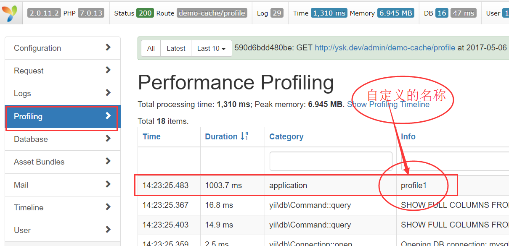

# 调试

## beginProfile  代码区间性能检测

```php
    /**
     * http://ysk.dev/admin/demo-cache/profile
     * 检查区间的性能,如耗时多少秒
     * @author cmk
     */
    public function actionProfile() {
        \Yii::beginProfile('profile1');
        echo 'aaaabbbbccc';
        sleep(1);
        \Yii::endProfile('profile1');
        exit;
    }
````
**debug查看**




## yii2_admin定义Profile

**vendor/mdmsoft/yii2-admin/models/Route.ph**
```php
protected function getRouteRecrusive($module, &$result) {
    $token = "Get Route of '" . get_class($module) . "' with id '" . $module->uniqueId . "'";
    Yii::beginProfile($token, __METHOD__);  //定义此
    try {
        dp($module->getModules());
        foreach ($module->getModules() as $id => $child) {
            if (($child = $module->getModule($id)) !== null) {
                $this->getRouteRecrusive($child, $result);
            }
        }

        foreach ($module->controllerMap as $id => $type) {
            $this->getControllerActions($type, $id, $module, $result);
        }

        $namespace = trim($module->controllerNamespace, '\\') . '\\';
        $this->getControllerFiles($module, $namespace, '', $result);
        $all = '/' . ltrim($module->uniqueId . '/*', '/');
        $result[$all] = $all;
    } catch (\Exception $exc) {
        Yii::error($exc->getMessage(), __METHOD__);
    }
    Yii::endProfile($token, __METHOD__);
}
```