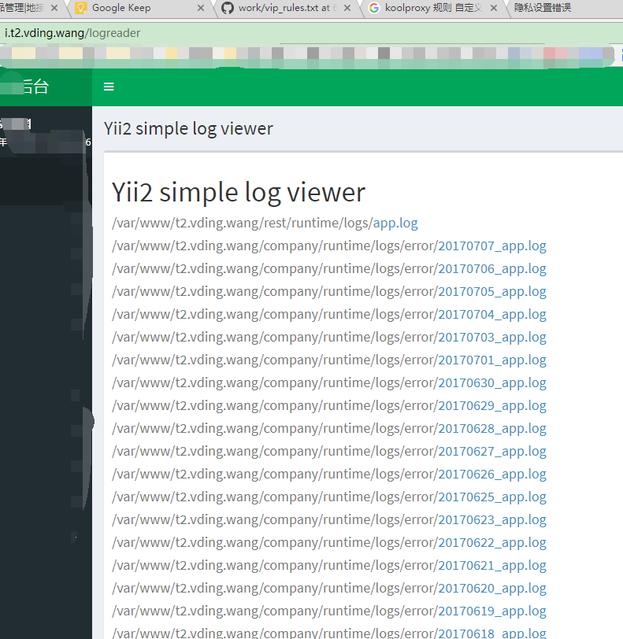
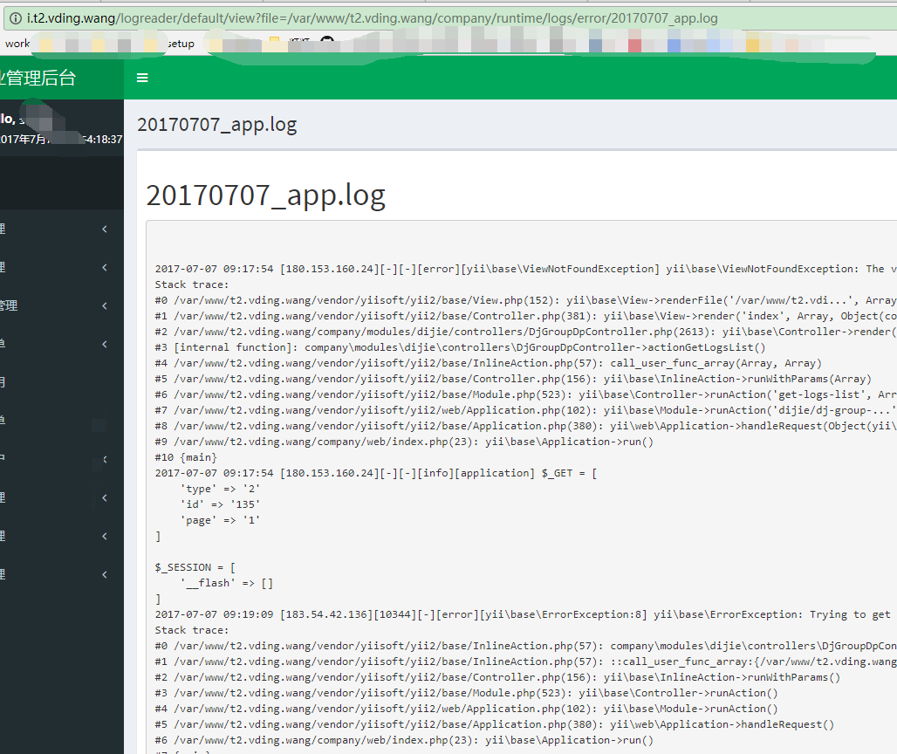

# 日志
# logreader

## logreader配置
**common/config/base.php**
```php
'modules' => [
    'logreader' => [
        'class' => 'zabachok\logreader\Module',
        'sources' => [
            '@company/runtime/logs/error',
            '@rest/runtime/logs',
            '@frontend/runtime/logs',
        ],
    ],
]
```
## logreader使用
> http://i.t2.vding.wang/logreader  




