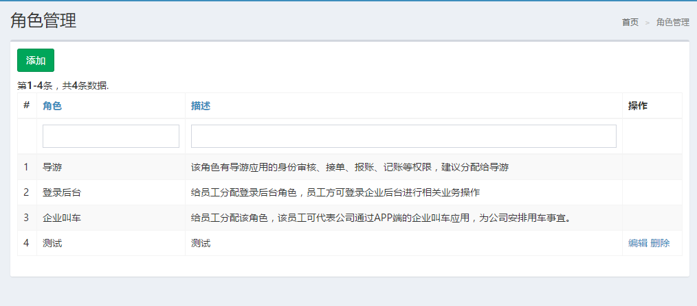
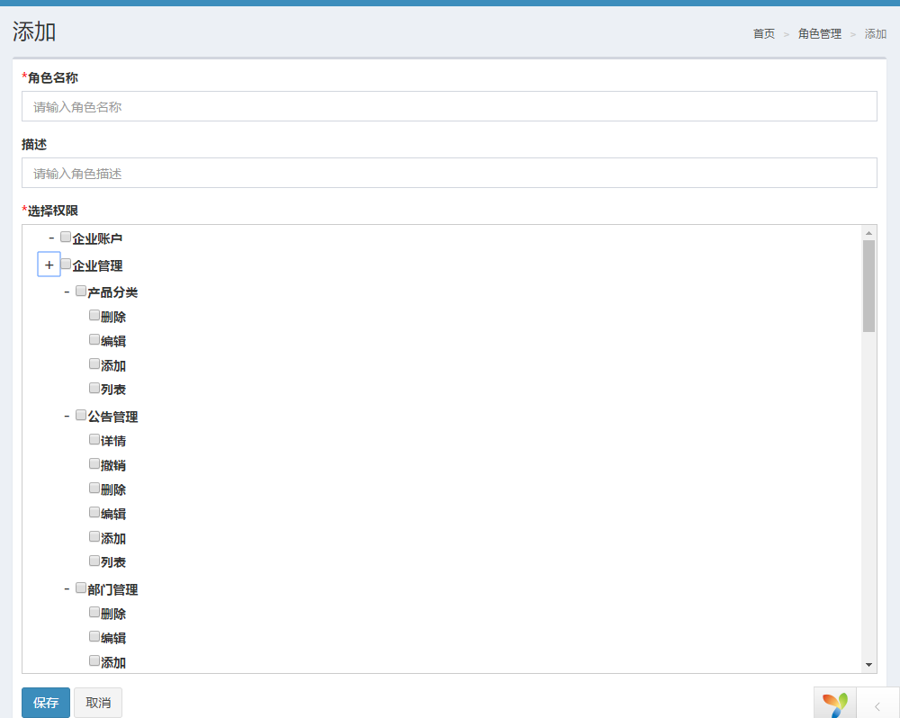
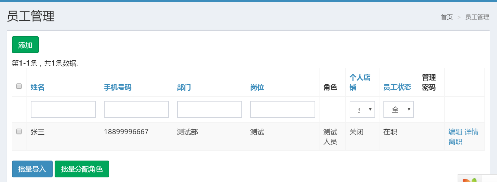
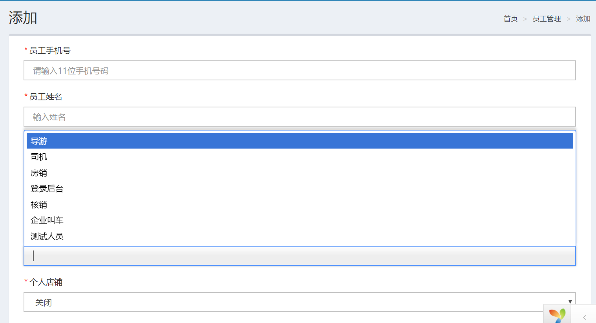
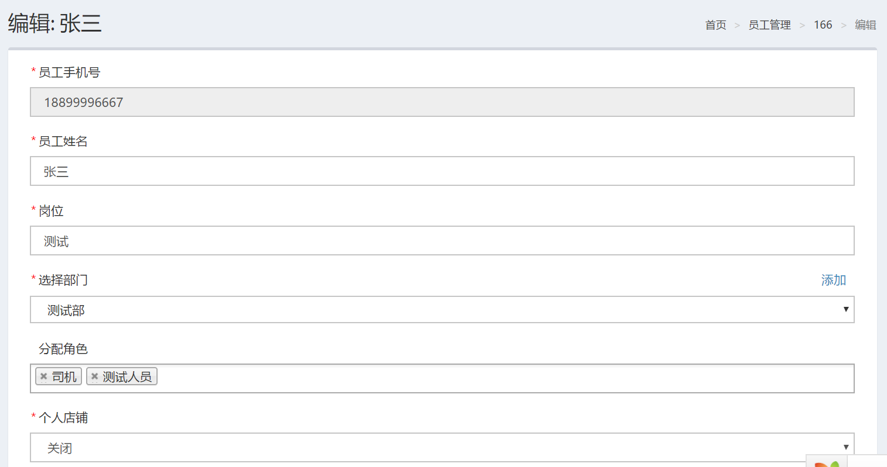
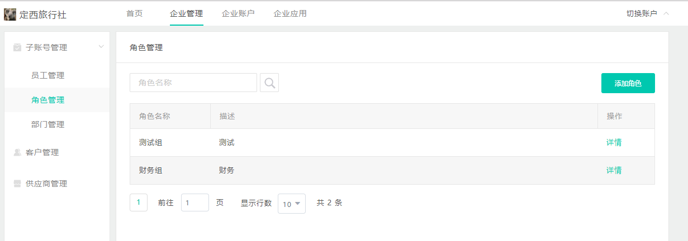
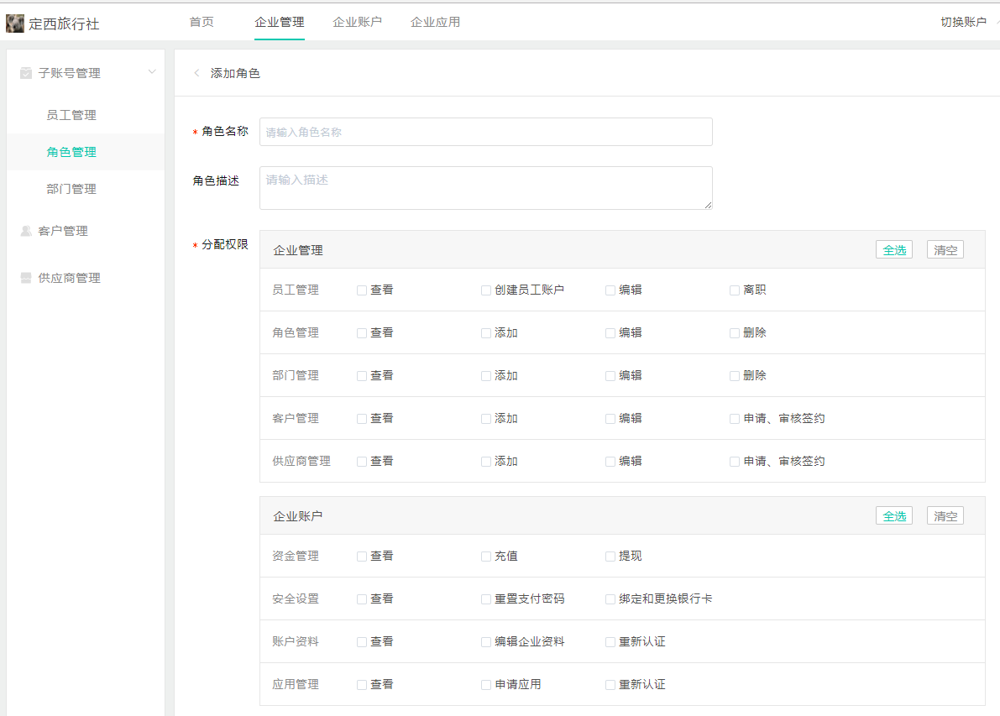
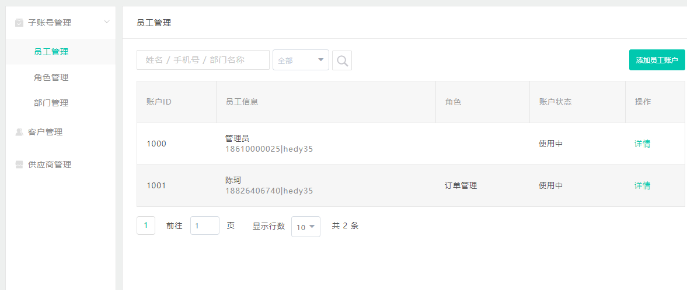
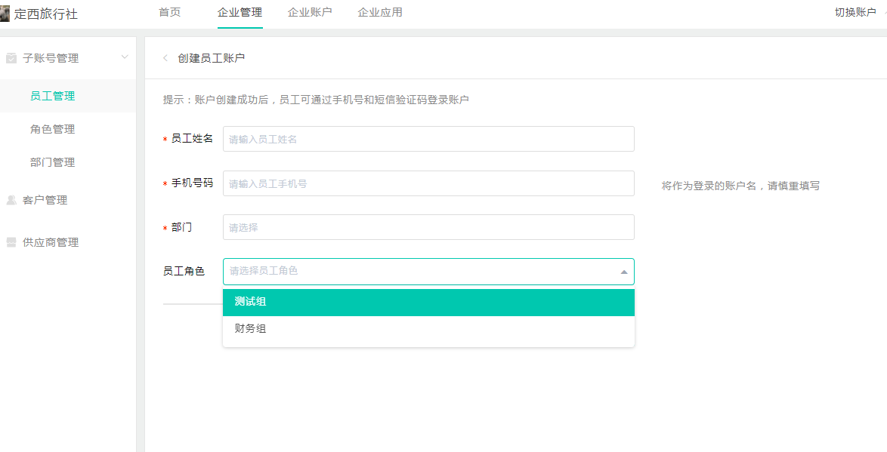

# 权限

## 企业后台_globalAccesss配置

```php
'as globalAccess'=>[
         'class'=>'\common\behaviors\GlobalAccessBehavior',
         'rules'=>[
             [
                 'controllers'=>['sign-in'],
                 'allow' => true,
                 'roles' => ['?'],
                 'actions'=>['login']
             ],
             [
                 'controllers'=>['sign-in'],
                 'allow' => true,
                 'roles' => ['@'],
                 'actions'=>['logout']
             ],
             [
                 'controllers'=>['site'],
                 'allow' => true,
                 'roles' => ['?', '@'],
                 'actions'=>['error']
             ],
             [
                 'controllers'=>['debug/default'],
                 'allow' => true,
                 'roles' => ['?'],
             ],
             [
                 'controllers'=>['user'],
                 'allow' => true,
                 'roles' => ['administrator'],
             ],
             [
                 'controllers'=>['user'],
                 'allow' => false,
             ],
             [
                 'allow' => true,
                 'roles' => ['manager'],
             ]
         ]
     ]
];
```

## 企业后台权限控制_v1

[源代码](rbac/企业后台权限控制_v1_source)  

# 3个表

## 表的数据结构
```

#auth_assign  角色指派 

CREATE TABLE `auth_assign` (
  `auth_item_id` int(11) NOT NULL,
  `auth_item_name` varchar(64) CHARACTER SET utf8 COLLATE utf8_bin NOT NULL COMMENT '角色名、权限名',
  `user_id` int(11) NOT NULL,
  `company_id` int(11) NOT NULL COMMENT '企业ID',
  `created_at` int(11) DEFAULT NULL,
  `updated_at` int(11) DEFAULT NULL,
  PRIMARY KEY (`auth_item_id`,`user_id`,`company_id`)
) ENGINE=InnoDB DEFAULT CHARSET=utf8 COMMENT='用户关联角色表'


# auth_item  创建权限

CREATE TABLE `auth_item` (
  `id` int(11) unsigned NOT NULL AUTO_INCREMENT COMMENT '主键ID',
  `name` varchar(64) CHARACTER SET utf8 COLLATE utf8_bin NOT NULL COMMENT '角色名、权限名',
  `url` varchar(64) CHARACTER SET utf8 COLLATE utf8_bin DEFAULT NULL,
  `industry_appid` tinyint(11) DEFAULT NULL COMMENT '企业开通的应用//look_up(industry_appid)',
  `company_id` int(11) DEFAULT '0' COMMENT '企业ID 0表示共用',
  `parent_id` int(11) DEFAULT '0' COMMENT '父级',
  `type` tinyint(4) NOT NULL COMMENT '类型：1角色 2权限,3 特殊权限,4 菜单',
  `description` text CHARACTER SET utf8 COLLATE utf8_bin COMMENT '描述',
  `visible` tinyint(4) DEFAULT '1' COMMENT '是否显示//0 否，1 是',
  `level` tinyint(4) DEFAULT '0' COMMENT '级别//-1 type为角色时,0 应用（模块级）， 1 控制器， 2  操作 ',
  `depth` int(4) DEFAULT '0' COMMENT '节点深度// 顶级 0 ， 一级 1，  二级 2 ， 三级 3 ... (程序如果需要可以使用这个字段）',
  `status` tinyint(11) unsigned DEFAULT '1' COMMENT '状态 1有效 0无效',
  `sort` mediumint(8) DEFAULT '0' COMMENT '排序，值越大，排越前',
  `created_at` int(11) DEFAULT NULL,
  `updated_at` int(11) DEFAULT NULL,
  `is_platform` tinyint(4) DEFAULT '0' COMMENT '是否为平台角色权限 1:是 0:不是',
  PRIMARY KEY (`id`),
  KEY `type` (`type`) USING BTREE,
  KEY `company_id` (`company_id`) USING BTREE,
  KEY `url` (`url`) USING BTREE,
  KEY `id` (`id`)
) ENGINE=InnoDB AUTO_INCREMENT=4617 DEFAULT CHARSET=utf8 COMMENT='角色、权限表'


#auth_item_child  创建角色

CREATE TABLE `auth_item_child` (
  `parent` int(11) NOT NULL COMMENT 'auth_item=>id type=1',
  `child` int(11) NOT NULL COMMENT 'auth_item=>id type=2',
  PRIMARY KEY (`parent`,`child`),
  KEY `child` (`child`)
) ENGINE=InnoDB DEFAULT CHARSET=utf8 COMMENT='角色权限关联表'

```

## 配置文件及过滤

### 配置文件

**company/config/web.php**

```php
 'as globalAccess'=>[
        'class'=>'\common\behaviors\GlobalAccessBehavior',
        'accessControlFilter' => 'common\filters\UrlAccessFilter',
        
    ],
```

### 改造过的过滤器

**common/filters/UrlAccessFilter.php**

```php
namespace common\filters;

use Yii;
use yii\base\ActionFilter;
use yii\web\ForbiddenHttpException;
use company\models\AuthAssign;
use yii\di\Instance;
use yii\caching\Cache;

class UrlAccessFilter extends ActionFilter
{
    public $db = 'db';

    public $cache;

    public $cacheKey = 'vding_rbac';

    /**
     * @var Item[] all auth items (name => Item)
     */
    protected $items;

    public $denyCallback;

    public $rules;

    /**
     * 需要登录但是不需要rbac控制的
     * @var array
     */
    public $noRbacController = [
        'site', // site/error default error handle action
        'debug',
        'util',
        'admin-notice',
        'company-notice',
        'alipay',

    ];

    /**
     * 不需要登录的
     * @var array
     */
    public $publicController= [
        'sign-in',
        'payment',
        'binding',
    ];

    public $publicModules = [
        'shop',
    ];

    public $noRbacModules = [
        'debug',
        'ucenter',
        'admin',
    ];

    public $noRbacAction = [
        'index/index',
        'company-account/check-condition',//检测提现条件是否满足  例如：实名认证，设置支付密码，綁卡
        'car/requisition/validate-form',
        'auth/load-auth-date',//异步加载权限数据
        'product-line/list',//线路管理--列表--view
        'product-line/preset-setting',//线路管理--预定设置--view
        'product-line/price-date',//线路管理--价格班期--view
        'product-line/delivery',//线路管理--分销商须知--view
        'product-line/detail',//线路管理--详情--view
        'product-line/to-do-list',
        'product-line/procurement',
        'product-line/order-list',//线路订单管理列表
        'product-line/order-detail',//线路订单详情

        'file-storage/upload-imperavi',//编辑器上传图片
        'product-line/product-route-view',//线路详情页面
        'product-line/product-trip-list',//行程列表
        'product-line/base-info',//基本信息--view
        'product-line/travel',//行程安排--view
        'line-order/order-list',//线路订单列表
        'index/admin-pwd-set',//首次登录企业设置管理密码
    ];

    /**
     * @param \yii\base\Action $action
     * @return bool
     * @throws ForbiddenHttpException
     */
    public function beforeAction($action)
    {
        $module_id = $action->controller->module->id;
        $url = $action->getUniqueId();
        $controller = $action->controller->id;
        $user = Yii::$app->user;

        //fix module layout
        if (in_array($module_id, ['sms', 'settings', 'lookup', 'log', 'key-storage', 'cache', 'file-manager', 'system-information'])) {
            Yii::$app->name = '平台管理后台';
            $action->controller->layout = '@company/modules/admin/views/layouts/main'; //your layout name
        }

        if (in_array($module_id, $this->publicModules)) {
            $action->controller->layout = 'main'; //your layout name
        }

        if (in_array($module_id, $this->publicModules)) {
            return true;
        }
        if (in_array($controller, $this->publicController)) {
            return true;
        }
        //登录检测
        if ($user->getIsGuest()) {
            $user->loginRequired();
            return false;
        }
        if (in_array($controller, $this->noRbacController)) {
            return true;
        }
        if (in_array($module_id, $this->noRbacModules)) {
            return true;
        }
        if (in_array($url, $this->noRbacAction)) {
            return true;
        }

        $userId = Yii::$app->user->getId();
        $compnayId = Yii::$app->user->getCompanyId();
        if ($compnayId) {
            if (Yii::$app->user->isCompanySuperUser()) {
                //超级管理员不检测
                return true;
            }
            $items = AuthAssign::findByUserId($userId, $compnayId);
            foreach ($items as $item) {
                foreach($item->authItem->children as $node) {
                    if ($node) {
                        if ($url == trim($node->url, '/')) {
                            return true;
                        }
                    }
                }
            }
        }
        //必须是 company_id = 1 的用户才能进这里
        if (in_array($module_id, ['admin', 'sms', 'lookup']) && $compnayId && Yii::$app->user->isAdminCompany()) {
            if (Yii::$app->user->isCompanySuperUser()) {
                //超级管理员不检测
                return true;
            }
            $items = AuthAssign::findByUserId($userId, 1);
            foreach ($items as $item) {
                foreach($item->authItem->children as $node) {
                    if ($node) {
                        if ($url == trim($node->url, '/')) {
                            return true;
                        }
                    }
                }
            }
        }
        if ($this->denyCallback !== null) {
            call_user_func($this->denyCallback, null, $action);
        } else {
            $this->denyAccess($url);
        }
        return false;
    }

    /**
     * Denies the access of the user.
     * The default implementation will redirect the user to the login page if he is a guest;
     * if the user is already logged, a 403 HTTP exception will be thrown.
     * @param User $user the current user
     * @throws ForbiddenHttpException if the user is already logged in.
     */
    protected function denyAccess($url)
    {
        $user = Yii::$app->user;
        if ($user->getIsGuest()) {
            $user->loginRequired();
        } else {
            throw new ForbiddenHttpException(Yii::t('yii', 'You are not allowed to perform this action.'));
        }
    }
}

```

## auth_item
> 添加权限  

### auth_item_列表页
>http://i.vding.dev/route/


### auth_item_创建页

> 访问的地址:http://i.vding.dev/route/create


```php
/**
 * 新增
 * @return mixed
 */
public function actionCreate()
{
    $request = Yii::$app->request;
    $model = new AuthItem();  
    
    $model->type = 1;
    if ($model->load($request->post()) && $model->save()) {
        return $this->redirect(['view', 'id' => $model->id]);
    } else {
        $parent_id = $request->get('id',0);
        $model->parent_id = $parent_id;
        $look_data = Lookup::find()->where(['type'=>'industry_appid'])->asArray()->all();
        $industry_appid = ArrayHelper::map($look_data, 'code','name');
        return $this->render('create', [
            'model' => $model,
            'industry_appid'=>$industry_appid
        ]);
    }

   
}

```

## auth_item_child
> 创建角色使用  

[时序图](../uml/rbac_vding_v1/角色添加.oom)  

### auth_item_child_列表页

> http://i.vding.dev/auth/index  




**company/controllers/AuthController.php**

```php
/**
 * 角色列表
 * @return mixed
 */
public function actionIndex()
{
    $searchModel = new AuthItemSearch(['type' => AuthItem::TYPE_ROLE]);
    $dataProvider = $searchModel->search(Yii::$app->request->queryParams);

    //ajax
    if (Yii::$app->request->getIsAjax()) {
        Yii::$app->getResponse()->format = Response::FORMAT_JSON;
        return $dataProvider->getModels();
    }
    return $this->render('index', [
        'searchModel' => $searchModel,
        'dataProvider' => $dataProvider,
    ]);
}
```

### auth_item_child_创建页
> 创建角色  
> http://i.vding.dev/auth/create  




```php
/**
 * 创建角色
 * @return mixed
 */
public function actionCreate()
{
    $model = new AuthItem();
    $model->type = AuthItem::TYPE_ROLE;
    if ($model->load(Yii::$app->request->post())) {
        Yii::$app->getResponse()->format = Response::FORMAT_JSON;
        $purview = Yii::$app->request->post('AuthItem')['purview'];
        $model->company_id = Yii::$app->user->getCompanyId();
        //编辑角色与权限
        if ($model->editAuth(1, $purview)) {
            $back['status'] = 1;
            $back['message'] = '';
            $back['url'] = Url::to(['auth/index']);
            return $back;
        } else {
            $back['status'] = 0;
            $back['message'] = current($model->errors)[0];
            $back['url'] = '';
            return $back;
        }
    } else {
        return $this->render('create', [
            'model' => $model,
        ]);
    }
}

```

### 权限入库 [auth_item_child]

```php
/**
 * 编辑角色与权限
 * @param int       $type       1:添加    2：修改
 * @param string    $purview    权限，多个权限则逗号隔开
 * @param int       $id         角色id，只有type=2的时候才用上
 * @return bool
 */
public function editAuth ($type = 1, $purview = '', $id = '') {
    if ($type == 1) {
        try {
            $trans = Yii::$app->db->beginTransaction();
            //第一步：保存角色基本信息
            if (!$this->save()) {
                $this->addError(array_keys($this->errors)[0],current($this->errors)[0]);
                throw new Exception(current($this->errors)[0]);
            }
            
            //第二步：为该角色添加新的权限
            if (!empty($purview)) {
                $arr_purview = explode(',', $purview);
                $rows = array();
                foreach ($arr_purview as $k=>$v) {
                    $rows[$k]['parent'] = $this->primaryKey;
                    $rows[$k]['child']  = $v;
                }
                //批量添加
                if (!ModelHelper::saveAll('auth_item_child', $rows)) {
                    $this->addError('add','操作失败');
                    throw new Exception('操作失败');
                }
            }
            
            $trans->commit();
            return true;
        } catch (\Exception $e) {
            $trans->rollback();
            return false;
        }
        
        
    } elseif ($type == 2) {
        try {
            $trans = Yii::$app->db->beginTransaction();
            //第一步：保存角色基本信息
            if (!$this->save()) {
                $this->addError(array_keys($this->errors)[0],current($this->errors)[0]);
                throw new Exception(current($this->errors)[0]);
            }
            
            //第二步：删除改角色原来所有的权限
            if (!AuthItemChild::deleteAll(['parent'=>$id])) {
                $this->addError('update','操作失败');
                throw new Exception('操作失败');
            }
            
            //第三步：为该角色添加新的权限
            if (!empty($purview)) {
                $arr_purview = explode(',', $purview);
                $rows = array();
                foreach ($arr_purview as $k=>$v) {
                    $rows[$k]['parent'] = $id;
                    $rows[$k]['child']  = $v;
                }
                //批量添加
                if (!ModelHelper::saveAll('auth_item_child', $rows)) {
                    $this->addError('update','操作失败');
                    throw new Exception('操作失败');
                }
            }
            
            $trans->commit();
            return true;
        } catch (\Exception $e) {
            $trans->rollback();
            return false;
        }

    }
}

```


### 选择权限_列表

> http://i.vding.dev/auth/load-auth-date  

```php
/异步加载权限数据
public function actionLoadAuthDate() {
    //ajax请求
	//编辑的时候才有ID,如 http://i.vding.dev/auth/update?id=4616
    $id = Yii::$app->request->post('id');
    $company_id = Yii::$app->user->CompanyId;
    if ($company_id == 1) {
        $is_platform = '';
    } else {
        $is_platform = 0;
    }
    
    //得到审核通过的应用
    $company_app_data = CompanyApp::find()->where(['company_id'=>$company_id,'audit_status'=>2])->all();
    $industry_appid = [8];//企业基础应用
    if ($company_app_data && count($company_app_data)>0) {
        foreach ($company_app_data as $k=>$v) {
            $industry_appid[] = $v['industry_app_id'];
        }
        array_unique($industry_appid);//去重
    }
    
    if (Yii::$app->request->isPost && !empty($id)) {
        Yii::$app->response->format = Response::FORMAT_JSON;
        //获取角色目前所拥有的权限节点
        $power = AuthItemChild::find()->where(['parent'=>$id])->asArray()->all();
        //获取所有权限节点
        $all_node = AuthItem::find()->where(['IN', 'type', [2,4]])->andWhere(['status'=>1])
                    ->andWhere(['or', ['company_id' => Yii::$app->user->getCompanyId()], ['company_id' => 0]])
                    ->andWhere(['in','industry_appid',$industry_appid])//得到指定应用的权限节点
                    ->andFilterWhere(['is_platform'=>$is_platform])
                    ->orderBy(['sort'=>SORT_DESC,'id'=>SORT_DESC])->asArray()->all();
        //重新组装数组结构
        $reArr = TreeHelper::getSubs($all_node);
        $reArr = $this->changeSubsEdit($reArr, $power);
        return $reArr;
    } else {
        Yii::$app->response->format = Response::FORMAT_JSON;
        //获取所有权限节点
        $all_node = AuthItem::find()->where(['IN', 'type', [2,4]])->andWhere(['status'=>1])
                    ->andWhere(['or', ['company_id' => Yii::$app->user->getCompanyId()], ['company_id' => 0]])
                    ->andWhere(['in','industry_appid',$industry_appid])//得到指定应用的权限节点
                    ->andFilterWhere(['is_platform'=>$is_platform])
                    ->orderBy(['sort'=>SORT_DESC,'id'=>SORT_DESC])->asArray()->all();
        //重新组装数组结构
        $reArr = TreeHelper::getSubs($all_node);
        $reArr = $this->changeSubsEdit($reArr, '');
        return $reArr;
    }
}

```

## auth_assign
> 指派角色 多个
[添加时序图](../uml/rbac_vding_v1/创建用户_新增角色.oom)   
[修改时序图](../uml/rbac_vding_v1/新建用户_编辑角色.oom)   

### auth_assign_列表页
> http://i.vding.dev/user-company/index  



**company/controllers/UserCompanyController.php**

```php
public function actionIndex()
{
    $userCompanyImport = new UserCompanyImport();
    $searchModel = new UserCompanySearch();
    $dataProvider = $searchModel->search(Yii::$app->request->queryParams);

    $company_id = Yii::$app->user->getCompanyId();

    //得到审核通过的应用
    $company_app_data = CompanyApp::find()->where(['company_id'=>$company_id,'audit_status'=>2])->all();
    $industry_appid = [8];//企业基础应用
    if ($company_app_data && count($company_app_data)>0) {
        foreach ($company_app_data as $k=>$v) {
            $industry_appid[] = $v['industry_app_id'];
        }
        array_unique($industry_appid);//去重
    }

    //角色列表
    $authitem_model = AuthItem::find()
                        ->where(['type'=>1,'status'=>1])
                        ->andWhere(['or', ['in','industry_appid',$industry_appid], ['company_id'=>$company_id]])
                        ->all();
    
    return $this->render('index', [
        'searchModel' => $searchModel,
        'dataProvider' => $dataProvider,
        'userCompanyImport'  => $userCompanyImport,
        'authitem_model'=>$authitem_model
    ]);
}
```


### auth_assign_创建页
 
> http://i.vding.dev/user-company/create



**company/controllers/UserCompanyController.php**

```php
public function actionCreate()
{

    if (Yii::$app->request->isPost) {
        $staff_mobile = Yii::$app->request->post('UserCompany')['staff_mobile'];
        $company_id = Yii::$app->user->getCompanyId();
        $model = UserCompany::find()->where(['company_id'=>$company_id,'staff_mobile'=>$staff_mobile,'is_deleted'=>1])->one();
        
        //如果员工记录存在，则更新状态，否则为创建记录
        if ($model) {
            if ($userRoles = ArrayHelper::getColumn(AuthAssign::getUserRoles($model->user_id), 'auth_item_id')) {
                $model->roleIds = $userRoles;
            }
            
            $model->staff_status = 1;
            $model->is_deleted = 0;
            if ($model->load(Yii::$app->request->post()) && $model->save()) {
                //分配角色
                AuthAssign::deleteAll(['company_id' => $company_id, 'user_id' => $model->user_id]);
                if ($model->roleIds) {
                    AuthAssign::create($model->user_id, $model->roleIds);
                }
                
                return $this->redirect('index');
            } else {
                return $this->render('create', [
                    'model' => $model,
                ]);
            }
            
        } else {
            $model = new UserCompany();
            $model->scenario = 'add_user_company';
            $model->company_id = Yii::$app->user->getCompanyId();
            if ($model->load(Yii::$app->request->post()) && $model->save()) {
                //分配角色
                AuthAssign::deleteAll(['company_id' => $company_id, 'user_id' => $model->user_id]);
                if ($model->roleIds) {
                    AuthAssign::create($model->user_id, $model->roleIds);
                }
                
                return $this->redirect('index');
            } else {
                return $this->render('create', [
                    'model' => $model,
                ]);
            }
        }
        
    } else {
        $model = new UserCompany();
        $model->company_id = Yii::$app->user->getCompanyId();
        
        return $this->render('create', [
            'model' => $model,
        ]);
    }
    
}
```

### auth_assign_编辑



```php
  public function actionUpdate($id)
    {
        $model = $this->findModel($id);
        $company_id = Yii::$app->user->getCompanyId();
        if ($userRoles = ArrayHelper::getColumn(AuthAssign::getUserRoles($model->user_id), 'auth_item_id')) {
            $model->roleIds = $userRoles;
        }
        if ($model->load(Yii::$app->request->post()) && $model->save()) {
            
            //分配角色
            AuthAssign::deleteAll(['company_id' => $company_id, 'user_id' => $model->user_id]);
            if ($model->roleIds) {
                AuthAssign::create($model->user_id, $model->roleIds);
            }
            return $this->redirect('index');
        } else {
            return $this->render('update', [
                'model' => $model,
            ]);
        }
    }
```

# 企业后台权限控制_v2
[源代码](rbac/企业后台权限控制_v2_source)  

## 表的数据结构_v2

```
# auth_assign  角色指派 
CREATE TABLE `auth_assign` (
  `auth_item_id` int(11) NOT NULL,
  `auth_item_name` varchar(64) CHARACTER SET utf8 COLLATE utf8_bin NOT NULL COMMENT '角色名、权限名',
  `user_id` int(11) NOT NULL,
  `company_id` int(11) NOT NULL COMMENT '企业ID',
  `created_at` int(11) DEFAULT NULL,
  `updated_at` int(11) DEFAULT NULL,
  PRIMARY KEY (`auth_item_id`,`user_id`,`company_id`)
) ENGINE=InnoDB DEFAULT CHARSET=utf8 COMMENT='用户关联角色表'

# auth_item  创建权限
CREATE TABLE `auth_item` (
  `id` int(11) unsigned NOT NULL AUTO_INCREMENT COMMENT '主键ID',
  `name` varchar(64) CHARACTER SET utf8 COLLATE utf8_bin NOT NULL COMMENT '角色名、权限名',
  `url` varchar(64) CHARACTER SET utf8 COLLATE utf8_bin DEFAULT NULL,
  `industry_appid` tinyint(11) DEFAULT NULL COMMENT '企业开通的应用//look_up(industry_appid)',
  `company_id` int(11) DEFAULT '0' COMMENT '企业ID 0表示共用',
  `parent_id` int(11) DEFAULT '0' COMMENT '父级',
  `type` tinyint(4) NOT NULL COMMENT '类型：1角色 2权限,3 特殊权限,4 菜单',
  `description` text CHARACTER SET utf8 COLLATE utf8_bin COMMENT '描述',
  `visible` tinyint(4) DEFAULT '1' COMMENT '是否显示//0 否，1 是',
  `level` tinyint(4) DEFAULT '0' COMMENT '级别//-1 type为角色时,0 应用（模块级）， 1 控制器， 2  操作 ',
  `depth` int(4) DEFAULT '0' COMMENT '节点深度// 顶级 0 ， 一级 1，  二级 2 ， 三级 3 ... (程序如果需要可以使用这个字段）',
  `status` tinyint(11) unsigned DEFAULT '1' COMMENT '状态 1有效 0无效',
  `sort` mediumint(8) DEFAULT '0' COMMENT '排序，值越大，排越前',
  `created_at` int(11) DEFAULT NULL,
  `updated_at` int(11) DEFAULT NULL,
  `is_platform` tinyint(4) DEFAULT '0' COMMENT '是否为平台角色权限 1:是 0:不是',
  `api_url` varchar(64) DEFAULT NULL,
  PRIMARY KEY (`id`),
  KEY `type` (`type`) USING BTREE,
  KEY `company_id` (`company_id`) USING BTREE,
  KEY `url` (`url`) USING BTREE,
  KEY `id` (`id`)
) ENGINE=InnoDB AUTO_INCREMENT=4993 DEFAULT CHARSET=utf8 COMMENT='角色、权限表'


# auth_item_child  创建角色
CREATE TABLE `auth_item_child` (
  `parent` int(11) NOT NULL COMMENT 'auth_item=>id type=1',
  `child` int(11) NOT NULL COMMENT 'auth_item=>id type=2',
  PRIMARY KEY (`parent`,`child`),
  KEY `child` (`child`)
) ENGINE=InnoDB DEFAULT CHARSET=utf8 COMMENT='角色权限关联表'

```

# 配置文件及过滤
## 自定义globalAccesss配置_v2
**company/config/web.php**
```php
'as globalAccess'=>[
        'class'=>'\common\behaviors\GlobalAccessBehavior',
        'accessControlFilter' => 'common\filters\UrlAccessFilter'
    ],
```

## 改造过的过滤器_v2
**common/filters/UrlAccessFilter.php**

```php

namespace common\filters;

use Yii;
use yii\base\ActionFilter;
use yii\web\ForbiddenHttpException;
use company\models\AuthAssign;
use yii\di\Instance;
use yii\caching\Cache;
use company\models\RoleManageForm;

class UrlAccessFilter extends ActionFilter
{
    public $db = 'db';

    public $cache;

    public $cacheKey = 'vding_rbac';

    /**
     * @var Item[] all auth items (name => Item)
     */
    protected $items;

    public $denyCallback;

    public $rules;

    /**
     * 需要登录但是不需要rbac控制的
     * @var array
     */
    public $noRbacController = [
        'site', // site/error default error handle action
        'debug',
        'util',
        'admin-notice',
        'company-notice',
    ];

    /**
     * 不需要登录的
     * @var array
     */
    public $publicController= [
        'sign-in',
        'settle-in', //企业入驻
        'payment',
        'binding',
        'alipay',
        'wechat-pay',
        'new',
        'sms-util',
        'upload-util',
        'verify-code',
        'alipay',
        'error',
        'city'//城市搜索
    ];

    public $publicModules = [
        'shop',
    ];

    public $noRbacModules = [
        'debug',
        'ucenter',
        'admin',
    ];

    public $noRbacAction = [
        'index/index',
        'company-account/check-condition',//检测提现条件是否满足  例如：实名认证，设置支付密码，綁卡
        'car/requisition/validate-form',
        'auth/load-auth-date',//异步加载权限数据
        'product-line/list',//线路管理--列表--view
        'product-line/preset-setting',//线路管理--预定设置--view
        'product-line/price-date',//线路管理--价格班期--view
        'product-line/delivery',//线路管理--分销商须知--view
        'product-line/detail',//线路管理--详情--view
        'product-line/to-do-list',
        'product-line/procurement',
        'product-line/order-list',//线路订单管理列表
        'product-line/order-detail',//线路订单详情
        'product-line/product-route-view',//线路详情页面
        'product-line/product-trip-list',//行程列表
        'product-line/base-info',//基本信息--view
        'product-line/travel',//行程安排--view
        'line-order/order-list',//线路订单列表
        'index/company-list',//获取公司列表
    ];

    /**
     * @param \yii\base\Action $action
     * @return bool
     * @throws ForbiddenHttpException
     */
    public function beforeAction($action)
    {
        $module_id = $action->controller->module->id;
        $url = $action->getUniqueId();
        $controller = $action->controller->id;
        $user = Yii::$app->user;

        //fix module layout
        if (in_array($module_id, ['sms', 'settings', 'lookup', 'log', 'key-storage', 'cache', 'file-manager', 'system-information'])) {
            Yii::$app->name = '平台管理后台';
            $action->controller->layout = '@company/modules/admin/views/layouts/main'; //your layout name
        }

        if (in_array($module_id, $this->publicModules)) {
            $action->controller->layout = 'main'; //your layout name
        }

        if (in_array($module_id, $this->publicModules)) {
            return true;
        }
        if (in_array($controller, $this->publicController)) {
            return true;
        }
        //登录检测
        if ($user->getIsGuest()) {
            $user->loginRequired();
            return false;
        }
        if (in_array($controller, $this->noRbacController)) {
            return true;
        }
        if (in_array($module_id, $this->noRbacModules)) {
            return true;
        }
        if (in_array($url, $this->noRbacAction)) {
            return true;
        }

        //必须是 company_id = 1 的用户才能进这里
        if (in_array($module_id, ['admin', 'sms', 'lookup']) && $compnayId && Yii::$app->user->isAdminCompany()) {
            if (Yii::$app->user->isCompanySuperUser()) {
                //超级管理员不检测
                return true;
            }
            $items = AuthAssign::findByUserId($userId, 1);
            foreach ($items as $item) {
                foreach($item->authItem->children as $node) {
                    if ($node) {
                        if ($url == trim($node->url, '/')) {
                            return true;
                        }
                    }
                }
            }
        }
        $roleManage = new RoleManageForm;
        return $roleManage->checkAccess($module_id,$controller,$action->id);
    }

    /**
     * Denies the access of the user.
     * The default implementation will redirect the user to the login page if he is a guest;
     * if the user is already logged, a 403 HTTP exception will be thrown.
     * @param User $user the current user
     * @throws ForbiddenHttpException if the user is already logged in.
     */
    protected function denyAccess($url)
    {
        $user = Yii::$app->user;
        if ($user->getIsGuest()) {
            $user->loginRequired();
        } else {
            if (YII_ENV_DEV || YII_ENV_TEST) {
                return true;
            }
            throw new ForbiddenHttpException(Yii::t('yii', 'You are not allowed to perform this action.'));
        }
    }
}
```

# auth_item_v2
> 创建角色使用  

[时序图](../uml/rbac_vding_v2/角色添加.oom)  

## auth_item_child_列表页_v2
> http://i2.vding.dev/role-manage/list  



**company/controllers/RoleManageController.php**

```php
/*
    * @API 子账号管理 -- 角色管理 -- 子账号角色列表
    * @param int $company_id
    * @param string $role_name
    * @param int $page_index
    * @param int $page_size
    */
public function actionList()
{
    if(!Yii::$app->request->isPost){
        return $this->render('index',[]);
    }
    $keyword = Yii::$app->request->post('role_name');
    $pageIndex = Yii::$app->request->post('page_index',1);
    $pageSize = Yii::$app->request->post('page_size',5);
    $pageOffset = $pageSize*($pageIndex-1);
    $list = (new RoleManageForm)->roleList($keyword,$pageOffset,$pageSize);
    return $this->ajaxSuccess('','',$list);
}
```

## auth_item_child_创建页_v2
> http://i2.vding.dev/role-manage/create  

[角色添加_时序图](../uml/rbac_vding_v2/角色添加.oom)  

["分配权限" 列表_时序图](../uml/rbac_vding_v2/分配权限_列表.oom)  



**company/controllers/RoleManageController.php**

```php
/*
    * @API 子账号管理 -- 角色管理 -- 创建角色
    */
public function actionCreate()
{
    if(!Yii::$app->request->isPost){
        return $this->render('create',[]);
    }
    $role_name = Yii::$app->request->post('role_name');
    $company_id = Yii::$app->user->getCompanyId();
    if($this->isRoleNameExist($role_name,$company_id)){
        return $this->ajaxFail('角色名称已经存在','','');
    }
    $model = new AuthItem();
    $model->scenario = AuthItem::SCENE_ROLE_AUTH;
    $model->type = AuthItem::TYPE_ROLE;
    if ($model->load(Yii::$app->request->post(),'')) {
        $model->company_id = Yii::$app->user->getCompanyId();
        $role_auth_id = Yii::$app->request->post('role_auth_id');
        $model->name = Yii::$app->request->post('role_name');
        $model->description = Yii::$app->request->post('role_desc');
        //创建角色并分配权限
        if ($model->editAuth(1, $role_auth_id)){
            return $this->ajaxSuccess('添加角色成功','','');
        }
        return $this->ajaxFail(current($model->getFirstErrors()),'','');
    }
    $error = $model->getFirstErrors();
    return $this->ajaxFail($error,'','');
}
```
## "分配权限"列表
> http://i2.vding.dev/role-manage/auth-list  

[结果输出](../uml/rbac_vding_v2/auth-list.php)

**company/controllers/RoleManageController.php**

```php
/*
* @API 子账号管理 -- 角色管理 -- 子账号权限列表
*/
public function actionAuthList()
{
    $authList = (new RoleManageForm)->queryAuthList();
    return $this->ajaxSuccess('', '', $authList);
}
```

# auth_assign_v2

## auth_assign_列表页_v2
> 角色指派  
> http://i2.vding.dev/staff-manage/list  



**company/controllers/StaffManageController.php**
```php
/*
    * @API 子账号管理 -- 员工管理 -- 查看列表
    * @Author code lighter
    * @Date 2017-06-01
    */
public function actionList()
{
    if(!Yii::$app->request->isPost){
        return $this->render('index');
    }
    $company_id = Yii::$app->user->getCompanyId();
    $page_index = Yii::$app->request->post('page_index',1);
    $page_size = Yii::$app->request->post('page_size',5);
    $keyword = Yii::$app->request->post('keyword','');
    $status = Yii::$app->request->post('status','');
    $page_offset = ($page_index-1)*$page_size;
    $expr = new Expression('S.id,S.staff_name,S.staff_no,
            S.staff_mobile,D.name AS staff_department,group_concat(A.auth_item_name) AS staff_role,S.is_activated AS staff_status');
    $query = (new Yii\db\Query())->select($expr)
            ->from('user_company S')
            ->leftJoin('department D','S.department_id=D.id')
            ->leftJoin('auth_assign A','A.company_id=S.company_id AND A.user_id=S.user_id')
            ->where(['S.company_id'=>$company_id]);
    if($keyword!=''){
        $query->andFilterWhere(['or',['like','S.staff_mobile',$keyword],
            ['like','S.staff_name',$keyword],
            ['like','D.name',$keyword]]);
    }
    if($status==1||$status==0){
        $query->andFilterWhere(['S.is_activated'=>$status]);
    }
    $total_num = $query->groupBy('S.staff_no')->count();
    $staff = $query->groupBy('S.staff_no')->orderBy('S.staff_no')->offset($page_offset)->limit($page_size)->all();
    /*foreach($staff as $k=>$v){

    }*/
    $data = ['total_num'=>$total_num,'staff'=>$staff];
    return $this->ajaxSuccess('','',$data);
}
```

## auth_assign_创建页_v2
> 角色指派  添加  
> http://i2.vding.dev/staff-manage/create  



**company/controllers/StaffManageController.php**

**参数**

```
staff_name:管理员
staff_mobile:18610000025
department_id:452
roleIds[0]:4993
roleIds[1]:4994
id:311
```
**代码**

```php
public function actionCreate()
{
    if(!Yii::$app->request->isPost){
        return $this->render('create');
    }
    $company_id = Yii::$app->user->getCompanyId();
    $user_id = Yii::$app->user->id;
    $role_ids = Yii::$app->request->post('roleIds',[]);
//        if(count($role_ids)==0){
//            return $this->ajaxFail('请添加角色名称 !','','');
//        }

    $mobile = Yii::$app->request->post('staff_mobile','');
    //查看该员工是否已经离职
    $old_staff =UserCompany::findOne(['company_id'=>$company_id,'staff_mobile'=>$mobile]);
    if($old_staff){
        if($old_staff->is_activated==0){
            return $this->ajaxFail('离职员工不能再次添加 !','','');
        }else{
            return $this->ajaxFail('该员工已存在 !','','');
        }
    }
    $model = new UserCompany();
    $model->scenario = 'add_user_company';
    if ($model->load(Yii::$app->request->post(),'') && $model->validate()) {
        $transaction = Yii::$app->db->beginTransaction();
        try {
            $ret = $this->registerVding($mobile,$company_id);
            //保存员工信息
            $model->isNewRecord = true;
            $model->user_id = $this->new_staff_user_id;
            $model->company_id = $company_id;
            $model->staff_no = $this->getStaffNo($company_id);
            $model->is_activated = 1; //处于激活状态
            $model->staff_status = 1;
            $model->is_deleted = 0;
            $ret = $ret && $model->save();
            $staff_id = $model->insert_staff_id;
            //保存操作记录
            $log = new OperationLog;
            $log->isNewRecord = true;
            $log->company_id = $company_id;
            $log->user_id = $user_id;
            $log->relation_type = 12; //操作员工记录
            $log->relation_id = $staff_id;//员工ID
            $log->name = "创建账户";
            $ret = $ret && $log->save(false);
            //分配角色
            if($role_ids!='') {
                AuthAssign::deleteAll(['company_id' => $company_id, 'user_id' => $model->user_id]);
                if ($model->roleIds) {
                    $ret = $ret &&AuthAssign::create($model->user_id, $model->roleIds);
                }
            }
            if($ret) {
                $transaction->commit();
                return $this->ajaxSuccess('', '', ['id' => $staff_id]);
            }
                $transaction->rollBack();
                return $this->ajaxFail('添加员工失败!','','');
        }catch(\Exception $e) {
            $transaction->rollBack();
            return $this->ajaxFail($e->getMessage(),'','');
        }
    }
    $error = current($model->getFirstErrors());
    return $this->ajaxFail($error,'','');
}
```
