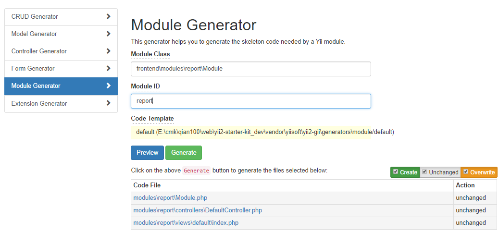

# module

## modules生成与使用
### 使用GII生成



```php
Module Class : frontend\modules\report\Module
Module ID : report
```

### modules使用
frontend/config/web.php  
```php
'modules' => [
    'user' => [
        'class' => 'frontend\modules\user\Module',
        //'shouldBeActivated' => true
    ],
    'report' => [
        'class' => 'frontend\modules\report\Module',
    ],
    'api' => [
        'class' => 'frontend\modules\api\Module',
        'modules' => [
            'v1' => 'frontend\modules\api\v1\Module'
        ]
    ]
],
```

### 地址访问
```php
http://ysk.dev/report
```
--- 

## 模块module包含组件使用

### 配置
** common/config/base.php ** 
```php
    'modules' => [
		....
        //modules测试
        'report' => [
            'class' => 'frontend\modules\report\Module',
            'components' => [
                'mycomponent' => [
                    'class' => 'common\components\MyComponent',
                    'terry' => 'xxxx',
                ],
            ],
            'params' => [
                'water' => 'good',
            ],
        ],
		...
    ],
```

** frontend/config/web.php  **

'modules' => [
	...
    'report' => [
        'class' => 'frontend\modules\report\Module',
        //'shouldBeActivated' => true
    ],
	...
],


### MyComponent组件代码
** common/components/MyComponent.php **  
```php
namespace common\components;

use Yii;
use yii\base\Component;

class MyComponent extends Component {

    public $terry;

    public function welcome() {
        echo "Hello workld" . "<br />";

        //输出参数
        if (isset(Yii::$app->controller->module->params['water'])) {
            echo Yii::$app->controller->module->params['water'] . "<br />";
        }
        //输出组件里的参数
        echo $this->terry . "<br />";
    }
}
```

### report_module下运行
** frontend/modules/report/controllers/DefaultController.php   **  
```php

    public function actionDemoModule() {

        $module = \Yii::$app->controller->module;
       echo  $module->mycomponent->welcome();
       exit;
    }
//输出
Hello workld
good
xxxx
```
** 注: 在其它module下运行,  water的参数不会输出 **

--- 

## 短信sms配置代码采集

### components配置参数
```php
'components' => [
...
 'sms' => [
            'class' => 'ihacklog\sms\Sms',
            'provider' => YII_ENV_PROD ? 'Yuntongxun' : 'File', //set default provider
            'verifyTemplateId' => 150294,
            'services' => [
                'Yuntongxun' => [
                    'class' => 'ihacklog\sms\provider\Yuntongxun',
                    'apiUrl' => 'https://app.cloopen.com:8883',
//                'apiUrl' => 'https://sandboxapp.cloopen.com:8883',
                    'templateId' => 150294,
                    'appId' => '8a216da856c131340156d3ff1bb60d47',
                    'accountSid' => '8a216da856c131340156d3ff1b280d40',
                    'accountToken' => '9068a167e6254ae49fbf516e0a3dfffe',
                    'softVersion' => '2013-12-26',
                ],
                'File' => [
                    'class' => 'ihacklog\sms\provider\File',
                    'templateId' => 1,
                ],
            ],
        ],
],
...

``` 
### modules配置参数
```php
'modules' => [
...
'sms' => [
            'class' => 'ihacklog\sms\Module',
            'userModelClass' => '\common\models\User', // optional. your User model. Needs to be ActiveRecord.
            'resendTimeSpan' => YII_ENV_PROD ? 60 : 10, //重发时间间隔(单位：秒）
            'singleIpTimeSpan' => YII_ENV_PROD ? 3600 : 0, //单个ip用于统计允许发送的最多次数的限定时间
            'singleIpSendLimit' => YII_ENV_PROD ? 20 : 0, //单个ip在限定的时间内允许发送的最多次数
            'verifyTimeout' => 300, //验证码超时(秒)
            'enableHttpsCertVerify' => YII_ENV_PROD ? true : false, //是否校验https证书,线上环境建议启用
        ],
...

],

```