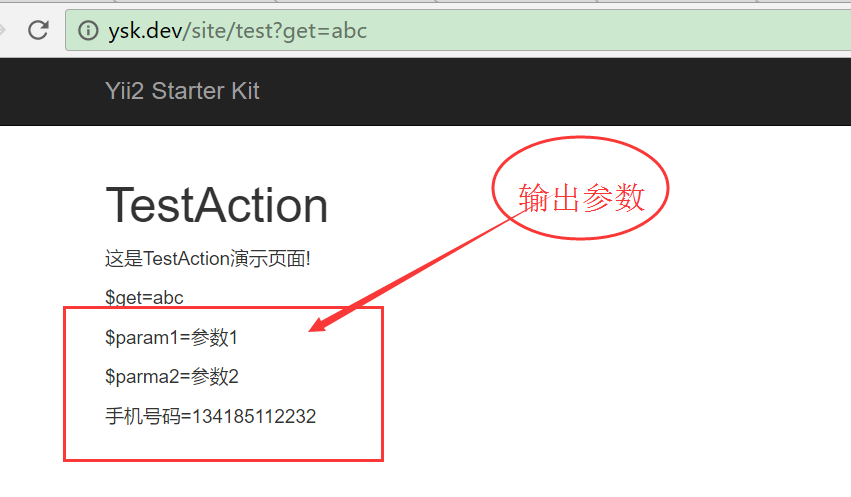

## 接收post再验证_标准例子

```

/** 
 * 1,将之前的栏目全部删除 BlogCategory 
 * 2.将前台选中栏目多个批量入库_BlogCategory栏目 
 *  
 */ 
public function actionUpdate($id) 
{ 
    $model = $this->findModel($id); 
 
    if ($model->load(Yii::$app->request->post()) && $model->validate()) 
    { 
 
        $transaction = Yii::$app->db->beginTransaction(); 
        try 
        { 
 
            /** 
             * current model save 
             */ 
            $model->save(false); 
 
            // 注意我们这里是获取刚刚插入blog表的id 
            $blogId = $model->id; 
 
            /** 
             * batch insert category 
             * 我们在Blog模型中设置过category字段的验证方式是required,因此下面foreach使用之前无需再做判断 
             */ 
            $data = []; 
            foreach ($model->category as $k => $v) 
            { 
                // 注意这里的属组形式[blog_id, category_id]，一定要跟下面batchInsert方法的第二个参数保持一致 
                $data[] = [$blogId, $v]; 
            } 
 
            // 获取BlogCategory模型的所有属性和表名 
            $blogCategory = new BlogCategory; 
            $attributes = array_keys($blogCategory->getAttributes()); 
            $tableName = $blogCategory::tableName(); 
 
            // 先全部删除对应的栏目 
            $sql = "DELETE FROM `{$tableName}`  WHERE `blog_id` = {$blogId}"; 
            Yii::$app->db->createCommand($sql)->execute(); 
 
            // 再批量插入栏目到BlogCategory::tableName()表 
            Yii::$app->db->createCommand()->batchInsert( 
                $tableName, 
                $attributes, 
                $data 
            )->execute(); 
 
            // 提交 
            $transaction->commit(); 
 
            return $this->redirect(['index']); 
 
        } 
        catch (Exception $e) 
        { 
            // 回滚 
            $transaction->rollback(); 
            throw $e; 
        } 
 
    } 
    else 
    { 
 
        // 获取博客关联的栏目 
        $model->category = BlogCategory::getRelationCategorys($id); 
 
        return $this->render('update', [ 
                                 'model' => $model, 
                             ]); 
    } 
} 


```

## 接收post再验证_例a

路径：company/modules/admin/controllers/RechargeController.php  

```php
 public function actionCreate() {

        $model = new Recharge();
        $model->setScenario(Recharge::OFFLINE_ADD);

        if (Yii::$app->request->isPost) {
            $posts = Yii::$app->request->post();
            try {
                //开起事务  
                $trans = Yii::$app->db->beginTransaction();
                //1.插入数据  recharge
                $data = $posts;
                $data['Recharge']['pay_at'] = strtotime($posts['Recharge']['pay_at']);
                $data['Recharge']['order_no'] = getRangNUm(10);
                $data['Recharge']['created_by'] = getMyId();
                $data['Recharge']['type'] = 0;
//                dp($data);
                $model->load($data);
                $model->setIsNewRecord(true);
                $result = $model->save();
                $relation_id = Yii::$app->db->getLastInsertID();
                if (!$result) {
                    throw new \Exception('充值入库失败');
                }

                //2.日志入库 operation-log
                $data['OperationLog'] = ['user_id' => getMyId(), 'relation_type' => 3, 'relation_id' => $relation_id, 'name' => '线下充值'];
                $order = new OperationLog;
                $order->load($data);
                $result = $order->save(FALSE);
                if (!$result) {
                    throw new \Exception('日志入库失败');
                }

                $trans->commit();
                Yii::$app->session->setFlash('noty', [
                    'text' => '操作成功',
                    'type' => Noty::SUCCESS
                ]);
                return $this->redirect('index');
            } catch (\Exception $e) {
                $trans->rollback();
                Yii::$app->session->setFlash('noty', [
                    'text' => $e->getMessage(),
                    'type' => Noty::ERROR
                ]);
                return $this->render('create', ['model' => $model]);
            }
        } else {
            return $this->render('create', [
                        'model' => $model,
            ]);
        }
    }


```


## 接收post再验证_例b
>(注:$model->save(false))  

```php
use common\models\Blog; 
use yii\base\Exception; 
use common\models\BlogCategory; 
public function actionCreate() 
{ 
    $model = new Blog(); 
    // 注意这里调用的是validate，非save,save我们放在了事务中处理了 
    if ($model->load(Yii::$app->request->post()) && $model->validate()) { 
        // 开启事务 
        $transaction = Yii::$app->db->beginTransaction(); 
        try { 
            /** 
             * current model save 
             */ 
            $model->save(false);  //前面$model->validate()已经验证，没有必要再验证，设置为false则不需要再验证
            // 注意我们这里是获取刚刚插入blog表的id 
            $blogId = $model->id; 
            /** 
             * batch insert category 
             * 我们在Blog模型中设置过category字段的验证方式是required,因此下面foreach使用之前无需再做判断 
             */ 
            $data = []; 
            foreach ($model->category as $k => $v) { 
                // 注意这里的属组形式[blog_id, category_id]，一定要跟下面batchInsert方法的第二个参数保持一致 
                $data[] = [$blogId, $v]; 
            } 
            // 获取BlogCategory模型的所有属性和表名 
            $blogCategory = new BlogCategory; 
            $attributes = array_keys($blogCategory->getAttributes()); 
            $tableName = $blogCategory::tableName(); 
            // 批量插入栏目到BlogCategory::tableName()表,第一个参数是BlogCategory对应的数据表名，第二个参数是该模型对应的属性字段，第三个字段是我们需要批量插入到该模型的字段，记得第二个参数和第三个参数对应值一致哦 
            Yii::$app->db->createCommand()->batchInsert( 
                $tableName,  
                $attributes, 
                $data 
            )->execute(); 
            // 提交 
            $transaction->commit(); 
            return $this->redirect(['index']); 
        } catch (Exception $e) { 
            // 回滚 
            $transaction->rollback(); 
            throw $e; 
        } 
    } else { 
        return $this->render('create', [ 
            'model' => $model, 
        ]); 
    } 
} 


```

## 没有记录插入_否则就更新 
>jason isGet isPost  

```php
    public function actionAdd()
    {
        if (Yii::$app->session['isLogin'] != 1) {
            return $this->redirect(['member/auth']);
        }
        $userid = User::find()->where('username = :name', [':name' => Yii::$app->session['loginname']])->one()->userid;
        if (Yii::$app->request->isPost) {
            $post = Yii::$app->request->post();
            $num = Yii::$app->request->post()['productnum'];
            $data['Cart'] = $post;
            $data['Cart']['userid'] = $userid;
        }
        if (Yii::$app->request->isGet) {
            $productid = Yii::$app->request->get("productid");
            $model = Product::find()->where('productid = :pid', [':pid' => $productid])->one();
            $price = $model->issale ? $model->saleprice : $model->price;
            $num = 1;
            $data['Cart'] = ['productid' => $productid, 'productnum' => $num, 'price' => $price, 'userid' => $userid];
        }
        //1.判断是否有记录
        if (!$model = Cart::find()->where('productid = :pid and userid = :uid', [':pid' => $data['Cart']['productid'], ':uid' => $data['Cart']['userid']])->one()) {
			//没有记录则,new呈个实例出来
            $model = new Cart;
        } else {
           //否则就保存数据
            $data['Cart']['productnum'] = $model->productnum + $num;
        }
        $data['Cart']['createtime'] = time();
        $model->load($data);
        $model->save();
        return $this->redirect(['cart/index']);
    }
```

## 没有记录插入_否则就更新_例2

```php
 public function actionGetBasePriceAdd() {
if (Yii::$app->request->isPost) {
    $posts = Yii::$app->request->post();
    try {
        //开起事务
        $trans = Yii::$app->db->beginTransaction();
        //dp($posts);
        //1.发团班期入库
        $model = PricelistLine::find()->where(['product_id' => $posts['product_id'], 'depart_city_id' => $posts['city_id'],])->one();
        if (!$model) {
            //插入
            $model = new PricelistLine();
            //$model->setIsNewRecord(true);
            $data['PricelistLine']['product_id'] = $posts['product_id'];
            $data['PricelistLine']['depart_city_id'] = $posts['city_id'];
            $data['PricelistLine']['group_schedule'] = $posts['days'];
            $data['PricelistLine']['created_at'] = time();
        } else {
            //更新
            $data['PricelistLine']['updated_at'] = time();
            $data['PricelistLine']['group_schedule'] = $posts['days'];
        }

        $model->load($data);
        $res = $model->save();
        if (!$res) {
            throw new \Exception('发团班期操作失败');
        }


       ....

        $trans->commit();
        return $this->ajaxSuccess('成功');

    } catch
    (\Exception $e) {

        $trans->rollback();
        return $this->ajaxFail('失败', '', $e->getMessage());
    }
}
}
```

#yii2自带函数连接  

## leftjoin
```php

```
public function actionView($id) {

        //操作记录
        //$query = OperationLog::find();
        //$query->

        /*  注：下面的 select($fields),查出来的数据只有一条，晕死，，坑。。。。即现在的解决方案就是select('operation_log.*')
        $fields = [
            'operation_log.*',
            'operation_log.user_id',
            'operation_log.name',
            'operation_log.memo',
            'operation_log.created_at',
            'operation_log.relation_type',
            'operation_log.relation_id',
            'user.*',
            'user.username',

        ];
        */

        $op_logs = OperationLog::find()->select('operation_log.*,user.username')->where('relation_id=:_id and relation_type = 9', [':_id' => $id]);
        $_op_logs = $op_logs->leftJoin('user', 'user.id = operation_log.user_id')->asArray()->all();

        //dp($_op_logs);
        return $this->render('view', [
            'model' => $this->findModel($id),
            'op_logs' => $_op_logs,
        ]);
    }

## leftjoin_详细页
```php
    public function actionView($id)
    {
        $query = UserActivity::find()->select('user_activity.*,user.username,user.mobile,user_profile.real_name,activity.valid_type,activity.valid_period,activity.valid_end_at')->where('user_activity.id=:_id',[':_id'=>$id]);
        $query->leftJoin('activity','activity.id = user_activity.activity_id');
        $query->leftJoin('user_profile','user_profile.user_id = user_activity.user_id');
        $model = $query->leftJoin('user','user.id=user_activity.user_id')->one();

        return $this->render('view', [
            'model' =>$model,
        ]);
    }
```

## leftjoin_分页_wqw  
company/modules/shop/controllers/ProductController.php  
```php
public function pro_list($page, $type)
    {
    	$page = intval($page);
        $proSearch = ProductSearch::find()->select('t.*')->from('product t')->where([
							't.company_id' => $this->store_company_id,
							't.sys_category_id' => $type,
        					't.status' => 1,
        					't.is_published_store' => 1,
        					't.is_on_sale' => 1,
        					't.is_deleted' => 0,
        					't.status' => 1,
			                't.is_passed_card'=>0
    				    ]);
        //价目表日期过期的产品不能显示
        $proSearch->leftJoin('pricelist','pricelist.product_id = t.id');
        $_time = time();
        $proSearch->andWhere("pricelist.end_at+3600*24>{$_time}");

        if ($type == Product::SYS_CATE_SCENIC){
        	$proSearch->leftJoin('product p','p.id = t.original_product_id');
        	$order = 'IF (`p`.is_passed_card IS NULL, `t`.is_passed_card, `p`.`is_passed_card`)DESC, ';
        }else{
        	$order = '';
        }
        $pages = new Pagination([
        		'totalCount' =>$proSearch->count(), 
        		'pageSize' => $this->page_size,
        		'page' => $page <= 0 ? 0 : $page - 1,
		]);
        $models = $proSearch->offset($pages->offset)
        			->limit($pages->limit)
        			->orderBy($order.' t.updated_at DESC')
        			->all();
        
        $datas = array();
        if ($models){
        	foreach ($models as $model){
        		$data = array();
        		$data['id']		= $model->id;
        		$data['name']	= $model->name;
        		
        		if ($model->images && is_array($model->images)){
        			$data['img']= $model->images[0]->base_url.'/'.$model->images[0]->path;
        		}else {
        			$data['img'] = '';
        		}
        		
        		if ($type == Product::SYS_CATE_SCENIC){
        			$data['level']	= $model->supplierApp ? $model->supplierApp->level : 0;
        			$data['is_passed_card'] = $model->originalProduct->is_passed_card;
        		}
        		$data['retail_price']	= $model->defaultPricelist ? $model->defaultPricelist->retail_price : 0;
        		
        		//$data['is_free']= $model->is_free;
        		
        		$datas[] = $data;
        	}
        }
        
        $res['page']		= $pages->page + 1;
        $res['page_count']	= $pages->pageCount;
        $res['items']		= $datas;

        return $this->ajaxSuccess('成功', '', $res);
    }

```

## leftJoin_分页_接口_视图_搜索
>get方式搜索  
>关联视图  
>分页  
>接口JSON发送  
 

```php
/**
     *接口- 企业店铺-获取折叠的产品列表
     * @param $company_id //店铺公司ID
     * @param $page //分页
     * @param $type //类型 2 酒店,4 门票，5餐厅，6 购物店,100 线路,
     * @author cmk
     * http://url/coshop/default/i-product-list?company_id=60&page=1&type=4
     * http://url/coshop/default/i-product-list?company_id=60&page=1&type=4&product_name=假&pricelist_name=普通
     * http://url/coshop/default/i-product-list?company_id=60&page=1&type=4&start_at=2017/02/16&end_at=2017/02/17
     * http://url/coshop/default/i-product-list?company_id=60&page=1&type=4&start_at=2017/02/16&city_name=深
     */
    public function actionIProductList($company_id, $page, $type) {

        try {


            $product_compayId = $company_id;//对应的产品表公司ID
            $login_companyId = Yii::$app->user->getCompanyID(); //登陆的企业ID
            $_login_company_id = Yii::$app->user->getCompanyId();
            $page = intval($page);

            //产品名
            $_product_name = Yii::$app->getRequest()->get('product_name');

            //价目名
            $_pricelist_name = Yii::$app->getRequest()->get('pricelist_name');

            //开始日期
            //$_start_at =  strtotime(intval(Yii::$app->getRequest()->get('start_at')))-3600*24;
            $_start_at = Yii::$app->getRequest()->get('start_at') ? strtotime(Yii::$app->getRequest()->get('start_at')) - 3600 * 24 : '';

            //结束日期
            //$_end_at =  strtotime(intval(Yii::$app->getRequest()->get('end_at')))+3600*24;;
            $_end_at = Yii::$app->getRequest()->get('end_at') ? strtotime(Yii::$app->getRequest()->get('end_at')) + 3600 * 24 : '';

            //省
            $_province_name = Yii::$app->getRequest()->get('province_name');

            //市
            $_city_name = Yii::$app->getRequest()->get('city_name');

            /**
             * 账期/价格/存库 计算
             */
            //已经登陆了
            if (!Yii::$app->user->isGuest) {
                if (!$login_companyId) {
                    throw new ErrorException('没有公司ID，请重新登陆');
                }
                $account_at = "f_get_payment_term({$login_companyId},{$product_compayId},product.id) as _account"; //获取客户的账期
                $stock = "f_get_product_stock(product.id,pricelist.id) as _stock";
                $price = "f_getProductPrice(pricelist.id,{$product_compayId},{$_login_company_id}) as _price";
            } else {
                $account_at = "('登陆后可见') as _account"; //获取客户的账期
                $stock = "('登陆后可见') as _stock";
                $price = "('登陆后可见') as _price";
            }

		//注：这边好奇怪竟然不用 product.* 跟上面的例子。有些冲突！先记下
            $_select = [
                'product.id as _product_id',
                'product.supplier_id',
                'product.company_id',
                'product.name as _product_name',
                'pricelist.id AS _pricelist_id',
                'pricelist.name as _pricelist_name',
                "FROM_UNIXTIME(pricelist.start_at,'%Y/%m/%d') as start_at",
                "FROM_UNIXTIME(pricelist.end_at,'%Y/%m/%d') as end_at",
                'v_region._province_name',
                'v_region._city_name',
                $account_at,
                $stock,
                $price,

            ];

            $query = Product::find()->select($_select)->where(
                [
                    'product.company_id' => $company_id,
                    'product.is_on_sale' => 1,
                    'product.is_deleted' => 0,
                ]
            );

            $query->leftJoin('pricelist', 'pricelist.product_id = product.id AND pricelist.is_default = 1');
            $query->leftJoin('supplier', 'supplier.id = product.supplier_id');
            $query->leftJoin('company', 'company.id = product.company_id');
            $query->leftJoin('v_region', 'v_region._product_id = product.id');
            //  $_rows = $query->asArray()->all();

            $query->andwhere('product.sys_category_id = ' . $type);
            //条件过滤
            $query->andFilterWhere(['like', 'product.name', $_product_name]);
            $query->andFilterWhere(['like', 'pricelist.name', $_pricelist_name]);
            $query->andFilterWhere(['like', '_province_name', $_province_name]);
            $query->andFilterWhere(['like', '_city_name', $_city_name]);
            if ($_start_at) {
                //&start_at=2017/02/17
                $query->andFilterWhere(['>', 'pricelist.start_at', $_start_at]);
            }

            if ($_end_at) {
                //&end_at=2017/02/17
                $query->andFilterWhere(['<', 'pricelist.end_at', $_end_at]);
            }

            $pages = new Pagination([
                'totalCount' => $query->count(),
                'pageSize' => 10,
                'page' => $page <= 0 ? 0 : $page - 1,
            ]);

            $models = $query->offset($pages->offset)->limit($pages->limit)->asArray()->all();
            //dp($models);

            //获取分组
            $Product = new Product();
            $groups = $Product->getProductGroup($company_id);
            //dp($groups);
            $arr = [];

            //分组汇总
            foreach ($models as $model) {

                foreach ($groups as $group) {
                    if ($group['_source'] == 'company') {
                        if ($group['company_id'] == $model['company_id'] && !$model['supplier_id']) {
                            $arr[$group['company_id']]['group_name'] = $group['_brand_name'];
                            $arr[$group['company_id']]['list'][] = $model;
                            //账期
                        }
                    } else {
                        //供应商入库
                        if ($model['supplier_id'] > 0 && $group['supplier_id'] == $model['supplier_id']) {
                            $arr[$group['supplier_id']]['group_name'] = $group['_brand_name'];
                            $arr[$group['supplier_id']]['list'][] = $model;
                        }
                    }
                }
            }
            $res['page'] = $pages->page + 1;
            $res['page_count'] = $pages->pageCount;
            $res['data'] = $arr;
            return $this->ajaxSuccess('成功', '', $res);
        } catch (\Exception $e) {
            $res['data'] = $e->getMessage();
            return $this->ajaxSuccess('失败', '', $res);
        }

    }

```
---
# 查询连环招
## 利用模型get表关联查询_wqw 
>本例子 产品表获取分类名称  
>关联 product.catetory_id = product_category.id,获取product_category.name  

## Controller
```php

	public function actionView() {
	
	    //获取 “类别”
	    $model = $this->findModel($product_id);
		/**
		* 第一个单词小写，后面的大写跟上
		*category对应product.php模型下的getCategory()
		* 如果该命名是getDpLine()
		* 则下面的使用是$model->dpLine()
		*/
	    $catetory_name =$model->category ? $model->category->name : '无';
         
         return $this->render('view', [
				...
                'catetory_name' => $catetory_name,
            ]);
        }	
	}


	protected function findModel($id) {
	    if (($model = Product::findOne($id)) !== null) {
	        return $model;
	    } else {
	        throw new NotFoundHttpException('The requested page does not exist.');
	    }
	}
或者
    protected function findModel($id)
    {
    	return Product::find()->where([
    			'id' => $id,
    			'status' => 1,
    			'is_published_store' => 1,
    			'is_on_sale' => 1,
    			'is_deleted' => 0,
    			'status' => 1,
    			])->one();
    }
```

## Model
product.php  

```php
//表间的关联
    public function getCategory() {
        return $this->hasOne(ProductCategory::className(), ['id' => 'category_id']);
    }

```
---
# actions全局定义
## 指定控制器嵌入全局性方法action
>即全局性方法可以前后台使用, 如短信  
>所谓一处定义,全局通用  
>来源 [zhoubo短信企业后台调用短信](controller/SignInController.php#L46-L67)  
>company/controllers/SignInController.php  

### 使用场景  
如短信，在前后台都会使用  

### 访问地址 
http://ysk.dev/site/test?get=abc  



- [指定控制器设置action配置](post.md#指定控制器设置action配置)
- [全局方法定义开发](post.md#全局方法定义开发)


## 指定控制器设置action配置
> 本例子参数zhoubo的短信发送的例子 代码如下  

frontend/controllers/SiteController.php  

```php
namespace backend\controllers;
use Yii;
use backend\models\Test;
use backend\models\TestSearch;
use yii\web\Controller;
use yii\web\NotFoundHttpException;
use yii\filters\VerbFilter;
use yii\helpers\Url;
/**
 * TestController implements the CRUD actions for Test model.
 */
class TestController extends Controller
{
 public function actions()
    {
        return [
			...
            'test'=>[
                'class'=>'common\actions\TestAction',
                'param1'=>'参数1',
                'param2'=>'参数2',
                'beforeCallback' => [$this, 'registerSmsBeforeCallback'],
                'initCallback' => [$this, 'registerSmsInitCallback'],
            ]
        ];
    }


    /**
     * @author cmk
     *  第1步  自定义函数  initCallback
     *  获取表单输入框内容
     */
   public function registerSmsInitCallback($action){
        $action->mobile = '134185112232';
   }

    /**
     * @author cmk
     *  第2步  自定义函数  initCallback
     *  后端验证规则 是否输入正确
     * @param $action
     * @return bool
     */
    public function registerSmsBeforeCallback($action){

   }
}
```

## 全局方法定义开发
common/actions/TestAction.php  
```php
namespace common\actions;
use yii\base\Action;

/**
 * Class TestAction
 * @package common\actions
 *
 * Example
 * @url  http://ysk.dev/site/test?get=abc
 *  public function actions(){
 *     return [
*           'test'=>[
 *          'class'=>'common\actions\TestAction',
 *          'param1'=>'参数1',
 *           'param2'=>'参数2',
 *              'initCallback'=> 'initCallback' => [$this, 'registerSmsInitCallback'],
 *              'beforeCallback' => [$this, 'registerSmsBeforeCallback'],
 *          ]
 *    ]
 * }
 */
class TestAction extends Action
{
    public $param1 = null;
    public $param2 = null;

    /**
     * @var string 手机号码
     */
    public $mobile;
    /**
     * @var \Closure
     * 自定义函数  初始化函数  第1步
     */
    public $initCallback;


    /**
     * @var \Closure
     * 自定义函数    初始化函数  第2步
     */
    public $beforeCallback;


    public function run($get = null)
    {
        //自定义函数 使用
        if($this->initCallback && ($this->initCallback instanceof \Closure || is_callable($this->initCallback))){
            call_user_func_array($this->initCallback,[$this]);
        }

        return $this->controller->render('test', [
            'get' => $get,
            'param1' => $this->param1,
            'param2' => $this->param2,
            'mobile'=>$this->mobile
        ]);
    }

}
```
---

## 批量插入
### 原始的方法foreach

```php
                foreach ($posts['arr'] as $row) {
                    $pricelist = new Pricelist();
                    $pricelist->name = $row['name'];
                    $pricelist->cost_price = $row['cost_price'];
                    $pricelist->wholesale_price = $row['wholesale_price'];
                    $pricelist->list_price = $row['list_price'];
                    $pricelist->retail_price = $row['retail_price'];
                    $pricelist->max_count = $posts['sock_num'];
                    $pricelist->company_id = $posts['company_id'];
                    $pricelist->product_id = $posts['product_id'];
                    $pricelist->created_by = $user_id;
                    $res = $pricelist->save(false);
                    if (!$res) {
                        throw new \Exception('价目表入库失败');
                    }
                }
```
### 批量_batchInsert

```php

             //2.批量插入价目
                //a.要插入的表的名称
                $tableName = Pricelist::tableName();
                //a1.插入的时间
                $now = time();
                //b.要插入的字段
                $field = [
                    'name',
                    'cost_price',
                    'wholesale_price',
                    'list_price',
                    'retail_price',
                    'max_count',
                    'company_id',
                    'product_id',
                    'created_by',
                    'created_at',
                ];
                //c.插入的数据
                foreach ($posts['arr'] as $row) {
                    $insertData[] = [
                        $row['name'],
                        $row['cost_price'],
                        $row['wholesale_price'],
                        $row['list_price'],
                        $row['retail_price'],
                        $posts['sock_num'],
                        $posts['company_id'],
                        $posts['product_id'],
                        $user_id,
                        $now,
                    ];
                }
                //d.执行插入--返回值为插入成功的数目
                $okCnt = Yii::$app->db->createCommand()->batchInsert($tableName, $field, $insertData)->execute();
                if (!$okCnt) {
                    throw new \Exception('价目表入库失败');
                }
```

### 封装批量插入

```php
namespace common\helpers;

class ModelHelper
{
    /**
     * 批量插入数据保存
     * 使用示例：
     *
     * $rows = [];
     * foreach ($items as $key => $value) {
     *     $rows[$key]['title'] = $value['title'];
     *     $rows[$key]['user_id'] = $userId;
     * }
     * if (!ModelHelper::saveAll(Post::tableName(), $rows)) {
     *     throw new Exception();
     * }
     *
     * @param $tableName
     * @param array $rows
     * @return int
     * @throws \yii\db\Exception
     */
    public static function saveAll($tableName, $rows = [])
    {
        if ($rows) {
            return \Yii::$app->db->createCommand()
                ->batchInsert($tableName, array_keys(array_values($rows)[0]), $rows)
                ->execute();
        }
        return false;
    }
}

```
### 封装批量插入_例子

**company/models/AuthAssign.php**
```php
public static function create($userId, $roleIds)
{
    if ($roleIds) {
        $rows = [];
        $time = time();
        $companyId = Yii::$app->user->getCompanyId();
        $roles = ArrayHelper::map(AuthItem::getRoles(), 'id', 'name');
        self::deleteAll(['user_id' => $userId, 'company_id' => $companyId]);
        foreach ($roleIds as $key => $roleId) {
            $rows[$key]['auth_item_id'] = $roleId;
            $rows[$key]['auth_item_name'] = $roles[$roleId];
            $rows[$key]['company_id'] = $companyId;
            $rows[$key]['user_id'] = $userId;
            $rows[$key]['created_at'] = $time;
            $rows[$key]['updated_at'] = $time;
        }
        if (!ModelHelper::saveAll(self::tableName(), $rows)) {
            throw new Exception('分配角色失败');
        }
    }
    return true;
}


```


## 更新
### updateAll

```php
// 方法1
Test::updateAll(['status'=>1],['status'=>0,'flag'=>1]);

```

```php
// 方法2
Test::updateAll(['status'=>1],['and',['status'=>0],['<>','flag',1]]);  
```
### updateAllCounters 针对于数字的更新 如 mount = mount+5
```php
// 方法1
Topic::updateAllCounters(['view_count' => 1], ['id' => $id]);
// 实现的效果就是 view_count + 1，1根据你的需求可以是正数也可以是负数。

// 方法2
Topic::updateAllCounters(['view_count' => 1], ['and', ['xxx' => 0, 'yyy' => 2], ['>', 'zzz', $time]);

// 方法3
 Topic::updateAll(
    ['view_count' => new Expression('`view_count` + 1'), 'updated_at' => time()],
    ['id' => $id]
);

// 其它使用
$model = Post::findOne($id);
$model->updateCounters(['view_count' => 1]);

```

## 取代updateAllCounters方法

```php
use yii\db\Expression;
$res = self::updateAll([
        'settlement_amount' => new Expression('`settlement_amount` + ' . $settlement_amount),
        'settlement_status' => new Expression(' CASE WHEN settlement_amount = actual_pay_amount THEN 2 ELSE 1 END'),
        'updated_at' => time(),
    ], [
        'id' => $dp_order_id,
    ]);
    if (!$res) {
        throw new Exception('更新订单表失败');
    }
```


## 删除
### 字符串格式删除
```php
// 方法1
User::deleteAll('status = :status AND age > :age', [':age' => 20, ':status' => 'active']);

```
### 数组加入范围
```php
//一般的使用
 Pricelist::deleteAll(['company_id' => $company_id, 'product_id' => $product_id, 'type' => 2,['between','start_at',$insert_start_day,$insert_end_day]]);

//加入范围条件必须这样
Pricelist::deleteAll(
    [
        'and',
        'company_id = :company_id',
        'product_id = :product_id',
        'type = 2',
        ['between', 'start_at', $insert_start_day, $insert_end_day],
    ],
    [
        ':company_id' => $company_id,
        ':product_id' => $product_id,
    ]
);

```
## 插入
### 统计店铺访问量
```php

		$dpstore_model = DpStore::find()->where(['company_id' => $this->store_company_id, 'ower_id' => $this->store_owner_id])->one();
		if ($dpstore_model) {
		    $dpstore_model->pv = $dpstore_model->pv + 1;
		    $dpstore_model->save();
		}
```

## 存储过程使用
```php
$sql = "CALL p_sj_qian({$order_id},{$user_id},{$company_id})";
$result = \Yii::$app->db->createCommand($sql)->queryOne();
```
