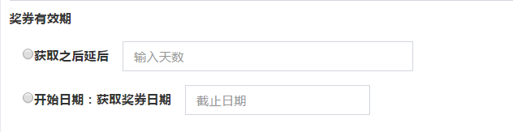

#最终效果如下



###开发代码
http://i.vding.dev/admin/activity/create<br />
路径 company/modules/admin/views/activity/_form.php

```php
<?= $form->field($model, 'valid_type', [
            'options' => ['class' => 'form-group form-md-radios col-lg-12'],
            'template' => '{label}<div class="md-radio-inline">{input}</div>{hint}{error}',
        ])->radioList([0 => '获取之后延后', 1 => '开始日期：获取奖券日期'],
            [
                'item' => function ($index, $label, $name, $checked, $value) {
                    $checked = $checked ? "checked" : "";
                    $return = '<div class="md-radio " style="display: inline-block;width: 100%;">';
                    $return .= '<div class="" style="float:left;margin-top:10px;">';
                    $return .= '<input type="radio" id="' . $name . $value . '" name="' . $name . '" value="' . $value . '" class="md-radiobtn"  ' . $checked . '>';
                    $return .= '<label for="' . $name . $value . '">
                    <span></span>
                    <span class="check"></span>
                    <span class="box"></span>' . ucwords($label) . '</label></div>';
                    $model2 = new common\models\Activity();
                    if ($value == 0) {
                        $return .= ActiveForm::begin()->field($model2, 'valid_period', ['options' => ['class' => 'col-lg-3']])->textInput(['placeholder' => '输入天数'])->label('');
                    } else {
                        $return .= ActiveForm::begin()->field($model2, 'valid_end_at', ['options' => ['class' => 'col-lg-2'],])->widget(
                            DateTimeWidget::className(), [
                                'phpMomentMapping' => ["yyyy-MM-dd HH:mm" => 'YYYY-MM-DD HH:mm',],
                                'phpDatetimeFormat' => 'yyyy-MM-dd HH:mm',
                                'locale' => 'zh-CN',
                            ]
                        )->label('')->textInput(['placeholder' => '截止日期']);
                    }
                    $return .= '</div>';
                    return $return;
                },
            ]

        )->label('') ?>
```


###网上借鉴的代码
[http://www.yiichina.com/tutorial/733?sort=desc](http://www.yiichina.com/tutorial/733?sort=desc "链接")

```php
<?php $model->test=($model->test)?:1?>
<?= $form->field($model, 'test',[
   'options'=>['class' => 'form-group form-md-radios'],
    'template' => '{label}<div class="col-md-9 md-radio-inline">{input}</div>{hint}{error}', 
])->radioList([1=>Yii::t('common','has'),0=>Yii::t('common','not')],
[
    'item' => function($index, $label, $name, $checked, $value) {
        $checked=$checked?"checked":"";
        $return = '<div class="md-radio">';
        $return .= '<input type="radio" id="' . $name . $value . '" name="' . $name . '" value="' . $value . '" class="md-radiobtn"  '.$checked.'>';
        $return .= '<label for="' . $name . $value . '">
                    <span></span>
                    <span class="check"></span>
                    <span class="box"></span>' . ucwords($label) . '</label>';
        $return .= '</div>';
        return $return;
    }
]) ?>
```


