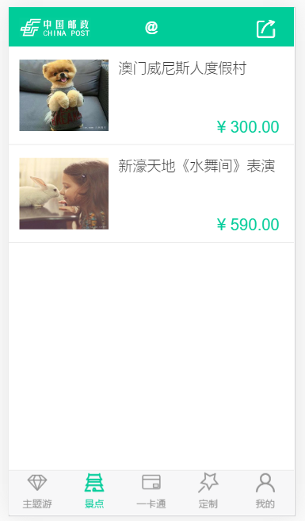
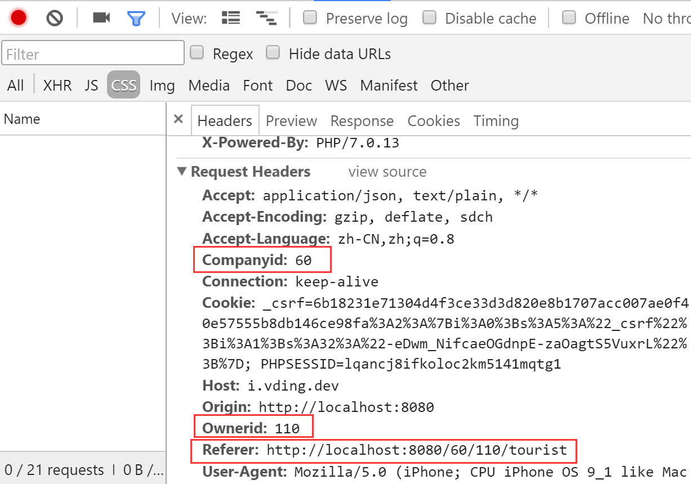

#店铺
---
>本店铺采用接口方式获取后端数据
>

>1.使用vue-sui 开发 https://github.com/eteplus/vue-sui-demo
>2.[安装与运行](#安装与运行)
>3.[开发环境地址](#开发环境地址)
>4.[后端跨域解决方案](#后端跨域解决方案)

##安装与运行
1. git clone git@github.com:eteplus/vue-sui-demo.git
2. #npm install //在根目录里执行cmk 安装
3. npm run dev  //运行
4. npm run build //代码修改过后运行


##开发环境地址
>localhost:8080


##店铺列表页


##头部 Request Headers绑定两个参数 Companyid 和Ownerid



##后端跨域解决方案
company/modules/shop/controllers/DpBaseController.php  
```php
public function behaviors()
    {
        return [
            'corsFilter' => [
                'class' => \yii\filters\Cors::className(),
                'cors' => [
                    'Origin' => [
                        'http://localhost',
                        'http://www.*.com',
                        'http://localhost:8080',
                        'http://shop.*.com',
                    ],
                    'Access-Control-Request-Method' => ['POST', 'GET'],
                    // Allow only POST and PUT methods
                    'Access-Control-Request-Headers' => ['X-Wsse', 'Companyid', 'Ownerid', 'Cookie', 'Set-Cookie'],
                    // Allow only headers 'X-Wsse'
                    'Access-Control-Allow-Credentials' => true,
                    // Allow OPTIONS caching
                    'Access-Control-Max-Age' => 3600,
                    // Allow the X-Pagination-Current-Page header to be exposed to the browser.
                    'Access-Control-Expose-Headers' => ['X-Pagination-Current-Page'],
                ],
            ],
        ];
    }
```


