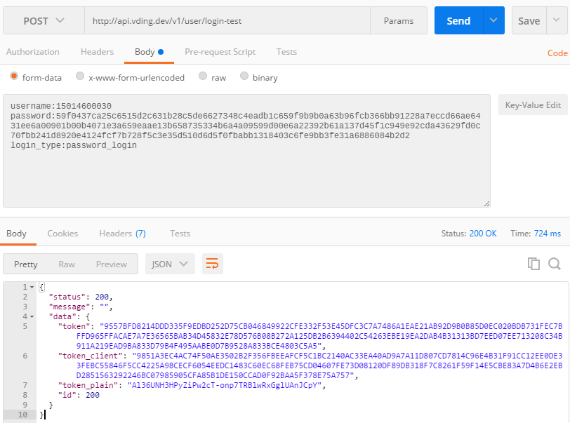
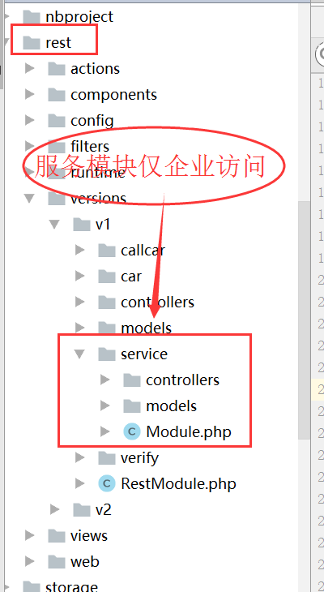

#vding_api

## 重置密码
http://vding.dev/test/hash?pwd=123456   
frontend/controllers/TestController.php  
```php
public function actionHash()
{
    $password = Yii::$app->request->getQueryParam('pwd');
    return Yii::$app->getSecurity()->generatePasswordHash($password);
}
``` 

--- 
**注意**
> rest rest\versions\v1\service 为企业帐号登陆 其它的是个人帐号


## 获取token  

**请求URL：** 
http://api.d.v.w/v1/user/login-test
  
**请求方式：**
- POST 

**参数：** 
### 注: password是使用公钥将密码加密!
|参数名|必选|类型|说明|数据|
|:----    |:---|:----- |-----   |-----  |
|username |是  |string |用户名|  如 zkyucn 最好用手机号码 |
|password |是  |string | 密码  | 访问 http://vding.dev/test/enc?pwd=123456 获取 |
|login_type     |否  |string | 类型 | 如 password_login  |

**postman地址：**
http://api.vding.dev/v1/user/login-test  

**postman地址参数  **  


```php
username:15014600030
password:59f0437ca25c6515d2c631b28c5de6627348c4eadb1c659f9b9b0a63b96fcb366bb91228a7eccd66ae6431ee6a00901b00b4071e3a659eaae13b658735334b6a4a09599d00e6a22392b61a137d45f1c949e92cda43629fd0c70fbb241d8920e4124fcf7b728f5c3e35d510d6d5f0fbabb1318403c6fe9bb3fe31a6886084b2d2
login_type:password_login
``` 
**postman 截图  **  



**返回 [注:使用token_client 作为 token]**  
```php
{
  "status": 200,
  "message": "",
  "data": {
    "token": "9557BFD8214DDD335F9EDBD252D75CB046849922CFE332F53E45DFC3C7A7486A1EAE21AB92D9B0B85D0EC020BDB731FEC7BFFD965FFACAE7A7E36565BAB34D45832E78D576B08B272A125DB2B6394402C54263EBE19EA2DAB4B31313BD7EED07EE713208C34B911A219EAD9BA833D79B4F495AABE0D7B9528A833BCE4803C5A5",
    "token_client": "9851A3EC4AC74F50AE3502B2F356FBEEAFCF5C1BC2140AC33EA40AD9A7A11D807CD7814C96E4B31F91CC12EE0DE33FEBC55846F5CC4225A98CECF6054EEDC1483C60EC68FEB75CD04607FE73D08120DF89DB318F7C8261F59F14E5CBE83A7D4B6E2EBD2851563292246BC07985905CFA85B1DE150CCAD0F92BAA5F378E75A757",
    "token_plain": "Al36UNH3HPyZiPw2cT-onp7TRBlwRxGglUAnJCpY",
    "id": 200
  }
}
```

 **访问接口** 
-  注:取 "token_client" 作为token
 ``` 
http://api.vding.dev/v1/user/token-test?access-token=28E4D51B3625E8C96506C4D845F823DE79C8B212B1705CD36B5BF2AF3CD19E690E3A276C0DCB47409C7C801A20E672025D0FFD24CDB193D766F49B35B898CC6CF84FE7E9EEC296761122021F78566FA3BA61754369E9AAF45391D469C8379200A9B2BFA82AD841C806A3B5190603D19042E04AC10560C0A48F70049C15F56859 

### 代码
rest/versions/v1/controllers/UserController.php  
```php
    /**
     * 登录接口
     * 接收参数：mobile or username password loginType (password or sms)
     * @return string AuthKey or model with errors
     * @throws BadRequestHttpException
     */
    public function actionLoginTest()
    {
        $model = new LoginForm();
        $this->chooseScenario($model);
        if ($model->load(\Yii::$app->getRequest()->post(), '') && $model->login()) {
            return $this->getTheAccessToken(true);
        } else {
            throw new BadRequestHttpException(current($model->getErrors())[0]);
        }
    }
```
## 服务模块仅企业帐号可登陆
  

rest/versions/v1/service/controllers/BaseController.php   
 
```php
    public function beforeAction($action)
    {
        $user = Yii::$app->user->getIdentity();
        if ($user && 1 != $user->user_type) {
            throw new BadRequestHttpException('只有企业用户能请求此接口!');
        }
        return parent::beforeAction($action); // TODO: Change the autogenerated stub
    }

```

## api认证_zhou
>参考 [yii2项目实战-restful api之授权验证
](http://blog.csdn.net/lhorse003/article/details/62215672)  


###控制器基类
 common/controllers/BaseRestController.php  
```php 
namespace common\controllers;
use yii\rest\ActiveController;
use yii\base\InvalidConfigException;
use yii\base\Model;
use yii\web\ForbiddenHttpException;
use rest\filters\auth\SecureTokenAuth;

class BaseRestController extends ActiveController
{
    public $serializer = [
        'class' => 'yii\rest\Serializer',
        'collectionEnvelope' => 'items',
    ];

    public function behaviors()
    {
        $behaviors = parent::behaviors();
        $behaviors['authenticator'] = [
            'class' => SecureTokenAuth::className(),
            //注意，这个只能限制到action,不能指定controller
            'except' => ['login', 'login-test', 'register', 'get-sms', 'get-register-sms', 'end-user-license','forget-pass'],
        ];
        return $behaviors;
    }
}

``` 
### 认证类
rest/filters/auth/SecureTokenAuth.php  
```php 
namespace rest\filters\auth;

use yii\filters\auth\AuthMethod;
use Yii;

/**
 * SecureTokenAuth is an action filter that supports the authentication based on the access token passed through a query parameter.
 * access-token 是rsa加密后的十六进制ASCII字符串
 * 这是原版auth认证的一个改进版，增加了rsa加密
 * @TODO 增加timestamp 和 singature
 * @author HuangYeWuDeng
 */
class SecureTokenAuth extends AuthMethod
{
    /**
     * @var string the parameter name for passing the access token
     */
    public $tokenParam = 'access-token';

    /**
     * @inheritdoc
     */
    public function authenticate($user, $request, $response)
    {
        $accessToken = $request->get($this->tokenParam);
        $accessTokenBin = hex2bin(strtolower($accessToken));
        $accessTokenPlain = Yii::$app->rsa->privateDecrypt($accessTokenBin);
        if (is_string($accessTokenPlain)) {
            $identity = $user->loginByAccessToken($accessTokenPlain, get_class($this));
            if ($identity !== null) {
                return $identity;
            }
        }
        if ($accessTokenPlain !== null) {
            $this->handleFailure($response);
        }

        return null;
    }
}

``` 

##将密码转换为 access_toekn  
frontend/controllers/TestController.php    
访问: http://vding.dev/test/enc?pwd=123456  
```php 
    public function actionEnc()
    {
        $password = Yii::$app->request->getQueryParam('pwd');
        return bin2hex(Yii::$app->rsa->publicEncrypt($password));
    }
// 输出 
3eeb6ade484c07e28e72fe676d237ac72196f7de5b3aab7dcbdd70c4691f118d5b11c306262f2c8932ad342a8b5ec7b499714bea3a41583725ff65e943b187242c70a62c9978987efe778bea8e77f209231301907007528825d16b1704ca296793844e060762d3ab19e2c812857e12deaa8f68de14a9d5e728ad3006adbc6ec2

``` 
## API的地址访问
```php 
http://api.v2.v.w/v1/user/token-test?access-token=3eeb6ade484c07e28e72fe676d237ac72196f7de5b3aab7dcbdd70c4691f118d5b11c306262f2c8932ad342a8b5ec7b499714bea3a41583725ff65e943b187242c70a62c9978987efe778bea8e77f209231301907007528825d16b1704ca296793844e060762d3ab19e2c812857e12deaa8f68de14a9d5e728ad3006adbc6ec2 

```
---
## 第三方
### 模拟登陆
```php
<?php
//账号 15014600030 密码：123456、
error_reporting(0);

//使用公钥加密
function public_encode($pwd) {
   // $publicstr = file_get_contents('./rest_api_public_key.pem');

	$publicstr = file_get_contents('./p2p20140616.cer');
    $publickey = openssl_pkey_get_public($publicstr); // 读取公钥
	
    $r = openssl_public_encrypt($pwd, $encrypted, $publickey);
    if ($r) {
        return $encrypted;
    }
    return false;
}
//使用公钥解密
function public_decode($data) {
    $publicstr = file_get_contents('./p2p20140616.cer');
    openssl_public_decrypt($data,$decrypted,$publicstr);//私钥加密
    if ($decrypted) {
        return $decrypted;
    }
    return false;
}

//使用私钥解密
function rsa_decode($data) {
	$private_key = file_get_contents('./p2p20140616.pem');
    openssl_private_decrypt($data,$decrypted,$private_key);//私钥加密
    var_dump($decrypted);exit;
    if ($decrypted) {
        return $decrypted;
    }
    return false;
}


function curl_post_contents($url, $postField, $timeout = 30)
{
	$ch = curl_init ();
	curl_setopt ( $ch, CURLOPT_URL, $url );
	curl_setopt ( $ch, CURLOPT_POST, 1 );
	curl_setopt($ch, CURLOPT_SAFE_UPLOAD, true);
	curl_setopt ( $ch, CURLOPT_POSTFIELDS, $postField );
	curl_setopt ( $ch, CURLOPT_TIMEOUT, $timeout );
	if (isset ( $_SERVER ['HTTP_USER_AGENT'] ))
		curl_setopt ( $ch, CURLOPT_USERAGENT, $_SERVER ['HTTP_USER_AGENT'] );
	curl_setopt ( $ch, CURLOPT_RETURNTRANSFER, 1 );
	$r = curl_exec ( $ch );
	curl_close ( $ch );
	return $r;
}
	//bin2hex

//
/**
 *
 * 使用公钥加密密码
 *
 */
$pwd = bin2hex(public_encode('123456'));

//$url = "http://api.d.vding.wang/v1/service/user/login";
$url = "http://api.vding.dev/v1/service/user/login";
$postField=array(
    "username" =>"15014600030",
    "password" =>$pwd,
    "login_type" =>'password_login'
);
$output=curl_post_contents($url, $postField);

$_output = json_decode($output,true);

//服务器使用私钥加密的token
$private_encode_token = $_output['data']['token'];


//1.使用公钥解密token
$_private_encode_token =   hex2bin(strtolower($private_encode_token));
$_private_encode_token_res = public_decode($_private_encode_token);


//2.使用公销加密 token
//客户端加密方式： 转换为大写(转换为十六进制ASCII字符(rsa 公钥加密('plain text')))
$public_token = strtoupper(bin2hex(public_encode($_private_encode_token_res)));

echo $public_token;exit;


//私销解密
/*
$_pwd = hex2bin(strtolower($pwd));
 $result=  rsa_decode($_pwd);

var_dump($result) ;

exit;

*/

print_r($output);
?>

```


--- 
## API创建过程
### 创建控制器继续基类
rest/versions/v1/service/controllers/SupplierController.php  
```php 
namespace rest\versions\v1\service\controllers;

use common\service\SupllierService;
use rest\versions\v1\car\models\Car;
use Yii;

class SupplierController extends BaseController
{
	//1. 这个必须要,否则会报错
    public $modelClass = 'rest\versions\v1\car\models\Car'; 

    public $model = '';

    public function init(){
        parent::init();
        $this->model = new Car();
    }


    public function actionTest(){
        echo 'xxx';exit;
    }
}
``` 
### rule设置
>设置访问类型是get或post 
 
rest/config/_rules.php    
```php 

    'GET,POST /v1/service/supplier/test' => '/v1/service/supplier/test',
```
---

## APP应用在多台手机上登陆短信提示
[本例源代码](function/api/APP应用在多台手机上登陆短信提示_source/rest/versions/v2/controllers/UserController.php)
[本例时序图](uml/APP应用在多台手机上登陆短信提示.oom)

### 控制器继承BaseRestController

**common/controllers/BaseRestController.php**

```php
public function behaviors()
{
    $behaviors = parent::behaviors();
    $behaviors['authenticator'] = [
        'class' => SecureTokenAuthV2::className(),
        //注意，这个只能限制到action,不能指定controller
        'except' => ['login', 'login-test', 'register', 'get-sms', 'get-register-sms', 'end-user-license','forget-pass'],
    ];
    return $behaviors;
}
```
### auth认证接口access-token源头解析
**rest/filters/auth/SecureTokenAuthV2.php**

```php
namespace rest\filters\auth;

use yii\filters\auth\AuthMethod;
use Yii;
use yii\web\HttpException;

/**
 * SecureTokenAuth is an action filter that supports the authentication based on the access token passed through a query parameter.
 * access-token 是rsa加密后的十六进制ASCII字符串
 * 这是原版auth认证的一个改进版，增加了rsa加密
 * @TODO 增加timestamp 和 singature
 * @author HuangYeWuDeng
 */
class SecureTokenAuthV2 extends AuthMethod
{
    /**
     * @var string the parameter name for passing the access token
     */
    public $tokenParam = 'access-token';

    /**
     * Code 498 indicates an expired or otherwise invalid token
     * @inheritdoc
     */
    public function handleFailureTokenExpired($response, $identity)
    {
        $login_type = $identity->last_login_type == 1 ? '密码' : '短信';
        $login_fail_msg  = [
          1 => '你的密码可能已泄露，请尽快修改密码。',
          2 => '你的验证码可能已泄露。请勿转发验证码。',
        ];
        $message = sprintf('您的微叮账号于%s在另一个%s设备上通过%s登录,如果非本人操作,%s',
            date('Y-m-d H:i:s', $identity->logged_at), $identity->device_name, $login_type, $login_fail_msg[$identity->last_login_type]);
        throw new HttpException(498, $message);
    }

    /**
     * @inheritdoc
     */
    public function authenticate($user, $request, $response)
    {
        $accessToken = $request->get($this->tokenParam);
        if (empty($accessToken)) {
            $this->handleFailure($response);
        }
        $accessTokenBin = hex2bin(strtolower($accessToken));
        $accessTokenPlain = Yii::$app->rsa->privateDecrypt($accessTokenBin);
        if (is_string($accessTokenPlain)) {
            $identity = $user->loginByAccessToken($accessTokenPlain, get_class($this));
            if ($identity !== null) {
                return $identity;
            }
			//代码到了这里感觉有问题! 就是执行不下来
            $identity = $user->loginByAccessTokenPrev($accessTokenPlain, get_class($this));
            if ($identity !== null) {
                $this->handleFailureTokenExpired($response, $identity);
            }
        }
        if ($accessTokenPlain !== null) {
            $this->handleFailure($response);
        }

        return null;
    }
}

```

### 登陆控制器userController
```php
class UserController extends V1UserController
{
    //设备型号
    public $device_model;

    /**
     * v2 版的getTheAccessToken
     * @param bool $debug
     * @author HuangYeWuDeng
     * @return array
     */
    protected function getTheAccessToken($debug = false)
    {
        //生成新的token
        $newToken = \Yii::$app->getSecurity()->generateRandomString(40);
        //保存上一次的token
        $token = \Yii::$app->user->identity->getAccessToken();
        \Yii::$app->user->identity->access_token_prev = $token;ee
        \Yii::$app->user->identity->access_token .                        z    = $newToken;
        \Yii::$app->user->identity->save();

        $accessTokenEnc = Yii::$app->rsa->privateEncrypt($newToken);
        if (!$debug) {
            return ['token' => strtoupper(bin2hex($accessTokenEnc)), 'id' => \Yii::$app->user->identity->id];
        }
        $accessTokenClient = Yii::$app->rsa->publicEncrypt($newToken);
        return [
            'token' => strtoupper(bin2hex($accessTokenEnc)),
            'token_client' => strtoupper(bin2hex($accessTokenClient)),
            'token_plain' => $token,
            'id' => \Yii::$app->user->identity->id
        ];
    }

    /**
     * 登录接口 v2 登录时校验唯一设备登录
     * 接收参数：mobile or username password loginType (password or sms)
     * @return string AuthKey or model with errors
     * @throws BadRequestHttpException
     */
    public function actionLogin()
    {
        $model = new LoginForm();
        $this->chooseScenario($model);
        if ($model->load(\Yii::$app->getRequest()->post(), '') && $model->login()) {
            return $this->getTheAccessToken();
        } else {
            throw new BadRequestHttpException(current($model->getErrors())[0]);
        }
    }
}
```


