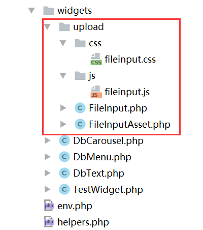

##widget简单例子
来源 [yii2项目实战-小部件widget的了解以及源码分析](http://www.manks.top/document/yii2-widget.html)

###1创建一个TestWidget
common/widgets/TestWidget.php
```php
namespace common\widgets;
use yii\base\Widget;

class TestWidget extends Widget {

    public function run(){
        echo "this is my test widget";
    }
}
```
###2view页调用
```php

# 输出结果 “this is my test widget”
echo \common\widgets\TestWidget::widget();
```
---

#widget仿WeUI上传插件
>使用widget来封装
>目前只能上传一张图片
>widget存放common\widgets\upload
>来源[yii2项目实战-自定义图片上传插件(仿WeUI上传插件)](http://www.manks.top/document/yii2-widget-upload.html)

##源码地址
https://github.com/408824338/test-yii2/tree/master/common/widgets/upload




##Widgt主文件
common/widgets/upload/FileInput.php
```php
namespace common\widgets\upload;
use yii\helpers\Html;
use yii\widgets\InputWidget;

/**
 * 图片上传插件
 *
 * @example
 * 同步单图上传的使用
 * ```php
 *   echo $form->field($model, 'image_url')->widget('common\widgets\upload\FileInput');
 * ```
 *
 * @see http://www.manks.top
 */
class FileInput extends InputWidget {
    public $clientOptions = [];

    public function run() {
        // 注册客户端所需要的资源
        $this->registerClientScript();
        // 构建html结构
        if ($this->hasModel()) {
            $this->options = array_merge($this->options, $this->clientOptions);
            $file = Html::activeInput('file', $this->model, $this->attribute, $this->options);
            // 如果当前模型有该属性值，则默认显示
            if ($image = $this->model->{str_replace(['[', ']'], '', $this->attribute)}) {
                $li = Html::tag('li', '', ['class' => 'uploader__file', 'style' => 'background: url(' . Yii::$app->params['imageServer'] . $image . ') no-repeat; background-size: 100%;']);
            }
            $uploaderFiles = Html::tag('ul', isset($li) ? $li : '', ['class' => 'uploaderFiles']);
            $inputButton = Html::tag('div', $file, ['class' => 'input-box']);
            echo Html::tag('div', $uploaderFiles . $inputButton, ['class' => 'file-div']);
        } else {
            throw new InvalidConfigException("'model' must be specified.");
        }

    }

    /**
     * Registers the needed client script and options.
     */
    public function registerClientScript() {
        $view = $this->getView();
        FileInputAsset::register($view);
    }

}
```
##Asset配置
common/widgets/upload/FileInputAsset.php
```php
namespace common\widgets\upload;
use yii\web\AssetBundle;

class FileInputAsset extends AssetBundle {

    public $sourcePath='@common/widgets/upload';
    public $css =[
        'css/fileinput.css'
    ];

    public $js=[
        'js/fileinput.js'
    ];

    public $depends = [
      'Yii\web\YiiAsset'
    ];

}
```

##视图调用

```php
<?= $form->field($model, 'pid')->widget('common\widgets\upload\FileInput') ?>
```